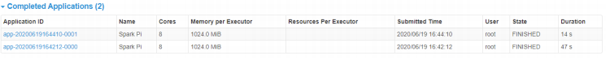
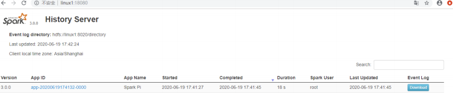
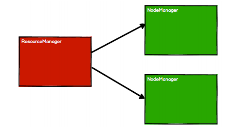
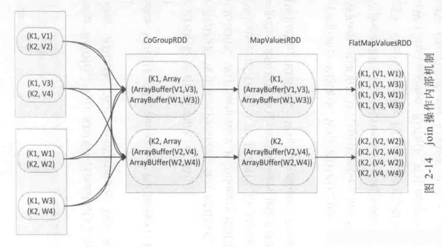
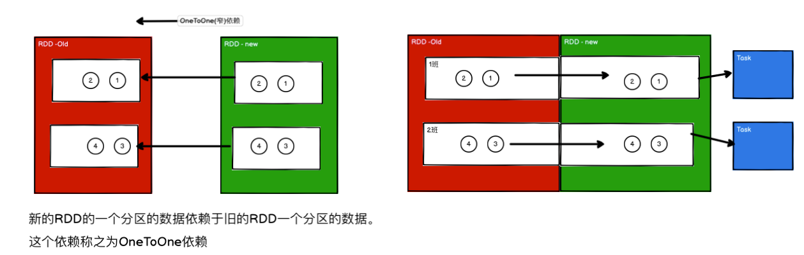
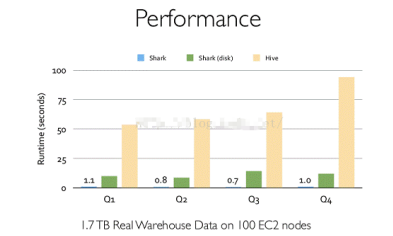
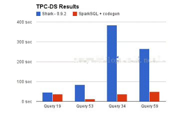
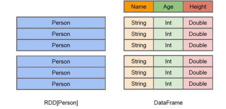

## 概述

Spark 是一种基于内存的快速、通用、可扩展的大数据分析计算引擎。

### **Spark and Hadoop**

在之前的学习中，Hadoop 的 MapReduce 是大家广为熟知的计算框架，那为什么咱们还要学习新的计算框架 Spark 呢，这里就不得不提到 Spark 和 Hadoop 的关系。

（1）从时间节点上来看: 

Hadoop：

- 2006 年 1 月，Doug Cutting 加入 Yahoo，领导 Hadoop 的开发；
- 2008 年 1 月，Hadoop 成为 Apache 顶级项目；
- 2011 年 1.0 正式发布；
- 2012 年 3 月稳定版发布；
- 2013 年 10 月发布 2.X (Yarn)版本

Spark：

- 2009 年，Spark 诞生于伯克利大学的 AMPLab 实验室；
- 2010 年，伯克利大学正式开源了 Spark 项目；
- 2013 年 6 月，Spark 成为了 Apache 基金会下的项目；
- 2014 年 2 月，Spark 以飞快的速度成为了 Apache 的顶级项目；
- 2015 年至今，Spark 变得愈发火爆，大量的国内公司开始重点部署或者使用 Spark

（2）从功能上来看：

Hadoop：

- Hadoop 是由 java 语言编写的，在分布式服务器集群上存储海量数据并运行分布式分析应用的开源框架；
- 作为 Hadoop 分布式文件系统，HDFS 处于 Hadoop 生态圈的最下层，存储着所有的 数 据 ， 支 持 着 Hadoop 的 所 有 服 务 。 它 的 理 论 基 础 源 于 Google 的TheGoogleFileSystem 这篇论文，它是 GFS 的开源实现；
-  MapReduce 是一种编程模型，Hadoop 根据 Google 的 MapReduce 论文将其实现，作为 Hadoop 的分布式计算模型，是 Hadoop 的核心。基于这个框架，分布式并行程序的编写变得异常简单。综合了 HDFS 的分布式存储和 MapReduce 的分布式计算，Hadoop 在处理海量数据时，性能横向扩展变得非常容易；
-  HBase 是对 Google 的 Bigtable 的开源实现，但又和 Bigtable 存在许多不同之处。HBase 是一个基于 HDFS 的分布式数据库，擅长实时地随机读/写超大规模数据集。它也是 Hadoop 非常重要的组件。

Spark：

- Spark 是一种由 Scala 语言开发的快速、通用、可扩展的**大数据分析引擎**；
- Spark Core 中提供了 Spark 最基础与最核心的功能；
- Spark SQL 是 Spark 用来操作结构化数据的组件。通过 Spark SQL，用户可以使用SQL 或者 Apache Hive 版本的 SQL 方言（HQL）来查询数据；
- Spark Streaming 是 Spark 平台上针对实时数据进行流式计算的组件，提供了丰富的处理数据流的 API。

由上面的信息可以获知，Spark 出现的时间相对较晚，并且主要功能主要是用于数据计算，所以其实 Spark 一直被认为是 Hadoop 框架的升级版。


### **Spark or Hadoop**

Hadoop 的 MR 框架和 Spark 框架都是数据处理框架，那么我们在使用时如何选择呢？

- Hadoop MapReduce 由于其设计初衷并不是为了满足循环迭代式数据流处理，因此在多并行运行的数据可复用场景（如：机器学习、图挖掘算法、交互式数据挖掘算法）中存在诸多计算效率等问题。所以 Spark 应运而生，Spark 就是在传统的 MapReduce 计算框架的基础上，利用其计算过程的优化，从而大大加快了数据分析、挖掘的运行和读写速度，并将计算单元缩小到更适合并行计算和重复使用的 RDD 计算模型。

- 机器学习中 ALS、凸优化梯度下降等。这些都需要基于数据集或者数据集的衍生数据反复查询反复操作。MR 这种模式不太合适，即使多 MR 串行处理，性能和时间也是一个问题。数据的共享依赖于磁盘。另外一种是交互式数据挖掘，MR 显然不擅长。而Spark 所基于的 scala 语言恰恰擅长函数的处理。

- Spark 是一个分布式数据快速分析项目。它的核心技术是弹性分布式数据集（Resilient Distributed Datasets），提供了比 MapReduce 丰富的模型，可以快速在内存中对数据集进行多次迭代，来支持复杂的数据挖掘算法和图形计算算法。

- Spark 和Hadoop 的根本差异是多个作业之间的数据通信问题 : Spark 多个作业之间数据通信是基于内存，而 Hadoop 是基于磁盘。

- Spark Task 的启动时间快。Spark 采用 fork 线程的方式，而 Hadoop 采用创建新的进程的方式。

- Spark 只有在 shuffle 的时候将数据写入磁盘，而 Hadoop 中多个 MR 作业之间的数据交互都要依赖于磁盘交互。

- Spark 的缓存机制比 HDFS 的缓存机制高效。

经过上面的比较，我们可以看出在绝大多数的数据计算场景中，Spark 确实会比 MapReduce更有优势。但是 Spark 是基于内存的，所以在实际的生产环境中，由于内存的限制，可能会由于内存资源不够导致 Job 执行失败，此时，MapReduce 其实是一个更好的选择，所以 Spark并不能完全替代MR。


### 核心模块

<center></center>

- **Spark Core**

  Spark Core 中提供了 Spark 最基础与最核心的功能，Spark 其他的功能如：Spark SQL，Spark Streaming，GraphX, MLlib 都是在 Spark Core 的基础上进行扩展的

- **Spark SQL**

  Spark SQL 是 Spark 用来操作结构化数据的组件。通过 Spark SQL，用户可以使用 SQL或者 Apache Hive 版本的 SQL 方言（HQL）来查询数据。

-  **Spark Streaming**

  Spark Streaming 是 Spark 平台上针对实时数据进行流式计算的组件，提供了丰富的处理数据流的 API。 

- **Spark MLlib**

  MLlib 是 Spark 提供的一个机器学习算法库。MLlib 不仅提供了模型评估、数据导入等额外的功能，还提供了一些更底层的机器学习原语。

- **Spark GraphX**

  GraphX 是 Spark 面向图计算提供的框架与算法库。


## 快速上手

在大数据早期的课程中我们已经学习了 MapReduce 框架的原理及基本使用，并了解了其底层数据处理的实现方式。接下来，就让咱们走进 Spark 的世界，了解一下它是如何带领我们完成数据处理的。

（1）**增加Scala插件**

Spark 由 Scala 语言开发的，所以本课件接下来的开发所使用的语言也为 Scala，咱们当前使用的 Spark 版本为 3.0.0，默认采用的 Scala 编译版本为 2.12，所以后续开发时。我们依然采用这个版本。开发前请保证 IDEA 开发工具中含有 Scala 开发插件。

<center></center>


（2）**增加依赖关系**

修改 Maven 项目中的 POM 文件，增加 Spark 框架的依赖关系。本课件基于 Spark3.0 版本，使用时请注意对应版本。

```xml
<dependencies>
    <dependency>
        <groupId>org.apache.spark</groupId>
        <artifactId>spark-core_2.12</artifactId>
        <version>3.0.0</version>
    </dependency>
</dependencies>
<build>
    <plugins>
        <!-- 该插件用于将 Scala 代码编译成 class 文件 -->
        <plugin>
            <groupId>net.alchim31.maven</groupId>
            <artifactId>scala-maven-plugin</artifactId>
            <version>3.2.2</version>
            <executions>
                <execution>
                    <!-- 声明绑定到 maven 的 compile 阶段 -->
                    <goals>
                        <goal>testCompile</goal>
                    </goals>
                </execution>
            </executions>
        </plugin>
        <plugin>
            <groupId>org.apache.maven.plugins</groupId>
            <artifactId>maven-assembly-plugin</artifactId>
            <version>3.1.0</version>
            <configuration>
                <descriptorRefs>
                    <descriptorRef>jar-with-dependencies</descriptorRef>
                </descriptorRefs>
            </configuration>
            <executions>
                <execution>
                    <id>make-assembly</id>
                    <phase>package</phase>
                    <goals>
                        <goal>single</goal>
                    </goals>
                </execution>
            </executions>
        </plugin>
    </plugins>
</build>
```


（3）**WordCount**

为了能直观地感受 Spark 框架的效果，接下来我们实现一个大数据学科中最常见的教学案例 WordCount：

```scala
// 创建 Spark 运行配置对象
val sparkConf = new SparkConf().setMaster("local[*]").setAppName("WordCount")
// 创建 Spark 上下文环境对象（连接对象）
val sc : SparkContext = new SparkContext(sparkConf)
// 读取文件数据
val fileRDD: RDD[String] = sc.textFile("input/word.txt")
// 将文件中的数据进行分词
val wordRDD: RDD[String] = fileRDD.flatMap( _.split(" ") )
// 转换数据结构 word => (word, 1)
val word2OneRDD: RDD[(String, Int)] = wordRDD.map((_,1))
// 将转换结构后的数据按照相同的单词进行分组聚合
val word2CountRDD: RDD[(String, Int)] = word2OneRDD.reduceByKey(_+_)
// 将数据聚合结果采集到内存中
val word2Count: Array[(String, Int)] = word2CountRDD.collect()
// 打印结果
word2Count.foreach(println)
//关闭 Spark 连接
sc.stop()
```

执行过程中，会产生大量的执行日志，如果为了能够更好的查看程序的执行结果，可以在项目的 resources 目录中创建 log4j.properties 文件，并添加日志配置信息：

```properties
log4j.rootCategory=ERROR, console
log4j.appender.console=org.apache.log4j.ConsoleAppender
log4j.appender.console.target=System.err
log4j.appender.console.layout=org.apache.log4j.PatternLayout
log4j.appender.console.layout.ConversionPattern=%d{yy/MM/dd HH:mm:ss} %p %c{1}: %m%n

# Set the default spark-shell log level to ERROR. When running the spark-shell, the
# log level for this class is used to overwrite the root logger's log level, so that
# the user can have different defaults for the shell and regular Spark apps.
log4j.logger.org.apache.spark.repl.Main=ERROR

# Settings to quiet third party logs that are too verbose
log4j.logger.org.spark_project.jetty=ERROR
log4j.logger.org.spark_project.jetty.util.component.AbstractLifeCycle=ERROR
log4j.logger.org.apache.spark.repl.SparkIMain$exprTyper=ERROR
log4j.logger.org.apache.spark.repl.SparkILoop$SparkILoopInterpreter=ERROR
log4j.logger.org.apache.parquet=ERROR
log4j.logger.parquet=ERROR

# SPARK-9183: Settings to avoid annoying messages when looking up nonexistent UDFs in SparkSQL with Hive support
log4j.logger.org.apache.hadoop.hive.metastore.RetryingHMSHandler=FATAL
log4j.logger.org.apache.hadoop.hive.ql.exec.FunctionRegistry=ERROR
```


## Spark运行环境

Spark 作为一个数据处理框架和计算引擎，被设计在所有常见的集群环境中运行, 在国内工作中主流的环境为 Yarn，不过逐渐容器式环境也慢慢流行起来。接下来，我们就分别看看不同环境下 Spark 的运行：

<center></center>


### Local(本地)

所谓的 Local 模式，就是不需要其他任何节点资源就可以在本地执行 Spark 代码的环境，一般用于教学，调试，演示等，之前在 IDEA 中运行代码的环境我们称之为开发环境，不太一样。

（1）**解压缩文件** 

将 spark-3.0.0-bin-hadoop3.2.tgz 文件上传到 Linux 并解压缩，放置在指定位置，路径中不要包含中文或空格，课件后续如果涉及到解压缩操作，不再强调。

```bash
tar -zxvf spark-3.0.0-bin-hadoop3.2.tgz -C /opt/module
cd /opt/module 
mv spark-3.0.0-bin-hadoop3.2 spark-local
```

（2）**启动** **Local** **环境** 

进入解压缩后的路径，执行如下指令

```bash
bin/spark-shell
```

启动成功后，可以输入网址进行 Web UI 监控页面访问：

```bash
http://虚拟机地址:4040
```

<center></center>


（3）**命令行工具** 

在解压缩文件夹下的 data 目录中，添加 word.txt 文件。在命令行工具中执行如下代码指令（和 IDEA 中代码简化版一致）

```bash
sc.textFile("data/word.txt").flatMap(_.split("")).map((_,1)).reduceByKey(_+_).collect
```

<center></center>

（4）**退出本地模式** 

按键 Ctrl+C 或输入 Scala 指令：

```bash
:quit
```


（5）**提交应用** 

```bash
bin/spark-submit \
--class org.apache.spark.examples.SparkPi \
--master local[2] \
./examples/jars/spark-examples_2.12-3.0.0.jar \
10
```

- --class 表示要执行程序的主类，此处可以更换为咱们自己写的应用程序
- --master local[2] 部署模式，默认为本地模式，数字表示分配的虚拟 CPU 核数量
- spark-examples_2.12-3.0.0.jar 运行的应用类所在的 jar 包，实际使用时，可以设定为咱们自己打的 jar 包
- 数字 10 表示程序的入口参数，用于设定当前应用的任务数量

<center></center>


### **Standalone** **模式**

local 本地模式毕竟只是用来进行练习演示的，真实工作中还是要将应用提交到对应的集群中去执行，这里我们来看看只使用 Spark 自身节点运行的集群模式，也就是我们所谓的独立部署（Standalone）模式。Spark 的 Standalone 模式体现了经典的 master-slave 模式。

集群规划:

|       | Linux1        | Linux2 | Linux3 |
| ----- | ------------- | ------ | ------ |
| Spark | Worker Master | Worker | Worker |

#### 搭建和使用

（1）**解压缩文件**

将 spark-3.0.0-bin-hadoop3.2.tgz 文件上传到 Linux 并解压缩在指定位置

```bash
tar -zxvf spark-3.0.0-bin-hadoop3.2.tgz -C /opt/module
cd /opt/module 
mv spark-3.0.0-bin-hadoop3.2 spark-standalone
```


（2）**修改配置文件** 

1. 进入解压缩后路径的 conf 目录，修改 slaves.template 文件名为 slaves

   ```bash
   mv slaves.template slaves
   ```

2. 修改 slaves 文件，添加 work 节点

   ```bash
   linux1
   linux2
   linux3
   ```

3. 修改 spark-env.sh.template 文件名为 spark-env.sh

   ```bash
   mv spark-env.sh.template spark-env.sh
   ```

4. 修改 spark-env.sh 文件，添加 JAVA_HOME 环境变量和集群对应的 master 节点

   ```bash
   export JAVA_HOME=/opt/module/jdk1.8.0_144
   SPARK_MASTER_HOST=linux1
   SPARK_MASTER_PORT=7077
   ```

   注意：7077 端口，相当于 hadoop3 内部通信的 8020 端口，此处的端口需要确认自己的 Hadoop配置

5. 分发 spark-standalone 目录

   ```bash
   xsync spark-standalone
   ```

   

（3）**启动集群**

执行脚本命令：

```bash
sbin/start-all.sh
```

查看三台服务器运行进程：

```bash
================linux1================
3330 Jps
3238 Worker
3163 Master
================linux2================
2966 Jps
2908 Worker
================linux3================
2978 Worker
3036 Jps
```

查看 Master 资源监控 Web UI 界面: http://linux1:8080

<center></center>


（4）**提交应用** 

```bash
bin/spark-submit \
--class org.apache.spark.examples.SparkPi \
--master spark://linux1:7077 \
./examples/jars/spark-examples_2.12-3.0.0.jar \
10
```

- --class 表示要执行程序的主类
-  --master spark://linux1:7077 独立部署模式，连接到 Spark 集群
-  spark-examples_2.12-3.0.0.jar 运行类所在的 jar 包
- 数字 10 表示程序的入口参数，用于设定当前应用的任务数量

<center></center>

执行任务时，会产生多个 Java 进程：

<center></center>

执行任务时，默认采用服务器集群节点的总核数，每个节点内存 1024M。

<center></center>


#### 提交参数说明

在提交应用中，一般会同时一些提交参数：

```bash
bin/spark-submit \
--class <main-class>
--master <master-url> \
... # other options
<application-jar> \
[application-arguments]
```


| 参数                     | 解释                                                         | 可选值举例                                |
| ------------------------ | ------------------------------------------------------------ | ----------------------------------------- |
| --class                  | Spark 程序中包含主函数的类                                   |                                           |
| --master                 | Spark 程序运行的模式(环境)                                   | 模式：local[*]、spark://linux1:7077、Yarn |
| --executor-memory 1G     | 指定每个 executor 可用内存为 1G                              |                                           |
| --total-executor-cores 2 | 指定所有executor使用的cpu核数为 2 个                         |                                           |
| --executor-cores         | 指定每个executor使用的cpu核数                                |                                           |
| application-jar          | 打包好的应用 jar，包含依赖。这个 URL 在集群中全局可见。 比如 hdfs:// 共享存储系统，如果是file:// path，那么所有的节点的path 都包含同样的 jar |                                           |
| application-arguments    | 传给 main()方法的参数                                        |                                           |


#### 配置历史服务

由于 spark-shell 停止掉后，集群监控 linux1:4040 页面就看不到历史任务的运行情况，所以开发时都配置历史服务器记录任务运行情况。

（1）修改 spark-defaults.conf.template 文件名为 spark-defaults.conf

```bash
mv spark-defaults.conf.template spark-defaults.conf
```

（2）修改 spark-default.conf 文件，配置日志存储路径

```bash
spark.eventLog.enabled true
spark.eventLog.dir hdfs://linux1:8020/directory
```

注意：需要启动 hadoop 集群，HDFS 上的 directory 目录需要提前存在。

```bash
sbin/start-dfs.sh
hadoop fs -mkdir /directory
```

（3）修改 spark-env.sh 文件, 添加日志配置

```bash
export SPARK_HISTORY_OPTS="
-Dspark.history.ui.port=18080 
-Dspark.history.fs.logDirectory=hdfs://linux1:8020/directory 
-Dspark.history.retainedApplications=30"
```

- 参数 1 含义：WEB UI 访问的端口号为 18080
- 参数 2 含义：指定历史服务器日志存储路径
- 参数 3 含义：指定保存 Application 历史记录的个数，如果超过这个值，旧的应用程序信息将被删除，这个是内存中的应用数，而不是页面上显示的应用数。

（4）分发配置文件

```bash
xsync conf
```

（5）重新启动集群和历史服务

```bash
sbin/start-all.sh
sbin/start-history-server.sh
```

（6）重新执行任务

```bash
bin/spark-submit \
--class org.apache.spark.examples.SparkPi \
--master spark://linux1:7077 \
./examples/jars/spark-examples_2.12-3.0.0.jar \
10
```

<center></center>

（7）查看历史服务：http://linux1:18080

<center></center>


#### 配置高可用（HA）

所谓的高可用是因为当前集群中的 Master 节点只有一个，所以会存在单点故障问题。所以为了解决单点故障问题，需要在集群中配置多个 Master 节点，一旦处于活动状态的 Master发生故障时，由备用 Master 提供服务，保证作业可以继续执行。这里的高可用一般采用Zookeeper 设置。

**集群规划**:

|       | Linux1                  | Linux2                  | Linux3           |
| ----- | ----------------------- | ----------------------- | ---------------- |
| Spark | Worker Master Zookeeper | Worker Master Zookeeper | Worker Zookeeper |

（1）停止集群

```bash
sbin/stop-all.sh
```

（2）启动 Zookeeper

```bash
xstart zk
```

（3）修改 spark-env.sh 文件添加如下配置

```bash
注释如下内容：
#SPARK_MASTER_HOST=linux1
#SPARK_MASTER_PORT=7077
添加如下内容:
#Master 监控页面默认访问端口为 8080，但是可能会和 Zookeeper 冲突，所以改成 8989，也可以自
定义，访问 UI 监控页面时请注意
SPARK_MASTER_WEBUI_PORT=8989
export SPARK_DAEMON_JAVA_OPTS="
-Dspark.deploy.recoveryMode=ZOOKEEPER 
-Dspark.deploy.zookeeper.url=linux1,linux2,linux3
-Dspark.deploy.zookeeper.dir=/spark"
```

（4）分发配置文件

```bash
xsync conf/
```

（5）启动集群

```bash
sbin/start-all.sh
```

<center></center>

（6）启动 linux2 的单独 Master 节点，此时 linux2 节点 Master 状态处于备用状态

```bash
sbin/start-master.sh
```

<center></center>

（7）提交应用到高可用集群

```bash
bin/spark-submit \
--class org.apache.spark.examples.SparkPi \
--master spark://linux1:7077,linux2:7077 \
./examples/jars/spark-examples_2.12-3.0.0.jar \
10
```

（8）停止 linux1 的 Master 资源监控进程

<center></center>

（9）查看 linux2 的 Master 资源监控 Web UI，稍等一段时间后，linux2 节点的 Master 状态提升为活动状态

<center></center>


### Yarn模式

独立部署（Standalone）模式由 Spark 自身提供计算资源，无需其他框架提供资源。这种方式降低了和其他第三方资源框架的耦合性，独立性非常强。但是你也要记住，**Spark 主要是计算框架，而不是资源调度框架**，所以本身提供的资源调度并不是它的强项，所以还是和其他专业的资源调度框架集成会更靠谱一些。所以接下来我们来学习在强大的 Yarn 环境下 Spark 是如何工作的（其实是因为在国内工作中，Yarn 使用的非常多）。

（1）**解压缩文件**

将 spark-3.0.0-bin-hadoop3.2.tgz 文件上传到 linux 并解压缩，放置在指定位置。

```bash
tar -zxvf spark-3.0.0-bin-hadoop3.2.tgz -C /opt/module
cd /opt/module 
mv spark-3.0.0-bin-hadoop3.2 spark-yarn
```

（2）**修改配置文件** 

修改 hadoop 配置文件/opt/module/hadoop/etc/hadoop/yarn-site.xml, 并分发：

```xml
<!--是否启动一个线程检查每个任务正使用的物理内存量，如果任务超出分配值，则直接将其杀掉，默认
是 true -->
<property>
    <name>yarn.nodemanager.pmem-check-enabled</name>
    <value>false</value>
</property>
<!--是否启动一个线程检查每个任务正使用的虚拟内存量，如果任务超出分配值，则直接将其杀掉，默认
是 true -->
<property>
    <name>yarn.nodemanager.vmem-check-enabled</name>
    <value>false</value>
</property>
```

修改 conf/spark-env.sh，添加 JAVA_HOME 和 YARN_CONF_DIR 配置：

```bash
mv spark-env.sh.template spark-env.sh
。。。
export JAVA_HOME=/opt/module/jdk1.8.0_144
YARN_CONF_DIR=/opt/module/hadoop/etc/hadoop
```

（3）**启动** **HDFS** **以及** **YARN** **集群**

（4）**提交应用** 

```bash
bin/spark-submit \
--class org.apache.spark.examples.SparkPi \
--master yarn \
--deploy-mode cluster \
./examples/jars/spark-examples_2.12-3.0.0.jar \
10
```

<center></center>

查看 http://linux2:8088 页面，点击 History，查看历史页面：

<center></center>

<center></center>

（5）**配置历史服务器**

1. 修改 spark-defaults.conf.template 文件名为 spark-defaults.conf

   ```bash
   mv spark-defaults.conf.template spark-defaults.conf
   ```

2. 修改 spark-default.conf 文件，配置日志存储路径

   ```bash
   spark.eventLog.enabled true
   spark.eventLog.dir hdfs://linux1:8020/directory
   ```

   注意：需要启动 hadoop 集群，HDFS 上的目录需要提前存在。

   ```bash
   sbin/start-dfs.sh
   hadoop fs -mkdir /directory
   ```

3. 修改 spark-env.sh 文件, 添加日志配置

   ```bash
   export SPARK_HISTORY_OPTS="
   -Dspark.history.ui.port=18080 
   -Dspark.history.fs.logDirectory=hdfs://linux1:8020/directory 
   -Dspark.history.retainedApplications=30"
   ```

   - 参数 1 含义：WEB UI 访问的端口号为 18080
   - 参数 2 含义：指定历史服务器日志存储路径
   - 参数 3 含义：指定保存 Application 历史记录的个数，如果超过这个值，旧的应用程序信息将被删除，这个是内存中的应用数，而不是页面上显示的应用数。

4. 修改 spark-defaults.conf

   ```bash
   spark.yarn.historyServer.address=linux1:18080
   spark.history.ui.port=18080
   ```

5. 启动历史服务

   ```bash
   sbin/start-history-server.sh
   ```

6. 重新提交应用

   ```bash
   bin/spark-submit \
   --class org.apache.spark.examples.SparkPi \
   --master yarn \
   --deploy-mode client \
   ./examples/jars/spark-examples_2.12-3.0.0.jar \
   10
   ```

<center></center>

7. Web 页面查看日志：http://linux2:8088

   <center></center>


### K8S & Mesos 模式

Mesos 是 Apache 下的开源分布式资源管理框架，它被称为是分布式系统的内核,在Twitter 得到广泛使用,管理着 Twitter 超过 30,0000 台服务器上的应用部署，但是在国内，依然使用着传统的 Hadoop 大数据框架，所以国内使用 Mesos 框架的并不多，但是原理其实都差不多，这里我们就不做过多讲解了。

<center></center>

容器化部署是目前业界很流行的一项技术，基于 Docker 镜像运行能够让用户更加方便地对应用进行管理和运维。容器管理工具中最为流行的就是 Kubernetes（k8s），而 Spark也在最近的版本中支持了 k8s 部署模式。这里我们也不做过多的讲解。给个链接大家自己感受一下：https://spark.apache.org/docs/latest/running-on-kubernetes.html

<center></center>


### 部署模式对比

<center></center>


### **端口号**

- Spark 查看当前 Spark-shell 运行任务情况端口号：4040（计算） 
- Spark Master 内部通信服务端口号：7077
- Standalone 模式下，Spark Master Web 端口号：8080（资源）
- Spark 历史服务器端口号：18080
- Hadoop YARN 任务运行情况查看端口号：8088


## Spark运行架构

### 运行架构

Spark 框架的核心是一个计算引擎，整体来说，它采用了标准 master-slave 的结构。 

如下图所示，它展示了一个 Spark 执行时的基本结构。图形中的 Driver 表示 master，负责管理整个集群中的作业任务调度。图形中的 Executor 则是 slave，负责实际执行任务。

<center></center>

### 核心组件

#### Driver & Executor

**Driver**：

Spark 驱动器节点，用于执行 Spark 任务中的 main 方法，负责实际代码的执行工作。

Driver 在 Spark 作业执行时主要负责：

- 将用户程序转化为作业（job） 
- 在 Executor 之间调度任务(task)
- 跟踪 Executor 的执行情况
- 通过 UI 展示查询运行情况

实际上，我们无法准确地描述 Driver 的定义，因为在整个的编程过程中没有看到任何有关Driver 的字眼。所以简单理解，所谓的 Driver 就是驱使整个应用运行起来的程序，也称之为Driver 类。

**Executor**：

Spark Executor 是集群中工作节点（Worker）中的一个 JVM 进程，负责在 Spark 作业中运行具体任务（Task），任务彼此之间相互独立。Spark 应用启动时，Executor 节点被同时启动，并且始终伴随着整个 Spark 应用的生命周期而存在。如果有 Executor 节点发生了故障或崩溃，Spark 应用也可以继续执行，会将出错节点上的任务调度到其他 Executor 节点上继续运行。

Executor 有两个核心功能：

- 负责运行组成 Spark 应用的任务，并将结果返回给驱动器进程；
- 它们通过自身的块管理器（Block Manager）为用户程序中要求缓存的 RDD 提供内存式存储。RDD 是直接缓存在 Executor 进程内的，因此任务可以在运行时充分利用缓存数据加速运算。


#### Master & Worker

Spark 集群的独立部署环境中，不需要依赖其他的资源调度框架，自身就实现了资源调度的功能，所以环境中还有其他两个核心组件：Master 和 Worker，这里的 Master 是一个进程，主要负责资源的调度和分配，并进行集群的监控等职责，类似于 Yarn 环境中的 RM, 而Worker 呢，也是进程，一个 Worker 运行在集群中的一台服务器上，由 Master 分配资源对数据进行并行的处理和计算，类似于 Yarn 环境中 NM。


#### ApplicationMaster

Hadoop 用户向 YARN 集群提交应用程序时,提交程序中应该包含 ApplicationMaster，用于向资源调度器申请执行任务的资源容器 Container，运行用户自己的程序任务 job，监控整个任务的执行，跟踪整个任务的状态，处理任务失败等异常情况。

说的简单点就是，ResourceManager（资源）和 Driver（计算）之间的解耦合靠的就是ApplicationMaster。


### 核心概念

#### Executor与Core

Spark Executor 是集群中运行在工作节点（Worker）中的一个 JVM 进程，是整个集群中的专门用于计算的节点。在提交应用中，可以提供参数指定计算节点的个数，以及对应的资源。这里的资源一般指的是工作节点 Executor 的内存大小和使用的虚拟 CPU 核（Core）数量。

应用程序相关启动参数如下：

| 名称              | 说明                                   |
| ----------------- | -------------------------------------- |
| --num-executors   | 配置 Executor 的数量                   |
| --executor-memory | 配置每个 Executor 的内存大小           |
| --executor-cores  | 配置每个 Executor 的虚拟 CPU core 数量 |


#### **并行度（**Parallelism**）**

在分布式计算框架中一般都是多个任务同时执行，由于任务分布在不同的计算节点进行计算，所以能够真正地实现多任务并行执行，记住，这里是并行，而不是并发。这里我们将整个集群并行执行任务的数量称之为并行度。那么一个作业到底并行度是多少呢？这个取决于框架的默认配置。应用程序也可以在运行过程中动态修改。


#### 有向无环图（DAG）

<center></center>

大数据计算引擎框架我们根据使用方式的不同一般会分为四类，其中第一类就是Hadoop 所承载的 MapReduce,它将计算分为两个阶段，分别为 Map 阶段 和 Reduce 阶段。对于上层应用来说，就不得不想方设法去拆分算法，甚至于不得不在上层应用实现多个 Job 的串联，以完成一个完整的算法，例如迭代计算。 由于这样的弊端，催生了支持 DAG 框架的产生。因此，支持 DAG 的框架被划分为第二代计算引擎。如 Tez 以及更上层的Oozie。这里我们不去细究各种 DAG 实现之间的区别，不过对于当时的 Tez 和 Oozie 来说，大多还是批处理的任务。接下来就是以 Spark 为代表的第三代的计算引擎。第三代计算引擎的特点主要是 Job 内部的 DAG 支持（不跨越 Job），以及实时计算。

这里所谓的有向无环图，并不是真正意义的图形，而是由 Spark 程序直接映射成的数据流的高级抽象模型。简单理解就是将整个程序计算的执行过程用图形表示出来,这样更直观，更便于理解，可以用于表示程序的拓扑结构。

DAG（Directed Acyclic Graph）有向无环图是由点和线组成的拓扑图形，该图形具有方向，不会闭环。


#### 提交流程(※)

所谓的提交流程，其实就是我们开发人员根据需求写的应用程序通过 Spark 客户端提交给 Spark 运行环境执行计算的流程。在不同的部署环境中，这个提交过程基本相同，但是又有细微的区别，我们这里不进行详细的比较，但是因为国内工作中，将 Spark 引用部署到Yarn 环境中会更多一些，所以本课程中的提交流程是基于 Yarn 环境的。

<center></center>

这个流程是按照如下的核心步骤进行工作的：

1. 任务提交后，都会先启动 Driver 程序；
2. 随后 Driver 向集群管理器注册应用程序；
3. 之后集群管理器根据此任务的配置文件分配 Executor 并启动；
4. Driver 开始执行 main 函数，Spark 查询为懒执行，当执行到 Action 算子时开始反向推算，根据宽依赖进行 Stage 的划分，随后每一个 Stage 对应一个 Taskset，Taskset 中有多个 Task，查找可用资源 Executor 进行调度；
5. 根据本地化原则，Task 会被分发到指定的 Executor 去执行，在任务执行的过程中，Executor 也会不断与 Driver 进行通信，报告任务运行情况。

Spark 应用程序提交到 Yarn 环境中执行的时候，一般会有两种部署执行的方式：Client和 Cluster。两种模式主要区别在于：Driver 程序的运行节点位置。

（1）**Yarn Client** **模式**

Client 模式将用于监控和调度的 Driver 模块在客户端执行，而不是在 Yarn 中，所以一般用于测试。

- Driver 在任务提交的本地机器上运行；
-  Driver 启动后会和 ResourceManager 通讯申请启动 ApplicationMaster；
-  ResourceManager 分配 container，在合适的 NodeManager 上启动 ApplicationMaster，负责向 ResourceManager 申请 Executor 内存；
- ResourceManager 接到 ApplicationMaster 的资源申请后会分配 container，然后ApplicationMaster 在资源分配指定的 NodeManager 上启动 Executor 进程；
- Executor 进程启动后会向 Driver 反向注册，Executor 全部注册完成后 Driver 开始执行 main 函数；
- 之后执行到 Action 算子时，触发一个 Job，并根据宽依赖开始划分 stage，每个 stage 生成对应的 TaskSet，之后将 task 分发到各个 Executor 上执行。

（2）**Yarn Cluster** **模式**

Cluster 模式将用于监控和调度的 Driver 模块启动在 Yarn 集群资源中执行。一般应用于实际生产环境。

- 在 YARN Cluster 模式下，任务提交后会和 ResourceManager 通讯申请启动ApplicationMaster；
- 随后 ResourceManager 分配 container，在合适的 NodeManager 上启动 ApplicationMaster，此时的 ApplicationMaster 就是 Driver；
- Driver 启动后向 ResourceManager 申请 Executor 内存，ResourceManager 接到，ApplicationMaster 的资源申请后会分配 container，然后在合适的 NodeManager 上启动Executor 进程；
- Executor 进程启动后会向 Driver 反向注册，Executor 全部注册完成后 Driver 开始执行main 函数；
- 之后执行到 Action 算子时，触发一个 Job，并根据宽依赖开始划分 stage，每个 stage 生成对应的 TaskSet，之后将 task 分发到各个 Executor 上执行。


## Spark核心编程

Spark 计算框架为了能够进行高并发和高吞吐的数据处理，封装了三大数据结构，用于处理不同的应用场景。三大数据结构分别是：

- RDD : 弹性分布式数据集

- 累加器：分布式共享只写变量
- 广播变量：分布式共享只读变量

接下来我们一起看看这三大数据结构是如何在数据处理中使用的。

## RDD

RDD（Resilient Distributed Dataset）叫做弹性分布式数据集，是 Spark 中最基本的**数据处理模型**。代码中是一个抽象类，它代表一个弹性的、不可变、可分区、里面的元素可并行计算的集合。

### RDD特点

- 弹性：

  存储的弹性：内存与磁盘的自动切换；

  容错的弹性：数据丢失可以自动恢复；

  计算的弹性：计算出错重试机制；

  分片的弹性：可根据需要重新分片。

- 分布式：数据存储在大数据集群不同节点上
-  数据集：RDD 封装了计算逻辑，并不保存数据
- 数据抽象：RDD 是一个抽象类，需要子类具体实现
- 不可变：RDD 封装了计算逻辑，是不可以改变的，想要改变，只能产生新的 RDD，在新的 RDD 里面封装计算逻辑
- 可分区、并行计算


### 核心属性

```scala
Internally, each RDD is characterized by five main properties:
- A list of partitions
- A function for computing each split
- A list of dependencies on other RDDs
- Optionally, a Partitioner for key-value RDDs (e.g. to say that the RDD is hash-partitioned)
- Optionally, a list of preferred locations to compute each split on (e.g. block locations for an HDFS file)
```

- 分区列表：RDD 数据结构中存在分区列表，用于执行任务时并行计算，是实现分布式计算的重要属性。

  ```scala
  /**
     * Implemented by subclasses to return the set of partitions in this RDD. This method will only
     * be called once, so it is safe to implement a time-consuming computation in it.
     *
     * The partitions in this array must satisfy the following property:
     *   `rdd.partitions.zipWithIndex.forall { case (partition, index) => partition.index == index }`
     */
  protected def getPartitions: Array[Partition]
  ```

- 分区计算函数：Spark 在计算时，是使用分区函数对每一个分区进行计算。

  ```scala
  /**
     * :: DeveloperApi ::
     * Implemented by subclasses to compute a given partition.
     */
  @DeveloperApi
  def compute(split: Partition, context: TaskContext): Iterator[T]
  ```

- RDD 之间的依赖关系：RDD 是计算模型的封装，当需求中需要将多个计算模型进行组合时，就需要将多个 RDD 建立依赖关系

  ```scala
  /**
     * Implemented by subclasses to return how this RDD depends on parent RDDs. This method will only
     * be called once, so it is safe to implement a time-consuming computation in it.
     */
  protected def getDependencies: Seq[Dependency[_]] = deps
  ```

  <center></center>

  如上图，建立的就是这每一个RDD之间的关系。

- 分区器（可选）：当数据为 KV 类型数据时，可以通过设定分区器自定义数据的分区

  ```scala
  /** Optionally overridden by subclasses to specify how they are partitioned. */
  @transient val partitioner: Option[Partitioner] = None
  ```

- 首选位置（可选）：计算数据时，可以根据计算节点的状态选择不同的节点位置进行计算

  ```scala
  /**
     * Optionally overridden by subclasses to specify placement preferences.
     */
  protected def getPreferredLocations(split: Partition): Seq[String] = Nil
  ```


### 执行原理

从计算的角度来讲，数据处理过程中需要计算资源（内存 & CPU）和计算模型（逻辑）。执行时，需要将计算资源和计算模型进行协调和整合。

Spark 框架在执行时，先申请资源，然后将应用程序的数据处理逻辑分解成一个一个的计算任务。然后将任务发到已经分配资源的计算节点上, 按照指定的计算模型进行数据计算。最后得到计算结果。

RDD 是 Spark 框架中用于数据处理的核心模型，接下来我们看看，在 Yarn 环境中，RDD的工作原理:

（1）启动 Yarn 集群环境

<center></center>

（2）Spark 通过申请资源创建调度节点和计算节点

<center></center>

（3）Spark 框架根据需求将计算逻辑根据分区划分成不同的任务

<center></center>

（4）调度节点将任务根据计算节点状态发送到对应的计算节点进行计算（task会考虑优先分配给文本所在的executor）

<center></center>

从以上流程可以看出 RDD 在整个流程中主要用于将逻辑进行封装，并生成 Task 发送给Executor 节点执行计算，接下来我们就一起看看 Spark 框架中 RDD 是具体是如何进行数据处理的。


###  RDD创建

在 Spark 中创建 RDD 的创建方式可以分为四种：

（1）**从集合（内存）中创建 RDD**

从集合中创建 RDD，Spark 主要提供了两个方法：parallelize 和 makeRDD：

```scala
val sparkConf =
new SparkConf().setMaster("local[*]").setAppName("spark")
val sparkContext = new SparkContext(sparkConf)
val rdd1 = sparkContext.parallelize(
    List(1,2,3,4)
)
val rdd2 = sparkContext.makeRDD(
    List(1,2,3,4)
)
rdd1.collect().foreach(println)
rdd2.collect().foreach(println)
sparkContext.stop()
```

从底层代码实现来讲，makeRDD 方法其实就是 parallelize 方法

```scala
def makeRDD[T: ClassTag](
    seq: Seq[T],
    numSlices: Int = defaultParallelism): RDD[T] = withScope {
    parallelize(seq, numSlices)
}
```

（2）**从外部存储（文件）创建 RDD**

由外部存储系统的数据集创建 RDD 包括：本地的文件系统，所有 Hadoop 支持的数据集，比如 HDFS、HBase 等。

```scala
def main(args: Array[String]): Unit = {
    // Todo 准备环境
    val sparkConf = new SparkConf().setMaster("local[*]").setAppName("RDD")
    val sc = new SparkContext(sparkConf)

    // Todo 创建RDD: 从文件中创建RDD，将文件中的数据作为处理的数据源
    // Todo 1. 绝对路径
    val rdd: RDD[String] = sc.textFile("D:\\spark-learn\\datas\\1.txt")

    // Todo 2. 相对路径: 以当前环境的根路径为基准 Project
    val rdd: RDD[String] = sc.textFile("datas/1.txt")

    // Todo 3. 目录，读取所有文件
    val rdd: RDD[String] = sc.textFile("datas")

    // Todo 4. path路径还可以使用通配符 *
    val rdd: RDD[String] = sc.textFile("datas/1*.txt")

    // Todo 5. path还可以是分布式存储系统路径：HDFS
    val rdd: RDD[String] = sc.textFile("hdfs://hadoop131:9000/b.txt")

    // 按行打印文件内容
    rdd.collect().foreach(println)

    // Todo 关闭环境
    sc.stop()
}
```

- textFile: 以行为单位来读取数据，读取的数据都是字符串
- wholeTextFiles: 读取的结果表示为元组，第一个元素表示文件路径，第二个元素表示文件内容，即`(path, content)`

```scala
/*
    (file:/D:/spark-learn/datas/1.txt,hello world  hello spark)
    (file:/D:/spark-learn/datas/2.txt,hello world  hello spark)
*/
val rdd: RDD[(String, String)] = sc.wholeTextFiles("datas")
```


（3）**从其他RDD创建**

主要是通过一个 RDD 运算完后，再产生新的 RDD。详情请参考后续章节

（4）**直接创建RDD（new）**

使用 new 的方式直接构造 RDD，一般由 Spark 框架自身使用。


### RDD并行度与分区

默认情况下，Spark 可以将一个作业切分多个任务后，发送给 Executor 节点并行计算，而能够并行计算的任务数量我们称之为并行度。这个数量可以在构建 RDD 时指定。记住，这里的并行执行的任务数量，并不是指的切分任务的数量，不要混淆了。

> 比如一个Job，被切分为10个子任务，CPU核数有8个，那么并行度最大为8，绝不是10

```scala
def makeRDD[T: ClassTag](
    seq: Seq[T],
    numSlices: Int = defaultParallelism): RDD[T] = {
    parallelize(seq, numSlices)
}
```

调用例子：

```scala
val rdd = sc.makeRDD(List(1,2,3,4))
val rdd = sc.makeRDD(List(1,2,3,4),2)
```

makeRDD方法可以传递第二个参数，这个参数表示分区的数量，makeRDD是可以选择性的传入numSlices。如果不传递，那么makeRDD方法会使用默认值 ： **defaultParallelism**（默认并行度），也就是**scheduler.conf.getInt("spark.default.parallelism", totalCores)**，spark在默认情况下，从配置对象中获取配置参数：**spark.default.parallelism**，如果获取不到，那么使用totalCores属性，这个属性取值为当前运行环境的最大可用核数。

可以自行配置如下：

```scala
val sparkConf = new SparkConf().setMaster("local[*]").setAppName("RDD")
sparkConf.set("spark.default.parallelism", "5")
val sc = new SparkContext(sparkConf)
```


#### 内存数据的分区

读取内存数据时，数据可以按照并行度的设定进行数据的分区操作，数据分区规则的 Spark 核心源码如下：

```scala
//length = 集合长度 numSlices = 分区个数
def positions(length: Long, numSlices: Int): Iterator[(Int, Int)] = {
    (0 until numSlices).iterator.map { i =>
        val start = ((i * length) / numSlices).toInt
        val end = (((i + 1) * length) / numSlices).toInt
        (start, end)
    }
}
```

看下几个例子：

```scala
// 【1，2】，【3，4】
//val rdd = sc.makeRDD(List(1,2,3,4), 2)
// 【1】，【2】，【3，4】
//val rdd = sc.makeRDD(List(1,2,3,4), 3)
// 【1】，【2,3】，【4,5】
val rdd = sc.makeRDD(List(1,2,3,4,5), 3)
```

分析一下：

```scala
以List(1,2,3,4,5)，分区个数=3为例，length=5, numSlices=3
i => [start, end) 该区间最终取左闭右开
0 => [0, 1) = 0
1 => [1, 3) = 1,2
2 => [3, 5) = 3,4
```


#### 文件数据的并行度和分区

读取文件：

```scala
/**
 *	path：路径
 *  minPartitions：最小分区数量，默认值为defaultMinPartitions = math.min(defaultParallelism, 2)		
 *  其中，defaultParallelism为默认并行度，该参数在2.2节中详细说过，= local[n]默认为n，local[*]为核心数
 */

def textFile(
    path: String,								 
    minPartitions: Int = defaultMinPartitions) 
```

Spark读取文件进行分区，底层其实使用的就是Hadoop的切片方式，简单来说分为三个步骤：

```scala
//1. 计算文件的总字节个数
long totalSize = compute(...)

//2. 计算每个分区的目标大小
long goalSize = totalSize / (numSplits == 0 ? 1 : numSplits);

//3. 计算分区个数
totalNum = totalSize / goalSize; //如果余数较大，totalNum++
```

实例1：不传分区数量

```scala
val rdd: RDD[String] = sc.textFile("datas/1.txt")
// 最小分区数量 minPartitions = math.min(defaultParallelism, 2) = 2
// 1. 假设总字节大小 	   totalSize = 24（byte）
// 2. 每个分区的目标大小   goalSize =  totalSize / 2 = 12 （byte）
// 3. 最终分区数量 		24 / 12 = 2 （可以整除）
```

实例2：传入分区数量

```scala
val rdd1 = sc.textFile("datas/3.txt", 2)
// 最小分区数量minPartitions = num = 2
//    1. totalSize = 7（byte）
//    2. goalSize =  totalSize / num = 7 / 2 = 3（byte）
//    3. 最终分区数量: 7 / 3 = 2...1 (不小于1.1倍) + 1 = 3
// 解释：如果余数足够小，为了防止小文件产生，只分为一个分区；如果余数较大，单独成为一个分区
```

> 所以无论是默认还是传入，**minPartitions 都不代表最终的分区数量，它代表最小分区数量**，为计算切片大小、最终分区数量提供依据。

看下分区规则：

准备文件`datas/3.txt`，其中`@@`是换行符，占两个字节，故该文件共7个字节。

```scala
a@@
b@@
c
```

指定最小分区个数为2，实际会产生3个分区：

```scala
val rdd = sc.textFile("datas/3.txt", 2)
// 产生三个分区，内容分别为【a b】、【c】、【】
```

为什么没有将三个数字均匀分配到三个分区呢？接下来介绍Spark读取文件数据的分区规则：

（1）数据 **以行为单位** 进行读取

spark读取文件，采用的是hadoop的方式读取，所以一行一行读取，和字节数没有关系。不存在一行只读部分，这一行要么不读，要么读整行。

（2）数据读取时，先以偏移量为单位，偏移量不会被重复读取

```scala
		偏移量：按字节数量进行编号
a@@   => 012
b@@   => 345
c     => 6

```

（3）数据分区的偏移量范围的计算

```scala
totalSize = 7（byte） goalSize =  totalSize / num = 7 / 2 = 3（byte）
最终分区数量: 7 / 3 = 2(...1) + 1 = 3
所以，该RDD一共产生3个分区，分别为0,1,2

分区i => 逻辑偏移量范围 [left, right], left = (i-1)*goalSize, right = left + curSize
其中，分区0、1的curSize=3，分区2的curSize=1，由分区数量的计算步骤可得

然后，根据逻辑偏移量范围 [left, right]，将涉及的行进行读取，不存在一行只读取部分
另外，偏移量不会被重复读取，跳至未读的偏移量

最终的结果为
分区   逻辑偏移范围                          内容
0  =>    [0, 3]    0-3涉及前两行       =>    a b
1  =>    [3, 6]    3-5已读取，只读取6   =>    c
2  =>    [6, 7]    6已读取             =>
```

另一个例子：

```scala
	内容        偏移量
abcdefg@@  => 012345678
hi@@       => 9101112
j          => 13

totalSize = 14（byte）
goalSize =  14 / 2 = 7 (byte)
最终分区数量：14 / 7 = 2

分区  逻辑偏移量范围   内容
0      [0, 7]   => abcdefg  会将8号字节读取（以行为单位）
1      [7, 14]  => hij      字节7-8已读，读取9-14，会读两行
```


### RDD转换算子

RDD 根据数据处理方式的不同将算子整体上分为 Value 类型、双 Value 类型和 Key-Value 类型。

#### Value类型

##### map

```scala
def map(f: T => U): RDD[U]
```

说明：将RDD中类型为T的元素，**一对一地映射**为类型为U的元素，这里的转换可以是**类型的转换**，也可以是**值的转换**。

```scala
val rdd: RDD[Int] = sc.makeRDD(List(1, 2, 3, 4))
// 值的转换 ==> List(2, 4, 6, 8)
val mapRDD: RDD[Int] = rdd.map( _ * 2 )
mapRDD.collect().foreach(println)

// 类型的转换 ==> List("1", "2", "3", "4")
val mapRDD1: RDD[String] = rdd.map( _ + "" )
mapRDD1.collect().foreach(println)
```

> 技巧：当map转换复杂的数据类型时，通过 **模式匹配** 简洁表达

tuple类型的转换：

```scala
val rdd: RDD[(String, Int)] = sc.makeRDD(List(("a", 1), ("b", 2), ("c", 3), ("d", 4)))

val mapRdd: RDD[String] = rdd.map(
    (tuple: (String, Int)) => {
       tuple._1 + tuple._2 // "a1","b2"...
    }
)

val mapRdd1: RDD[String] = rdd.map {	//最外层是 { }
    case (str, num) => {
       str + num
    }
}
```

还要注意下map操作是串行的，其和主线程是并行运行的：

```scala
val rdd = sc.makeRDD(List(1,2,3,4),2)
val mapRDD = rdd.map(
    num => {
        println(">>>>>>>> " + num)
        num
    }
)
val mapRDD1 = mapRDD.map(
    num => {
        println("######" + num)
        num
    }
)
```

输出结果：
```scala
>>>>>>>> 3
>>>>>>>> 1
######1
######3
>>>>>>>> 4
>>>>>>>> 2
######2
######4
```


##### mapPartitions

```scala
def mapPartitions(
      f: Iterator[T] => Iterator[U],
      preservesPartitioning: Boolean = false): RDD[U]
```

说明：将待处理的数据 **以分区为单位** 发送到计算节点进行处理，输入参数为RDD中每一个分区的迭代器。参数二`preservesPartitioning`是否保留父RDD的分区信息。

示例：获取每个数据分区的最大值：

```scala
val rdd = sc.makeRDD(List(1, 2, 3, 4), 2)

// 传入 f: Iterator => Iterator
val mpRDD: RDD[Int] = rdd.mapPartitions(
    iterator => {
        List(iterator.max).iterator
    }
)
mpRDD.collect().foreach(println)

output: 
2
4
```

思考：**map 和 mapPartitions 的区别？**

- 数据处理角度 Map 算子是读一个record计算一个record，类似于**串行**操作。而 mapPartitions 算子是**以分区为单位进行批处理**操作，会先**将分区内的全部数据加载到内存中**，然后执行逻辑。

- 功能的角度 Map 算子主要目的将数据源中的数据进行转换，不会减少或增多数据，**映射前后维度不变**。 MapPartitions 算子需要传递一个迭代器，返回一个迭代器，没有要求的元素的个数保持不变，**可以增加或减少数据**。

- 性能的角度 Map 算子因为类似于串行操作，所以性能比较低，而 mapPartitions 算子类似于批处理，所以性能较高。

  但是 mapPartitions 算子会将整个分区的数据加载到内存进行引用，那么这样会导致内存可能不够用，出现内存溢出的错误。**所以在内存有限的情况下，不推荐使用MapPartitions**。

思考：**mapPartitions 使用场景？**

如果在映射过程中需要频繁创建额外的对象，mapPartitions 可以使 RDD中各个分区可以共享同一个对象以提高性能。

思考：如何理解Map 算子类似于串行，而mapPartitions 算子是以分区为单位进行批处理操作呢？

- map

```scala
val rdd: RDD[Int] = sc.makeRDD(List(1, 2, 3, 4), 1)	//单个分区

val mapRDD1: RDD[Int] = rdd.map(
    num => {
        println(">>>>>>>> " + num)
        num
    }
)

val mapRDD2: RDD[Int] = mapRDD1.map(
    num => {
        println("-------- " + num)
        num
    }
)
mapRDD2.collect()
```

output：

```scala
>>>>>>>> 1
-------- 1
>>>>>>>> 2
-------- 2
>>>>>>>> 3
-------- 3
>>>>>>>> 4
-------- 4
```

当分区个数为1时，只有当前面一个record全部的逻辑执行完毕后，才会执行下一个数据（串行）。分区内数据的执行是有序的。

当分区格式为2时，不同分区之间是并行执行的，无先后顺序；而同一分区内的数据，满足有序性，逐个执行（串行）。

- mapPartitions

```scala
val rdd: RDD[Int] = sc.makeRDD(List(1, 2, 3, 4), 2)

// 传入 f: Iterator => Iterator
val mpRDD: RDD[Int] = rdd.mapPartitions(
    // iterator代表一个分区的迭代器
    iterator => {
        println(">>>>>>>>>>")
        iterator.map(_ * 2) //一次性加载整个分区，然后对该分区进行map转换，类似于批处理
    }
)
mpRDD.collect()
```

output: 
```scala
">>>>>>>>>>"
">>>>>>>>>>"
```


##### mapPartitionsWithIndex

```scala
def mapPartitionsWithIndex[U: ClassTag](
    f: (Int, Iterator[T]) => Iterator[U],
    preservesPartitioning: Boolean = false): RDD[U]
```

说明：将待处理的数据 **以分区为单位** 发送到计算节点进行处理，在处理时同时可以**获取当前分区索引**。

示例：获取第二个数据分区的数据

```scala
val rdd = sc.makeRDD(List(1, 2, 3, 4, 5), 3)
//分区结果 ==> 【1】，【2,3】，【4,5】

//获取第2个分区的数据
val mpiRDD = rdd.mapPartitionsWithIndex(
    (index, iterator) => {
        if (index == 1) {
            iterator
        } else {
            Nil.iterator
        }
    }
)

mpiRDD.collect().foreach(println)// 【2,3】
```


##### flatMap

```scala
def flatMap(f: T => TraversableOnce[U]): RDD[U]
```

说明：将RDD中的每一个元素进行一对多转换，然后扁平化

强调：`f: T => TraversableOnce[U]`的返回值**必须是可遍历集合，不能是标量**。

```scala
// 先映射后打散，只需传入映射逻辑
val rdd1: RDD[String] = sc.makeRDD(List("hello spark", "hello scala"))

// "hello spark" ==> Array["hello", "spark"] ==> "hello", "spark"
val flatRDD1: RDD[String] = rdd1.flatMap(
    s => s.split(" ")		
)

flatRDD1.collect().foreach(println)
//    hello
//    spark
//    hello
//    scala
```

示例：将 `List(List(1,2),3,List(4,5))` 进行扁平化操作

```scala
val rdd: RDD[Any] = sc.makeRDD(List(
    List(1, 2), 3, List(4, 5)
))

// List中元素类型不同，需模式匹配
val flatRDD = rdd.flatMap{
    case list: List[_] => list
    case a: Int 	   => List(a)
}

flatRDD.collect().foreach(println)	// 1 2 3 4 5
```


##### glom(获取分区数组)

```scala
def glom(): RDD[Array[T]]
```

说明：将 **同一个分区** 的数据直接转换为相同类型的内存**数组**进行处理，分区不变，每个分区只有一个数组元素。

示例： 计算所有分区最大值求和（分区内取最大值，分区间求和）

```scala
val rdd: RDD[Int] = sc.makeRDD(List(1,2,3,4,5), 2)
// 【1，2】，【3，4，5】

// List(1,2,3,4) => RDD(Array(1,2), Array(3,4,5))
val glomRDD: RDD[Array[Int]] = rdd.glom()

// Array(1,2) -> 2;  Array(3,4,5) -> 5
val maxRDD: RDD[Int] = glomRDD.map(
    arr => arr.max
)
// RDD(2, 5) => 归约（相加）
val res: Int = maxRDD.reduce(_ + _)

println(res) // res = 7
```

- 补充：使用行动算子`aggregate`一步实现

```scala
val res: Int = rdd.aggregate(0)(math.max(_, _), _ + _)
```

- 思考：如何理解分区不变性？

```scala
// 将RDD保存到目录下，以观察分区情况
val rdd: RDD[Int] = sc.makeRDD(List(1,2,3,4), 2)
rdd.saveAsTextFile("output1")

val mapRDD: RDD[Int] = rdd.map(_ * 2)
mapRDD.saveAsTextFile("output2")

/*
    原始rdd的每条record会有分区号，经过map操作后，依然在相同的分区中

    output1  part-00000   1 2
             part-00001   3 4

    output2  part-00000   2 4
             part-00001   6 8

*/
```

与分区不变性相对立的是shuffle，下面介绍的算子groupBy涉及到shuffle过程。


##### groupBy

```scala
def groupBy
	(f: T => K): RDD[(K, Iterable[T])]
```

说明：

```scala
/**
 *  groupBy(f: T => K ) 将数据源中的元素映射到key上
 *  T是数据源元素的类型，K为任意类型
 *
 *  groupBy将数据源中的每一个数据进行f映射，根据返回的分组key进行分组
 *  相同的key值的数据会放置在一个可迭代的集合中，即Iterable()中
 */
```

示例1：按奇偶分组

```scala
val intRdd: RDD[Int] = sc.makeRDD(List(1, 2, 3, 4, 5, 6), 2)
// 按奇偶分组
val groupRDD1: RDD[(Int, Iterable[Int])] = intRdd.groupBy(
    (num: Int) => {
       num % 2
    }
)

groupRDD1.collect().foreach(println)
//    (0,CompactBuffer(2, 4, 6))
//    (1,CompactBuffer(1, 3, 5))
```

示例2：按单词首字母分组

```scala
val strRdd: RDD[String] = sc.makeRDD(List("Hello", "Spark", "Scala", "Hadoop"), 2)
//按首字母分组
val groupRDD2: RDD[(Char, Iterable[String])] = strRdd.groupBy(
    word => word.charAt(0)
)

groupRDD2.collect().foreach(println)
//    (H,CompactBuffer(Hello, Hadoop))
//    (S,CompactBuffer(Spark, Scala))
```


>Q：分组和分区有什么关系？
>
>A：**分组后，一个组的数据会在一个分区中，但是并不是说一个分区中只有一个组，一句话：分组和分区没有必然的关系。**

```scala
val intRdd: RDD[Int] = sc.makeRDD(List(1, 2, 3, 4, 5, 6), 2)
// 原集合分区
intRdd.saveAsTextFile("output1")

val groupRDD: RDD[(Int, Iterable[Int])] = intRdd.groupBy(
    (num: Int) => {
        num % 2
    }
)
// 分组后
groupRDD.saveAsTextFile("output2")
```

结果：

```scala
output1:  part-00000  1 2 3
		  part-00001  4 5 6

output2:  part-00000  (0,CompactBuffer(2, 4, 6))
		  part-00001  (1,CompactBuffer(1, 3, 5))
```


<center></center>


##### filter

```scala
def filter(f: T => Boolean): RDD[T]
```

说明：将数据根据指定的规则进行筛选过滤，符合规则的数据保留，不符合规则的数据丢弃（返回True的保留，False丢弃）

示例：过滤，只保留偶数

```scala
val rdd: RDD[Int] = sc.makeRDD(List(1, 2, 3, 4, 5, 6))
val filterRdd: RDD[Int] = rdd.filter(num => num % 2 == 0)
filterRdd.collect().foreach(println)	// 2 4 6
```

**当数据进行筛选过滤后，分区不变**，但是分区内的数据可能不均衡，即数据倾斜。

```scala
val rdd: RDD[Int] = sc.makeRDD(List(2, 4, 6, 8, 1, 3, 5, 8), 2)
val filterRdd: RDD[Int] = rdd.filter(num => num % 2 == 0)
// 原分区：		【2,4,6,8】  【1,3,5,8】
// 过滤分区不变：【2,4,6,8】  【8】        <== 不同分区的数据不均衡
```


##### distinct

```scala
def distinct(): RDD[T]
def distinct(numPartitions: Int): RDD[T]
```

说明：将数据集中重复的数据去重

```scala
/**
*  空参 distinct() 调用的实际是 distinct(partitions.length)
*  其中，distinct(numPartitions: Int) 去重原理为
*  map(x => (x, null)).reduceByKey((x, _) => x, numPartitions).map(_._1)
*/
```

示例：去重

```scala
val rdd: RDD[Int] = sc.makeRDD(List(1, 2, 3, 4, 1, 2, 3, 4))
rdd.distinct()
	.collect().foreach(println)	// 1 2 3 4
```


##### coalesce(缩小/扩大分区)

```scala
def coalesce(numPartitions: Int, 
             shuffle: Boolean = false): RDD[T]
```

说明：根据数据量**增减分区**，用于大数据集过滤后，提高小数据集的执行效率。

当 spark 程序中，存在过多的小任务的时候，可以通过 coalesce 方法，收缩分区，减少分区的个数，减小任务调度成本。

（1）缩小分区（N > M）且 N 和 M 相差不多的两种形式

```scala
/*
   1. coalesce方法默认情况下不会将分区的数据打乱重新组合
   例如元素3和4原本同一分区，那么缩减后仍会处于同一分区（窄依赖）
   这种情况下的缩减分区可能会导致数据倾斜   
 */
val rdd = sc.makeRDD(List(1,2,3,4,5,6), 3)
val newRDD: RDD[Int] = rdd.coalesce(2)
newRDD.saveAsTextFile("output")
// 产生两个分区：分别为【1,2】、【3,4,5,6】
```

<center></center>

```scala
// 2. 如果想要让数据均衡，可以进行shuffle处理，第二个参数为True（宽依赖）
val newRDD: RDD[Int] = rdd.coalesce(2, true)
newRDD.saveAsTextFile("output")
```

<center></center>


（2）扩大分区（N < M）

**扩大分区个数，如果不进行shuffle操作，是没有意义的，无法改变RDD分区数目**：

```scala
val rdd = sc.makeRDD(List(1,2,3,4,5,6), 2)
val newRDD: RDD[Int] = rdd.coalesce(3, shuffle = true)
```

spark提供了一个简化的操作`repartition`，专门用于扩大分区， 底层代码调用的就是coalesce，而且采用shuffle。


##### repartition(扩大分区)

```scala
def repartition(numPartitions: Int): RDD[T] = coalesce(numPartitions, shuffle = true)
```

示例：

```scala
val rdd = sc.makeRDD(List(1,2,3,4,5,6), 2)
rdd.repartition(3)
   .saveAsTextFile("output")
// 【1,6】 【2,5】 【3,4】
```

- 思考：**coalesce 和 repartition 区别？**

coalesce 和 repartition 本质是相同的，后者底层代码调用的就是coalesce，且一定要经过shuffle。

习惯上**减少分区使用coalesce， 扩大分区使用repartition 。**


##### sortBy

```scala
def sortBy(
      f: T => K,
      ascending: Boolean = true,
      numPartitions: Int = this.partitions.length): RDD[T]
```

说明：该操作用于排序数据。在排序之前，可以将数据通过 f 函数进行处理，之后按照 f 函数处理的结果进行排序，默认为升序排列，第二个参数为False为降序。

默认排序前后 RDD 的**分区数一致**，**中间存在 shuffle 的过程**。

示例1：

```scala
val rdd: RDD[Int] = sc.makeRDD(List(2, 1, 6, 5, 4, 3), 2)
val newRDD: RDD[Int] = rdd.sortBy(num=>num)
newRDD.saveAsTextFile("output")
// 两个分区为 【1,2,3】 【4,5,6】，所以经历了shuffle 
```

示例2：

```scala
val rdd = sc.makeRDD(List(("1", 1), ("11", 2), ("2", 3)), 2)
// 按元组的第一个元素，降序
val sortRDD: RDD[(String, Int)] = rdd.sortBy(t => t._1, false)
sortRDD.collect().foreach(println)	// ("2",3) ("11",2) ("1",1)
```


##### sample

```scala
def sample(
      withReplacement: Boolean,
      fraction: Double,
      seed: Long = Utils.random.nextLong): RDD[T]
```

说明：根据指定的规则从数据集中抽取数据

抽样函数的作用：对发生数据倾斜的分区数据集，进行多次抽样，从样本中分析数据的分布。

（1）不放回

```scala
val rdd: RDD[Int] = sc.makeRDD(List(1, 2, 3, 4, 5, 6, 7, 8, 9, 10))

/*   抽取数据不放回（伯努利算法）
     具体实现：根据种子和随机算法算出一个数和第二个参数设置几率比较，小于第二个参数要，大于不要
     第一个参数：抽取的数据是否放回，false：不放回
     第二个参数：抽取的几率，范围在[0,1]之间,0：全不取；1：全取；
     第三个参数：随机数种子，种子相同随机结果也是相同的，不传递的话默认值为当前系统时间
     */
println(rdd.sample(
    false,
    0.3
).collect().mkString(","))
// 7,8,9
```

（2）放回

```scala
/* 	 抽取数据放回（泊松算法）
     第一个参数：抽取的数据是否放回，true：放回
     第二个参数：表示数据源中的每条数据被抽取的可能次数
     第三个参数：随机数种子
 */
println(rdd.sample(
    true,
    2
).collect().mkString(","))
// 1,1,2,2,4,6,6,6,6,6,7,8,8,9,10
```


#### 双 Value 类型

方法签名：

```scala
// 交集
def intersection(other: RDD[T]): RDD[T]
// 并集
def union(other: RDD[T]): RDD[T]
// 差集
def subtract(other: RDD[T]): RDD[T]
// 拉链，形成元组
def zip(other: RDD[U]): RDD[(T, U)]
```

示例：

```scala
val rdd1: RDD[Int] = sc.makeRDD(List(1,2,3,4))
val rdd2: RDD[Int] = sc.makeRDD(List(3,4,5,6))

// 交集 : 【3，4】，会去重
val rdd3: RDD[Int] = rdd1.intersection(rdd2)
println(rdd3.collect().mkString(","))

// 并集 : 【1，2，3，4，3，4，5，6】，不会去重
val rdd4: RDD[Int] = rdd1.union(rdd2)
println(rdd4.collect().mkString(","))

// 差集 : 【1，2】
val rdd5: RDD[Int] = rdd1.subtract(rdd2)
println(rdd5.collect().mkString(","))

// 拉链 : (1,3),(2,4),(3,5),(4,6)
val rdd6: RDD[(Int, Int)] = rdd1.zip(rdd2)
println(rdd6.collect().mkString(","))
```

特点：

- **交集、并集 和 差集要求两个数据源数据类型一致**
- 拉链操作：两个数据源的类型**可以不一致**

```scala
val rdd7 = sc.makeRDD(List("a","b","c","d"))
val rdd8 = rdd1.zip(rdd7)
println(rdd8.collect().mkString(","))
// (1,a),(2,b),(3,c),(4,d)
```

- 拉链操作：两个RDD要求**分区数量要保持一致，分区中数据量保持一致**

```scala
val rdd1 = sc.makeRDD(List(1,2,3,4),2)

val rdd2 = sc.makeRDD(List(3,4,5,6),3)
// val rdd3: RDD[(Int, Int)] = rdd1.zip(rdd2) 分区数量不一致，异常

val rdd4 = sc.makeRDD(List(3,4,5,6,7,8), 2)
// val rdd5: RDD[(Int, Int)] = rdd1.zip(rdd5) 分区中数据量不一致，异常
```

注：scala语法中，两个集合zip操作，不要求元素个数相同。

>Q：是否存在shuffle？
>
>A：一般情况下，intersection和subtract都会有shuffle过程；而union是窄依赖（RangeDependency ），不存在shuffle，如下图所示：
>
><center></center>


#### Key - Value 类型

Value 类型 与 Key - Value 类型区别在于，前者更为广泛，单值`RDD[U]`与键值`RDD[(K,V)]`都适用；后者只适用于`RDD[(K,V)]`。

##### partitionBy(重分区)

```scala
def partitionBy(partitioner: Partitioner): RDD[(K, V)]
```

说明：将数据 **基于 key 按照指定 Partitioner 重分区**。Spark 默认的分区器是 HashPartitioner。

按照指定的分区器，对Key进行计算得到新的分区号，从而对数据重新分区。

```scala
val rdd: RDD[(Int, String)] = sc.makeRDD(
    Array((1,"aaa"),(2,"bbb"),(3,"ccc"), (4,"ddd")),
    2)

/* HashPartitioner(2) 传入分区数为2，也可以与原分区数不同 */
val value: RDD[(Int, String)] = rdd.partitionBy(new HashPartitioner(2))

value.saveAsTextFile("output")  
// Key 按照哈希分区器划定分区，【(1,"aaa"),(3,"ccc")】 【(2,"bbb"),(4,"ddd")】
```

- 补充：`partitionBy()`是PairRDDFunctions类中的方法，那么RDD为何可以调用呢？

  ```scala
  /* 因为存在 隐式转换（二次编译），RDD => PairRDDFunctions  */
  abstract class RDD {...}
  object RDD{
      implicit def rddToPairRDDFunctions(rdd: RDD) = new PairRDDFunctions(rdd)
      ...
  }
  ```

- 思考：如果重分区的分区器和当前 RDD 的分区器一样怎么办？

  ```scala
  /*	当【分区器类别 + 分区数量】相同时，就不会创建新的RDD，返回当前RDD
  	二者有任一不同，将创建新的RDD返回 */
  
  val value: RDD[(Int, String)] = rdd.partitionBy(new HashPartitioner(2))
  val value1: RDD[(Int, String)] = value.partitionBy(new HashPartitioner(2))
  println(value1 == value)  // true
  ```

- 思考：Spark 还有其他分区器吗？

  常见的有 **HashPartitioner**、**RangePartitioner**

- 思考：如果想按照自己的方法进行数据分区怎么办？

  自定义分区器，继承 Partitioner


##### mapValues

```scala
def mapValues(f: V => U): RDD[(K, U)] 
```

说明：针对KV类型的映射map，当K不变，只对V进行映射时，可采用mapValues简化

示例：wordCount

```scala
val rdd = sc.makeRDD(List("Hello Scala", "Hello Spark"))
val flatRdd: RDD[String] = rdd.flatMap(_.split(" "))
val groupRdd: RDD[(String, Iterable[String])] = flatRdd.groupBy(str => str)

// 使用map，(k1,V1) -> (k2,v2)
val value: RDD[(String, Int)] = groupRdd.map{
    case (a, b) => {
        (a, b.size)
    }
}

// 使用mapValues，(K,V) -> (K,U)
val value: RDD[(String, Int)] = groupRdd.mapValues(
    iter => iter.size
)

outout:
// (Spark,1)
// (Hello,2)
// (Scala,1)
```


##### reduceByKey

```scala
// 泛型为[K, V]，V代表value的类型
def reduceByKey(func: (V, V) => V): RDD[(K, V)] 
def reduceByKey(func: (V, V) => V, numPartitions: Int): RDD[(K, V)]
```

说明：相同的key的数据进行value的聚合操作（两两聚合），**传入的func表示两个val的聚合逻辑**。如果key的数据只有一个，是不会参与运算的，直接返回。

示例：wordCount

```scala
val rdd = sc.makeRDD(List(
    ("a", 1), ("a", 2), ("a", 3), ("b", 4)
))

// 【1，2，3】-> 【3，3】 -> 【6】
val value: RDD[(String, Int)] = rdd.reduceByKey(
    (x: Int, y: Int) => {
        x + y
    }
)

value.collect().foreach(println)
// (a,6)
// (b,4)
```


##### groupByKey(分组)

```scala
def groupByKey(): RDD[(K, Iterable[V])]
def groupByKey(numPartitions: Int): RDD[(K, Iterable[V])]
def groupByKey(partitioner: Partitioner): RDD[(K, Iterable[V])]
```

说明：将数据源的数据按照key ，对 value 进行分组

```scala
 val rdd = sc.makeRDD(List(
     ("a", 1), ("a", 2), ("a", 3), ("b", 4)
 ))

// groupByKey : 针对[K,V]类型，将数据源中的数据，相同key的数据分在一个组中，形成一个对偶元组
//              元组中的第一个元素就是key，元组中的第二个元素就是相同key的value的集合
val groupRDD1: RDD[(String, Iterable[Int])] = rdd.groupByKey()

groupRDD1.collect().foreach(println)
//    (a,CompactBuffer(1, 2, 3))
//    (b,CompactBuffer(4))

println(groupRDD1.partitioner)
// Some(org.apache.spark.HashPartitioner@8) 默认使用哈希分区器，8个分区
```

- **groupByKey 与 groupBy的区别？**

|              | groupByKey                  | groupBy                      |
| ------------ | --------------------------- | ---------------------------- |
| 适用集合类型 | 必须是`RDD[(K, V)]`         | 任意`RDD[T]`                 |
| 分组逻辑     | 按照Key分组                 | 自定义`f:T->key`，需传入     |
| 返回值       | `k ->Iterable(v1, v2, ...)` | `k -> Iterable(T1, T2, ...)` |

- **reduceByKey 和 groupByKey 的区别？**
  - 从 shuffle 的角度：**reduceByKey 和 groupByKey 都存在 shuffle 的操作**，但是 reduceByKey 可以在 shuffle 前对分区内相同 key 的数据进行预聚合（combine）功能，这样会减少落盘的数据量，而 groupByKey 只是进行分组，不存在数据量减少的问题，reduceByKey 性能比较高。
  - 从功能的角度：reduceByKey 其实包含分组和聚合的功能。GroupByKey 只能分组，不能聚合，所以在分组聚合的场合下，推荐使用 reduceByKey，如果仅仅是分组而不需要聚合，只能使用 groupByKey。

<center></center>


<center></center>

reduceByKey针对分区内与分区间，计算规则是相同的。如果分区内与分区间的计算规则不同，可以使用aggregateByKey。


##### aggregateByKey(分区内+外聚合)

```scala
def aggregateByKey(zeroValue: U)
			(seqOp: (U, V) => U, combOp: (U, U) => U): RDD[(K, U)] 
```

说明：将数据根据 **不同的规则** 进行分区内计算和分区间计算

```scala
/**
  * aggregateByKey存在函数柯里化，有两个参数列表
  * 第一个参数列表,需要传递一个参数，表示为初始值（只用于分区内计算）
  * 		用于当碰见key第一个value时，与它进行分区内计算
  * 第二个参数列表需要传递2个参数
  * 		参数1表示分区内计算规则
  * 		参数2表示分区间计算规则
  */
```

示例：取出每个分区内相同 key 的最大值然后分区间相加

```scala
val rdd = sc.makeRDD(List(
    ("a", 1), ("a", 2), ("b", 3),
    ("b", 4), ("b", 5), ("a", 6)
),2)

rdd.aggregateByKey(0)(
    (x, y) => math.max(x, y),
    (x, y) => x + y
).collect().foreach(println)	
//(b,8)
//(a,8)
```

<center></center>

初始值`zeroValue`的选取是重要的，如果给的值不合适，将会是不同的结果：

```scala
rdd.aggregateByKey(5)(
    (x, y) => math.max(x, y),
    (x, y) => x + y
).collect().foreach(println)
//(b,10)
//(a,11)
```

<center></center>

aggregateByKey中初始值的类型与原本值的类型 **可以不同**，而最终的返回数据结果应该和初始值的类型保持一致，重温一下方法签名：

```scala
// 键值对的泛型[K, V]，输出为[K, U]
def aggregateByKey(zeroValue: U)
			(seqOp: (U, V) => U, combOp: (U, U) => U): RDD[(K, U)]
```

示例：获取相同key的数据的平均值

```scala
val rdd = sc.makeRDD(List(
    ("a", 1), ("a", 2), ("b", 3),
    ("b", 4), ("b", 5), ("a", 6)
),2)


// 获取相同key的数据的平均值 => (a, 3),(b, 4)
val newRDD : RDD[(String, (Int, Int))] = rdd.aggregateByKey( (0,0) )(
    // (Tuple, Int) => Tuple 
    // a: t=(0,0),v=1 => (1,1) => t=(1,1),v=2 => (3,2)
    ( t, v ) => {
        (t._1 + v, t._2 + 1)
    },
    // (Tuple, Tuple) => Tuple 
    // a: t1=(3,2),t2=(6,1) => (9,3)
    (t1, t2) => {
        (t1._1 + t2._1, t1._2 + t2._2)
    }
)

// 对[K,V]做映射时，若K保持不动，仅对V做映射，可使用mapValues(f: V => U)
val resultRDD: RDD[(String, Int)] = newRDD.mapValues {
    case (num, cnt) => {
        num / cnt
    }
}
resultRDD.collect().foreach(println) // (a, 3) (b, 4)
```

<center></center>


##### foldByKey(分区内+外简化聚合)

```scala
def foldByKey(zeroValue: V)(func: (V, V) => V): RDD[(K, V)]
```

说明：当分区内计算规则和分区间计算规则相同时，aggregateByKey 就可以简化为 foldByKey

示例：

```scala
val rdd = sc.makeRDD(List(
    ("a", 1), ("a", 2), ("b", 3),
    ("b", 4), ("b", 5), ("a", 6)
),2)

// 二者等价: 结果为 (b,12)，(a,9)
rdd.aggregateByKey(0)(_+_, _+_)

rdd.foldByKey(0)(_+_)
```

注：值得注意的是，foldByKey保持键值对的泛型不变（`(k,v)->(k,v)`），而aggregateByKey可能会改变输出的值类型（`(k,v)->(k,u)`）。

- 问题：当分区内计算规则和分区间计算规则相同时，foldByKey和reduceByKey都能实现，二者有什么区别呢？

```scala
def reduceByKey(func: (V, V) => V): RDD[(K, V)] 
def foldByKey(zeroValue: V)(func: (V, V) => V): RDD[(K, V)]
```

**相同点**：不会改变键值对类型`(K,V)->(K,V)`，针对相同的Key，对Value做**两两聚合**操作

**不同点**：`reduceByKey`没有初始值，如果key的数据只有一个，是不会参与运算的，直接返回；而`foldByKey`要给定初始值，如果key的数据只有一个，就会与初始值进行计算。


##### combineByKey(分区内+外 初始值转换聚合)

```scala
def combineByKey(
      createCombiner: V => C,
      mergeValue: (C, V) => C,
      mergeCombiners: (C, C) => C): RDD[(K, C)]
```

说明：它是对aggregateByKey的另一种实现，它不直接给定初始值，而是将相同key的第一个数据进行结构的转换，作为初始值。

```scala
/**
 * combineByKey : 方法需要三个参数
 * 1. createCombiner：将相同key的第一个数据进行结构的转换，实现操作
 * 2. mergeValue：分区内的计算规则
 * 3. mergeCombiners：分区间的计算规则
 */
```

示例：获取相同key的数据的平均值

```scala
val rdd = sc.makeRDD(List(
      ("a", 1), ("a", 2), ("b", 3),
      ("b", 4), ("b", 5), ("a", 6)
    ),2)

//注：因为第一个参数返回值类型是动态的，所以计算规则需加上泛型限定
val newRDD : RDD[(String, (Int, Int))] = rdd.combineByKey(
    t => (t, 1),				//"a":   1 => (1, 1)形成初始值
    ( t: (Int, Int), v) => {
        (t._1 + v, t._2 + 1)
    },
    (t1: (Int, Int), t2: (Int, Int)) => {
        (t1._1 + t2._1, t1._2 + t2._2)
    }
)

val resultRDD: RDD[(String, Int)] = newRDD.mapValues {
    case (num, cnt) => {
        num / cnt
    }
}

resultRDD.collect().foreach(println)	// (a, 4) (b, 4)
```

执行流程（初始值 -> 分区内 -> 分区间）如图所示：

<center></center>

- groupByKey、reduceByKey、foldByKey、aggregateByKey这四种算子，**最终都归结为对combineByKey 的调用**。

- combineByKey 共有五个参数如下：

  <center></center>

- 值得注意的是：groupByKey的参数`mapSideCombine=false`，不会在map端进行combine操作，其余四种算子该参数为`mapSideCombine=true`。

- 归约算子的内部实现：

  <center></center>


| 转换操作                                                | 生成RDD的类型                                              |
| ------------------------------------------------------- | ---------------------------------------------------------- |
| combineByKey （reduceByKey、foldByKey、aggregateByKey） | MapParitionsRDD（预聚合）-> ShuffledRDD -> MapParitionsRDD |
| groupByKey                                              | ShuffledRDD -> MapParitionsRDD                             |

其中， ShuffledRDD 进行 reduce（通过 aggregate + mapPartitions() 操作来实现）得到 MapPartitionsRDD。

- 对比：**reduceByKey、foldByKey、aggregateByKey、combineByKey 的区别？**

|                | 初始值 | 相同的Key第一个值                           | 分区内&分区间的计算规则 |
| -------------- | ------ | ------------------------------------------- | ----------------------- |
| reduceByKey    | 无     | 相同 key 的第一个数据不进行任何计算         | 计算规则相同            |
| foldByKey      | 给定   | 相同 key 的第一个数据和初始值进行分区内计算 | 计算规则相同            |
| aggregateByKey | 给定   | 相同 key 的第一个数据和初始值进行分区内计算 | 计算规则可以不同        |
| combineByKey   | 无     | 相同 key 的第一个数据结构转换，作为初始值   | 计算规则可以不同        |

**重要相同点：四个算子均具有“预聚合”功能，即在shuffle落盘之前，在内存中先聚合数据，再写入磁盘，减少数据落盘量**

示例：实现wordCount

```scala
val rdd = sc.makeRDD(List(
    ("a", 1), ("a", 2), ("b", 3),
    ("b", 4), ("b", 5), ("a", 6)
),2)

//实现wordCount的四种方式：(b,12)、(a,9)
rdd.reduceByKey(_+_)
rdd.aggregateByKey(0)(_+_, _+_)
rdd.foldByKey(0)(_+_)
rdd.combineByKey(v=>v, (v1: Int, v2) => v1+v2, (v1: Int, v2: Int)=> v1+v2)

```


##### join

```scala
def join(other: RDD[(K, W)]): RDD[(K, (V, W))]
```

说明：在类型为`(K,V)`和`(K,W)`的 RDD 上调用，返回一个相同 key 对应的所有元素连接在一起的`(K,(V,W))`的 RDD

```scala
val rdd1 = sc.makeRDD(List( ("a", 1), ("b", 2), ("c", 3) ))

val rdd2 = sc.makeRDD(List( ("a", 4), ("a", 5), ("c", 6) ))

val joinRDD: RDD[(String, (Int, Int))] = rdd1.join(rdd2)
joinRDD.collect().foreach(println)
//(a,(1,5))
//(a,(1,4))
//(c,(3,6))
```

如果两个数据源中key没有匹配上，那么数据不会出现在结果中（内连接，取交集）；

如果两个数据源中key有多个相同的，会逐个匹配，可能会出现**笛卡尔乘积**，且会发生shuffle，故不推荐使用。


##### leftOuterJoin

```scala
def leftOuterJoin(other: RDD[(K, W)]): RDD[(K, (V, Option[W]))]
```

说明：类似于左外连接，保留主表的所有数据，从表数据会由Option封装。

```scala
val rdd1 = sc.makeRDD(List(("a", 1), ("b", 2), ("c", 3)))
val rdd2 = sc.makeRDD(List(("a", 4), ("b", 5)))
val leftRDD: RDD[(String, (Int, Option[Int]))] = rdd1.leftOuterJoin(rdd2)
//(a,(1,Some(4)))
//(b,(2,Some(5)))
//(c,(3,None))
```

相应的，还有右外连接**rightOuterJoin**。


##### cogroup

```scala
def cogroup(other: RDD[(K, W)]): RDD[(K, (Iterable[V], Iterable[W]))]
```

说明：在类型为`(K,V)`和`(K,W)`的 RDD 上调用，返回一个`(K,(Iterable<V>,Iterable<W>))`类型的 RDD

```scala
val rdd1 = sc.makeRDD(List(("a", 1), ("a", 2), ("b", 3)))
val rdd2 = sc.makeRDD(List(("a", 4), ("b", 5),("c", 6),("c", 7)))

val value: RDD[(String, (Iterable[Int], Iterable[Int]))] = rdd1.cogroup(rdd2)
// (a,(CompactBuffer(1, 2),CompactBuffer(4)))
// (b,(CompactBuffer(3),CompactBuffer(5)))
// (c,(CompactBuffer(),CompactBuffer(6, 7)))
```

它的Join的区别在于：Join返回的是两侧RDD公共的Key，而cogroup可以返回仅一侧出现的Key，类似于**全外连接**。

join等连接操作的底层，使用的是cogroup实现，**Join内部机制**如图：

<center></center>


##### sortByKey

```scala
def sortByKey(ascending: Boolean = true, 
              numPartitions: Int = self.partitions.length): RDD[(K, V)]
```

说明：在一个(K,V)的 RDD 上调用，**K 必须实现 Ordered 特质**，返回一个按照 key 进行排序的(K, V)

```scala
val dataRDD1 = sc.makeRDD(List(("a",3),("b",2),("c",1)))

val sortRdd1: RDD[(String, Int)] = dataRDD1.sortByKey()
// 按Key升序 (a,3),(b,2),(c,1)

val sortRdd2: RDD[(String, Int)] = dataRDD1.sortByKey(false)
// 按Key降序 (c,1),(b,2),(a,3)
```


#### 经典案例

数据准备：

> agent.log  [时间戳，省份，城市，用户，广告]，中间字段使用空格分隔。

功能实现：统计出 **每一个省份 每个广告被点击数量排行的 Top3**

分析：

① **提取有效数据**：通过`map`只保留有效数据，比如省份，广告，减少数据传输量

② **建立有效键Key**：省份与广告均为分组关键词，应将元组`(省份，广告)`作为Key

③ **归约**：` ( ( 省份，广告 ), 1 ) => ( ( 省份，广告 ), sum )`

④ **结构转换**：为了查询每一个省份的TOP，做转换` ( ( 省份，广告 ), sum ) => ( 省份, ( 广告, sum ) )`

⑤ **分组**：按照省份进行分组，每个省份对应多干个`( 广告, sum )`

⑥ **排序**：对`sum`降序排序，取前三

<center></center>

```scala
// 1. 获取原始数据：时间戳，省份，城市，用户，广告
val rdd: RDD[String] = sc.textFile("data/agent.log")

// 2. 将原始数据进行结构的转换。方便统计
//    时间戳，省份，城市，用户，广告
//    =>
//    ( ( 省份，广告 ), 1 )
val mapRDD: RDD[((String, String), Int)] = rdd.map(
    line => {
        val words: Array[String] = line.split(" ")j
    }
)

// 3. 将转换结构后的数据，进行分组聚合
//    ( ( 省份，广告 ), 1 ) => ( ( 省份，广告 ), sum )
val reduceRDD: RDD[((String, String), Int)] = mapRDD.reduceByKey(_ + _)

// 4. 将聚合的结果进行结构的转换
//    ( ( 省份，广告 ), sum ) => ( 省份, ( 广告, sum ) )
val mapRdd1: RDD[(String, (String, Int))] = reduceRDD.map {
    case ((prv, ad), sum) => {
        (prv, (ad, sum))
    }
    /*
      case (tuple, cnt) => {
      (tuple._1, (tuple._2, cnt))
    }*/
}

// 5. 将转换结构后的数据根据省份进行分组
//    ( 省份, 【( 广告A, sumA )，( 广告B, sumB )】 )
val groupRDD: RDD[(String, Iterable[(String, Int)])] = mapRdd1.groupByKey()

// 6. 将分组后的数据组内排序（降序），取前3名
val resultRDD: RDD[(String, List[(String, Int)])] = groupRDD.mapValues(
    iter => {
        iter.toList.sortBy(_._2)(Ordering.Int.reverse).take(3)
    }
)

// 7. 采集数据打印在控制台
resultRDD.collect().foreach(println)
```


### RDD行动算子

如何理解行动算子？

```scala
val rdd: RDD[Int] = sc.makeRDD(List(1, 2, 3, 4))

// 转换算子：将旧的RDD封装为新的RDD，形成transform chain，不会执行任何Job
val mapRdd: RDD[Int] = rdd.map(_ * 2)

// 行动算子：其实就是触发作业(Job)执行的方法，返回值不再是RDD
mapRdd.collect()
```

> `collect()`等行动算子在底层调用环境对象的`runJob`方法，会创建ActiveJob，并提交执行。

如果只有转换算子，而没有行动算子，那么Job不会执行，只是功能上的封装拓展。

转换算子将功能不断封装，最终由行动算子执行Job，这比封装一次执行一次，更加高效。

还有一个重要特点，转换算子的返回值是`RDD`，行动算子的返回值是scala集合或标量。


#### collect

```scala
def collect(): Array[T]
```

说明：会将不同分区的数据**按照分区顺序**采集到**Driver端内存**中，形成数组

```scala
val rdd: RDD[Int] = sc.makeRDD(List(1, 2, 3, 4))
val arr: Array[Int] = rdd.collect()
println(arr.mkString(","))	
//1,2,3,4  ==> 保持顺序
```

- 其他：

```scala
val rdd = sc.makeRDD(List(4,2,3,1))

// count : 数据源中数据的个数
val cnt: Long = rdd.count()

// first : 获取数据源中数据的第一个元素
val first: Int = rdd.first()

// take : 返回一个由 RDD 的前 n 个元素组成的数组 Array(4, 2, 3)
val ints: Array[Int] = rdd.take(3)

// takeOrdered : 返回该 RDD 排序后的前 n 个元素组成的数组 Array(1, 2, 3)
val ints1: Array[Int] = rdd.takeOrdered(3)

// top: 与takeOrdered正好反序
val ints2: Array[Int] = rdd.top(3)
// Array(4, 3, 2)
```

以count为例，说明action算子执行的流程：

- 每个 task 统计每个 partition 里 records 的个数，比如 partition 0 里含有 5 个 records，partition 1 里含有 10 个 records 等 。
- task 执行完后，driver 收集每个 task 的执行结果，然后进行 sum()。

总结：分区内计算（并行），分区间汇总（Driver）


#### reduce

```scala
def reduce(f: (T, T) => T): T
```

说明：对 RDD 中的元素进行**二元计算**，分区内与分区间计算规则相同。

```scala
// 单值类型 f:(Int, Int) => Int
val rdd: RDD[Int] = sc.makeRDD(List(1, 2, 3, 4))
val reduceRDD: Int = rdd.reduce((x, y) => x + y)
// 10


// KV类型: f:((string,Int), (string,Int)) => (string,Int)
val rdd1: RDD[(String, Int)] = sc.makeRDD(List(("hello", 2), ("hello", 3)))
val reduceRDD1: (String, Int) = rdd1.reduce(
    (t1, t2) => {
        (t1._1, t1._2 + t2._2)
    }
)
// ("hello", 5)
```


#### aggregate

```scala
def aggregate(zeroValue: U)
			 (seqOp: (U, T) => U, combOp: (U, U) => U): U
```

说明：分区的数据通过**初始值**先和**分区内**的数据进行聚合，然后再和**初始值**进行**分区间**的数据聚合

```scala
val rdd: RDD[Int] = sc.makeRDD(List(1, 2, 3, 4), 2)

val res: Int = rdd.aggregate(0)(_ + _, _ + _)
//res = 10

val res1: Int = rdd.aggregate(10)(_ + _, _ + _)
//分区内：13 和 17；分区间 13 + 17 + 10 = 40，故 res = 40
```

- 区别：

> aggregateByKey : 初始值只会参与分区内计算；仅适用于 KV 类型
>
> aggregate : 初始值会参与分区内计算,并且和参与分区间计算；可使用任意类型


#### fold

```scala
def fold(zeroValue: T)(op: (T, T) => T): T
```

说明：当分区内与分区间的计算规则相同时，它是aggregate 的简化版操作

```scala
val rdd: RDD[Int] = sc.makeRDD(List(1, 2, 3, 4), 2)

val result = rdd.aggregate(0)(_+_, _+_)
val result1 = rdd.fold(0)(_+_)
//res=10
```


#### countByKey/Value

```scala
def countByKey(): Map[K, Long]
```

说明：统计每种 key 的个数

```scala
// 针对KV类型，计算每个Key出现的个数（并不是聚合！）
val rdd = sc.makeRDD(List(
    ("a", 1),("a", 2),("a", 3),("b",2)
))

val countKeyRdd: collection.Map[String, Long] = rdd.countByKey()
println(countKeyRdd)	// Map(a -> 3, b -> 1)
```

补充：countByValue

```scala
// 任意类型的集合
val rdd: RDD[Int] = sc.makeRDD(List(1, 2, 3, 4), 2)
val countValRdd: collection.Map[Int, Long] = rdd.countByValue()
println(countValRdd)
// Map(4 -> 1, 2 -> 1, 1 -> 1, 3 -> 1)
```


#### foreach

```scala
def foreach(f: T => Unit): Unit 
```

说明：**分布式遍历** RDD 中的每一个元素，调用指定函数

```scala
val rdd = sc.makeRDD(List(1,2,3,4), 2)
// 先collect()，在Driver端内存 循环遍历
rdd.collect().foreach(println)
1
2
3
4
```

```scala
val rdd = sc.makeRDD(List(1,2,3,4), 2)
// rdd.foreach 其实是Executor端内存数据打印（分布式打印）
rdd.foreach(println)
3
1
4
2
```

图解：

<center></center>

 类似的，行动算子 `foreachPartition(f: Iterator[T] => Unit)` 针对RDD的每个分区执行一次。


#### save

将数据保存到不同格式的文件中

```scala
val rdd = sc.makeRDD(List(("a", 1),("a", 2),("a", 3)))

// 保存成 Text 文件（最常用）
rdd.saveAsTextFile("output")

// 序列化成对象保存到文件
rdd.saveAsObjectFile("output1")

//保存成 Sequencefile 文件，该方法要求数据的格式必须为K-V类型
rdd.saveAsSequenceFile("output2")
```

该方法可以用来查看分区结果：

```scala
val rdd: RDD[Int] = sc.makeRDD(List(1, 2, 3, 4), 2)
rdd.saveAsTextFile("output")
```

<center></center>


### RDD序列化

#### 介绍

Spark是基于JVM运行的进行，其序列化必然遵守Java的序列化规则。

序列化就是指将一个对象转化为二进制的byte流（注意，不是bit流），然后以文件的方式进行保存或通过网络传输，等待被反序列化读取出来。序列化常被用于数据存取和通信过程中。

对于java应用实现序列化一般方法：

- class实现序列化操作是让class 实现Serializable接口，但实现该接口不保证该class一定可以序列化，因为序列化必须保证该class引用的所有属性可以序列化。
- 这里需要明白，static和transient修饰的变量不会被序列化，这也是解决序列化问题的方法之一，让不能序列化的引用用static和transient来修饰。（static修饰的是类的状态，而不是对象状态，所以不存在序列化问题。transient修饰的变量，是不会被序列化到文件中，在被反序列化后，transient变量的值被设为初始值，如int是0，对象是null）
- 此外还可以实现readObject()方法和writeObject()方法来自定义实现序列化。

**Spark的transformation操作为什么需要序列化?**

Spark是分布式执行引擎，其核心抽象是弹性分布式数据集RDD，其代表了分布在不同节点的数据。Spark的计算是在executor上分布式执行的，故用户开发的关于RDD的map，flatMap，reduceByKey等transformation 操作（闭包）有如下执行过程：

- **代码中对象在driver本地序列化**
- **对象序列化后传输到远程executor节点**
- **远程executor节点反序列化对象**
- **最终远程节点执行**

故对象在执行中需要序列化通过网络传输，则必须经过序列化过程。

在spark中4个地方用到了序列化：

- 算子中用到了driver定义的外部变量的时候；
- 将自定义的类型作为RDD的泛型类型，所有的自定义类型对象都会进行序列化；
- 使用可序列化的持久化策略的时候。比如：MEMORY_ONLY_SER，spark会将RDD中每个分区都序列化成一个大的字节数组。
- shuffle的时候

任何分布式系统中，序列化都扮演着一个很重要的角色。如果使用的序列化技术操作很慢，或者序列化之后数据量还是很大的话，那么会严重影响分布式系统的性能。

#### 案例

下面看看一个案例：

```scala
object Spark01_RDD_Serial {

    def main(args: Array[String]): Unit = {
        val sparConf = new SparkConf().setMaster("local").setAppName("WordCount")
        val sc = new SparkContext(sparConf)

        val rdd: RDD[String] = sc.makeRDD(Array("hello world", "hello spark", "hive", "atguigu"))

        val search = new Search("h")

        //search.getMatch1(rdd).collect().foreach(println)
        search.getMatch2(rdd).collect().foreach(println)

        sc.stop()
    }
    // 查询对象
    // 类的构造参数其实是类的属性, 构造参数需要进行闭包检测，其实就等同于类进行闭包检测
    class Search(query:String){

        def isMatch(s: String): Boolean = {
            s.contains(this.query)
        }

        // 函数序列化案例
        def getMatch1 (rdd: RDD[String]): RDD[String] = {
            rdd.filter(isMatch)
        }

        // 属性序列化案例
        def getMatch2(rdd: RDD[String]): RDD[String] = {
            val s = query
            rdd.filter(x => x.contains(s))
        }
    }
}
```

算子以外的代码都是在 Driver 端执行, 算子里面的代码都是在 Executor端执行。

如果不进行序列化直接运行程序会发现报错: Task not serializable。

<center></center>

将上述代码从scala反编译为java可以看到：

1. 类的构造参数其实是类的属性，构造参数需要进行闭包检测，其实就等同于类进行闭包检测，闭包概念见Spark中的闭包和闭包检测
2. 在getMatch1方法中所调用的方法isMatch()是定义在Search这个类中的，实际上调用的是this.isMatch()，this表示Searcher这个类的对象，程序在运行过程中需要将Searcher对象序列化以后传递到Executor端。
3. 在getMatch2方法中所调用的方法query是定义在Searcher这个类中的字段，实际上调用的是this.query，this表示Searcher这个类的对象，程序在运行过程中需要将Search对象序列化以后传递到Executor端。

```scala
public static class Search {
    private final String query;

    public boolean isMatch(final String s) {
        return s.contains(this.query);
    }

    public RDD getMatch1(final RDD rdd) {
        return rdd.filter((s) -> {
            return BoxesRunTime.boxToBoolean($anonfun$getMatch1$1(this, s));
        });
    }

    public RDD getMatch2(final RDD rdd) {
        return rdd.filter((x) -> {
            return BoxesRunTime.boxToBoolean($anonfun$getMatch2$1(this, x));
        });
    }
```


#### 解决办法

（1）**类继承scala.Serializable**

```scala
class Search(query: String) extends Serializable{
    def isMatch(s: String): Boolean = {
        s.contains(query)
    }

    // 函数序列化案例
    def getMatch1(rdd: RDD[String]): RDD[String] = {
        rdd.filter(isMatch)
    }

    // 属性序列化案例
    def getMatch2(rdd: RDD[String]): RDD[String] = {
        rdd.filter(x => x.contains(query))
    }
}
```

（2）**使用case class修饰类**

```scala
case class Search(query: String) {
    def isMatch(s: String): Boolean = {
        s.contains(query)
    }

    // 函数序列化案例
    def getMatch1(rdd: RDD[String]): RDD[String] = {
        rdd.filter(isMatch)
    }

    // 属性序列化案例
    def getMatch2(rdd: RDD[String]): RDD[String] = {
        rdd.filter(x => x.contains(query))
    }
}
```

样例类就是使用 case 关键字修饰的类，**样例类默认是实现了序列化接口的**

我们将上述scala代码反编译为java就可以很清晰看到样例类底层默认实现了Serializable接口，所以使用case修饰类即可让类序列化

```scala
public static class Search implements Product, Serializable {
    private final String query;

    public String query() {
        return this.query;
    }

    public boolean isMatch(final String s) {
        return s.contains(this.query());
    }

    public RDD getMatch1(final RDD rdd) {
        return rdd.filter((s) -> {
            return BoxesRunTime.boxToBoolean($anonfun$getMatch1$1(this, s));
        });
    }

    public RDD getMatch2(final RDD rdd) {
        return rdd.filter((x) -> {
            return BoxesRunTime.boxToBoolean($anonfun$getMatch2$1(this, x));
        });
    }
}
```

（3）**传递局部变量而不是属性，将类变量query赋值给局部变量**

当Executor内需要的是一个属性时，可以使用局部变量接收这个属性值，传递局部变量而不是属性，将类变量query赋值给局部变量，修改getMatch2为

```scala
def getMatch2(rdd: RDD[String]): RDD[String] = {
      val q = query// 在Driver端，q为字符串类型，可以序列化，传给executor时不会出错
      rdd.filter(x => x.contains(q))
}
```


#### kryo序列化机制

spark使用的默认序列化机制是java提供的序列化机制，即基于**ObjectInputStream**和 **ObjectOutputStream**的序列化机制。

这种序列化机制使用起来便捷，只要你的类实现了**Serializable**接口，那么都是可以序列化的。而且Java序列化机制是提供了自定义序列化支持的，只要你实现**Externalizable**接口即可实现自己的更高性能的序列化算法。但是这种方式的性能并不是很高，序列化的速度也相对较慢，并且序列化之后数据量也是比较大，占用较多的内存空间。

除了默认使用的序列化机制以外，spark还提供了另一种序列化机制，**Kryo序列化机制**。

这种序列化机制比java的序列化机制更快，并且序列化之后的数据占用空间更少，通常比java序列化小10倍。那么Kryo序列化机制为什么不是默认机制？原因是即使有些类实现了Seriralizable接口它也不一定能进行序列化，而且如果你想实现某些类的序列化，需要在spark程序中进行注册。

Java 的序列化能够序列化任何的类。但是比较重（字节多），序列化后，对象的提交也比较大。Spark 出于性能的考虑，Spark2.0 开始支持另外一种 Kryo 序列化机制。Kryo 速度是 Serializable 的 10 倍。当 RDD 在 Shuffle 数据的时候，简单数据类型、数组和字符串类型已经在 Spark 内部使用 Kryo 来序列化。

|类别	|优点|	缺点|	备注|
|---|---|---|---|
|java native serialization	|兼容性好、和scala更好融合	|序列化性能较低、占用内存空间大（一般是Kryo Serialization 的10倍）|	默认的serializer|
|Kryo Serialization	|序列化速度快、占用空间小（即更紧凑）|	不支持所有的Serializable类型、且需要用户注册要进行序列化的类class|	shuffle的数据量较大或者较为频繁时建议使用|

注意：即使使用 Kryo 序列化，也要继承 Serializable 接口。

```scala
package com.cw.spark.core.rdd.serial

import org.apache.spark.rdd.RDD
import org.apache.spark.{SparkConf, SparkContext}


object serializable_Kryo {
    def main(args: Array[String]): Unit = {
        val conf: SparkConf = new SparkConf()
        .setAppName("SerDemo")
        .setMaster("local[*]")
        // 替换默认的序列化机制
        .set("spark.serializer",
             "org.apache.spark.serializer.KryoSerializer")
        // 注册需要使用 kryo 序列化的自定义类（非必须，但是强烈建议做）
        // 虽说该步不是必须要做的（不做Kryo仍然能够工作），但是如果不注册的话，
        //  Kryo会存储自定义类中用到的所有对象的类名全路径，这将会导致耗费大量内存。
        .registerKryoClasses(Array(classOf[Searcher]))

        val sc = new SparkContext(conf)
        val rdd: RDD[String] = sc.makeRDD(Array("hello world", "hello spark",
                                                "spark", "hahah"), 2)
        val searcher = new Searcher("hello")
        val result: RDD[String] = searcher.getMatchedRDD1(rdd)
        result.collect.foreach(println)
    }
}

case class Searcher(val query: String) {
    def isMatch(s: String) = {
        s.contains(query)
    }

    def getMatchedRDD1(rdd: RDD[String]) = {
        rdd.filter(isMatch)
    }

    def getMatchedRDD2(rdd: RDD[String]) = {
        val q = query
        rdd.filter(_.contains(q))
    }
}
```


### RDD依赖关系

#### 依赖关系

RDD 只支持粗粒度转换，即在大量记录上执行的单个操作。将创建 RDD 的一系列 Lineage（血统）记录下来，以便恢复丢失的分区。RDD 的 Lineage 会记录 RDD 的元数据信息和转换行为，当该 RDD 的部分分区数据丢失时，它可以根据这些信息来重新运算和恢复丢失的数据分区。

```scala
val fileRDD: RDD[String] = sc.textFile("input/1.txt")
println(fileRDD.toDebugString)
println("----------------------")
val wordRDD: RDD[String] = fileRDD.flatMap(_.split(" "))
println(wordRDD.toDebugString)
println("----------------------")
val mapRDD: RDD[(String, Int)] = wordRDD.map((_,1))
println(mapRDD.toDebugString)
println("----------------------")
val resultRDD: RDD[(String, Int)] = mapRDD.reduceByKey(_+_)
println(resultRDD.toDebugString)
resultRDD.collect()
```

依赖关系，其实就是两个相邻 RDD 之间的关系

<center></center>

<center></center>

 RDD其实不存储真是的数据，只存储数据的获取的方法，以及分区的方法，还有就是数据的类型。

- 初代RDD: 处于血统的顶层，存储的是任务所需的数据的分区信息，还有单个分区数据读取的方法，没有依赖的RDD， 因为它就是依赖的开始。
- 子代RDD: 处于血统的下层， 存储的东西就是 **初代RDD到底干了什么才会产生自己，还有就是初代RDD的引用**。现在我们基本了解了RDD里面到底存储了些什么东西，那么问题就来了，到底读取数据发生在什么时候。直接开门见山的说， 数据读取是发生在运行的Task中，也就是说，数据是在任务分发的executor上运行的时候读取的，上源码:
  


#### 窄依赖

窄依赖表示每一个父(上游)RDD 的 Partition 最多被子（下游）RDD 的一个 Partition 使用，窄依赖我们形象的比喻为独生子女。

```scala
class OneToOneDependency[T](rdd: RDD[T]) extends NarrowDependency[T](rdd)
```

<center></center>


#### 宽依赖

宽依赖表示同一个父（上游）RDD 的 Partition 被多个子（下游）RDD 的 Partition 依赖，会引起 Shuffle，总结：宽依赖我们形象的比喻为多生。

```scala
class ShuffleDependency[K: ClassTag, V: ClassTag, C: ClassTag](
    @transient private val _rdd: RDD[_ <: Product2[K, V]],
    val partitioner: Partitioner,
    val serializer: Serializer = SparkEnv.get.serializer,
    val keyOrdering: Option[Ordering[K]] = None,
    val aggregator: Option[Aggregator[K, V, C]] = None,
    val mapSideCombine: Boolean = false)
extends Dependency[Product2[K, V]]
```

<center></center>


#### RDD 阶段划分
- DAG（Directed Acyclic Graph）有向无环图是由点和线组成的拓扑图形，该图形具有方向，不会闭环。例如，DAG 记录了 RDD 的转换过程和任务的阶段
- 当RDD中存在shuffle依赖时，阶段会自动增加1个
- 阶段的数量=shuffle依赖的数量+1
- ResultStage只有1个，最后需要执行的阶段

<center></center>

- 最后一个shuffle之前的所有变换的Stage叫ShuffleMapStage，对应的task是shuffleMapTask；
- 最后一个shuffle之后操作的Stage叫ResultStage，它是最后一个Stage。它对应的task是ResultTask。

**为什么要划分stage？**

- 对于窄依赖，partition的转换处理在一个Stage中完成计算；
- 对于宽依赖，由于有Shuffle的存在，只能在parent RDD处理完成后，才能开始接下来的计算；
- 由于划分完stage之后，在同一个stage中只有窄依赖，没有宽依赖，可以实现流水线计算，stage中的每一个分区对应一个task，在同一个stage中就有很多可以并行运行的task， 而且同一个task在一个stage中可以在同一个executor中执行。

**如何划分stage？**

> **划分stage的依据就是宽依赖**

- 首先根据rdd的算子操作顺序生成DAG有向无环图，接下里从最后一个rdd往前推，创建一个新的stage，把该rdd加入到该stage中，它是最后一个stage。
- 在往前推的过程中运行遇到了窄依赖就把该rdd加入到本stage中，如果遇到了宽依赖，就从宽依赖切开，那么最后一个stage也就结束了。
- 重新创建一个新的stage，按照第二个步骤继续往前推，一直到最开始的rdd，整个划分stage也就结束了

<center></center>

**stage与stage之间的关系**

划分完stage之后，每一个stage中有很多可以并行运行的task，后期把每一个stage中的task封装在一个taskSet集合中，最后把一个一个的taskSet集合提交到worker节点上的executor进程中运行。

rdd与rdd之间存在依赖关系，stage与stage之前也存在依赖关系，前面stage中的task先运行，运行完成了再运行后面stage中的task，也就是说后面stage中的task输入数据是前面stage中task的输出结果数据。

<center></center>

```scala
try {
    // New stage creation may throw an exception if, for example, jobs are run on 
    a
    // HadoopRDD whose underlying HDFS files have been deleted.
    finalStage = createResultStage(finalRDD, func, partitions, jobId, callSite)
} catch {
    case e: Exception =>
    logWarning("Creating new stage failed due to exception - job: " + jobId, e)
    listener.jobFailed(e)
    return
}
……
private def createResultStage(
    rdd: RDD[_],
    func: (TaskContext, Iterator[_]) => _,
    partitions: Array[Int],
    jobId: Int,
    callSite: CallSite): ResultStage = {
    val parents = getOrCreateParentStages(rdd, jobId)
    val id = nextStageId.getAndIncrement()
    val stage = new ResultStage(id, rdd, func, partitions, parents, jobId, callSite)
    stageIdToStage(id) = stage
    updateJobIdStageIdMaps(jobId, stage)
    stage
}

……
private def getOrCreateParentStages(rdd: RDD[_], firstJobId: Int): List[Stage] 
= {
    getShuffleDependencies(rdd).map { shuffleDep =>
        getOrCreateShuffleMapStage(shuffleDep, firstJobId)
    }.toList
}
……
private[scheduler] def getShuffleDependencies(
    rdd: RDD[_]): HashSet[ShuffleDependency[_, _, _]] = {
    val parents = new HashSet[ShuffleDependency[_, _, _]]
    val visited = new HashSet[RDD[_]]
    val waitingForVisit = new Stack[RDD[_]]
    waitingForVisit.push(rdd)
    while (waitingForVisit.nonEmpty) {
        val toVisit = waitingForVisit.pop()
        if (!visited(toVisit)) {
            visited += toVisit
            toVisit.dependencies.foreach {
                case shuffleDep: ShuffleDependency[_, _, _] =>
                parents += shuffleDep
                case dependency =>
                waitingForVisit.push(dependency.rdd)
            }
        } }
    parents
}
```


#### RDD 任务划分
RDD 任务切分中间分为：Application、Job、Stage 和 Task：

- Application：初始化一个 SparkContext 即生成一个 Application；
- Job：一个 Action 算子就会生成一个 Job；
- Stage：Stage 等于宽依赖(ShuffleDependency)的个数加 1；
- Task：一个 Stage 阶段中，最后一个 RDD 的分区个数就是 Task 的个数。

>- 最后一个shuffle之前的所有变换的Stage叫ShuffleMapStage，对应的task是shuffleMapTask；
>- 最后一个shuffle之后操作的Stage叫ResultStage，它是最后一个Stage。它对应的task是ResultTask。

注意：Application->Job->Stage->Task 每一层都是 1 对 n 的关系。
<center></center>

```scala
val tasks: Seq[Task[_]] = try {
    stage match {
        case stage: ShuffleMapStage =>
        partitionsToCompute.map { id =>
            val locs = taskIdToLocations(id)
            val part = stage.rdd.partitions(id)
            new ShuffleMapTask(stage.id, stage.latestInfo.attemptId,
                               taskBinary, part, locs, stage.latestInfo.taskMetrics, properties, 
                               Option(jobId),
                               Option(sc.applicationId), sc.applicationAttemptId)
        }
        case stage: ResultStage =>
        partitionsToCompute.map { id =>
            val p: Int = stage.partitions(id)
            val part = stage.rdd.partitions(p)
            val locs = taskIdToLocations(id)
            new ResultTask(stage.id, stage.latestInfo.attemptId,
                           taskBinary, part, locs, id, properties, stage.latestInfo.taskMetrics,
                           Option(jobId), Option(sc.applicationId), sc.applicationAttemptId)
        }
    }
    ……
    val partitionsToCompute: Seq[Int] = stage.findMissingPartitions()
    ……
    override def findMissingPartitions(): Seq[Int] = {
        mapOutputTrackerMaster
        .findMissingPartitions(shuffleDep.shuffleId)
        .getOrElse(0 until numPartitions) }
```


### RDD持久化

#### 缓存持久化

RDD 通过 Cache 或者 Persist 方法将前面的计算结果缓存，默认情况下会把数据以缓存在 JVM 的堆内存中。但是并不是这两个方法被调用时立即缓存，而是触发后面的 action 算子时，该 RDD 将会被缓存在计算节点的内存中，并供后面重用。

```scala
// cache 操作会增加血缘关系，不改变原有的血缘关系
println(wordToOneRdd.toDebugString)
// 数据缓存。
wordToOneRdd.cache()
// 可以更改存储级别
//mapRdd.persist(StorageLevel.MEMORY_AND_DISK_2)
```

Spark 提供了 persist 和 cache 两个持久化函数，其中 cache 将 RDD 持久化到内存中，而 persist 则支持多种存储级别。

persist RDD 存储级别：

| 持久化级别         | 含义                                                         |
| :----------------- | :----------------------------------------------------------- |
| MEMORY_ONLY        | 以非序列化的Java对象的方式持久化在JVM内存中。如果内存无法完全存储RDD所有的partition，那么那些没有持久化的partition就会在下一次需要使用它的时候，重新被计算。 |
| MEMORY_AND_DISK    | 同上，但是当某些partition无法存储在内存中时，会持久化到磁盘中。下次需要使用这些partition时，需要从磁盘上读取。 |
|                    |                                                              |
| MEMORY_ONLY_SER    | 同MEMORY_ONLY，但是会使用Java序列化方式，将Java对象序列化后进行持久化。可以减少内存开销，但是需要进行反序列化，因此会加大CPU开销 |
| MEMORY_AND_DSK_SER | 同MEMORY_AND_DSK。但是使用序列化方式持久化Java对象。         |
| DISK_ONLY          | 使用非序列化Java对象的方式持久化，完全存储到磁盘上。         |
| MEMORY_ONLY_2      |                                                              |
| MEMORY_AND_DISK_2  | 如果是尾部加了2的持久化级别，表示会将持久化数据复用一份，保存到其他节点，从而在数据丢失时，不需要再次计算，只需要使用备份数据即可。 |

并不是这两个方法被调用时立即缓存，而是**触发后面的action时，该RDD将会被缓存在计算节点的内存中，并供后面重用**。

通过过查看源码发现cache最终也是调用了persist方法，默认的存储级别都是仅在内存存储一份，Spark的存储级别还有好多种，存储级别在object StorageLevel中定义的。

缓存有可能丢失，或者存储于内存的数据由于内存不足而被删除，RDD 的缓存容错机制保证了即使缓存丢失也能保证计算的正确执行。通过基于 RDD 的一系列转换，丢失的数据会被重算，**由于 RDD 的各个 Partition 是相对独立的，因此只需要计算丢失的部分即可，并不需要重算全部 Partition**。

**Spark 会自动对一些 Shuffle 操作的中间数据做持久化操作**(比如：reduceByKey)。这样做的目的是为了当一个节点 Shuffle 失败了避免重新计算整个输入。但是，在实际使用的时候，如果想重用数据，仍然建议调用 persist 或 cache。

（1）**如何选择RDD持久化策略？**

Spark 提供的多种持久化级别，主要是为了在 CPU 和内存消耗之间进行取舍。下面是一些通用的持久化级别的选择建议：

- 优先使用 MEMORY_ONLY，如果可以缓存所有数据的话，那么就使用这种策略。因为纯内存速度最快，而且没有序列化，不需要消耗CPU进行反序列化操作。
- 如果MEMORY_ONLY策略，无法存储的下所有数据的话，那么使用MEMORY_ONLY_SER，将数据进行序列化进行存储，纯内存操作还是非常快，只是要消耗CPU进行反序列化。
- 如果需要进行快速的失败恢复，那么就选择带后缀为_2的策略，进行数据的备份，这样在失败时，就不需要重新计算了。
- 能不使用DISK相关的策略，就不用使用，有的时候，从磁盘读取数据，还不如重新计算一次。

（2）**什么时候设置缓存？**

1. **某个rdd的数据后期被使用了多次**

   <center></center>

   如上图所示的计算逻辑：

   - 当第一次使用rdd2做相应的算子操作得到rdd3的时候，就会从rdd1开始计算，先读取HDFS上的文件，然后对rdd1 做对应的算子操作得到rdd2,再由rdd2计算之后得到rdd3。同样为了计算得到rdd4，前面的逻辑会被重新计算。
   - 默认情况下多次对一个rdd执行算子操作， rdd都会对这个rdd及之前的父rdd全部重新计算一次。 这种情况在实际开发代码的时候会经常遇到，但是我们一定要避免一个rdd重复计算多次，否则会导致性能急剧降低。

   总结：**可以把多次使用到的rdd，也就是公共rdd进行持久化，避免后续需要，再次重新计算，提升效率**。

2. **为了获取得到一个rdd的结果数据，经过了大量的算子操作或者是计算逻辑比较复杂**

   <center></center>

   ```scala
   val rdd2=rdd1.flatMap(函数).map(函数).reduceByKey(函数).xxx.xxx.xxx.xxx.xxx
   ```

   

（3）**清除缓存数据**

1. **自动清除**：一个application应用程序结束之后，对应的缓存数据也就自动清除；
2. **手动清除**：调用rdd的unpersist方法。


#### RDD的checkpoint机制

除了 cache 和 persist 之外，Spark 还提供了另外一种持久化：**checkpoint**, 它能**将 RDD 写入分布式文件系统，提供类似于数据库快照的功能**。

它是提供了一种相对而言更加可靠的数据持久化方式。它是把数据保存在分布式文件系统，比如HDFS上。这里就是利用了HDFS高可用性，高容错性（多副本）来最大程度保证数据的安全性。

```scala
// 设置检查点路径
sc.setCheckpointDir("./checkpoint1")
// 创建一个 RDD，读取指定位置文件:hello atguigu atguigu
val lineRdd: RDD[String] = sc.textFile("input/1.txt")
// 业务逻辑
val wordRdd: RDD[String] = lineRdd.flatMap(line => line.split(" "))
val wordToOneRdd: RDD[(String, Long)] = wordRdd.map {
    word => {
        (word, System.currentTimeMillis())
    } }
// 增加缓存,避免再重新跑一个 job 做 checkpoint
wordToOneRdd.cache()
// 数据检查点：针对 wordToOneRdd 做检查点计算
wordToOneRdd.checkpoint()
// 触发执行逻辑
wordToOneRdd.collect().foreach(println)
```

由于血缘依赖过长会造成容错成本过高，这样就不如在中间阶段做检查点容错，如果检查点之后有节点出现问题，可以从检查点开始重做血缘，减少了开销。

对 RDD 进行 checkpoint 操作并不会马上被执行，**必须执行 Action 操作才能触发**。

**建议对 checkpoint()的 RDD 使用 Cache 缓存**，这样 checkpoint 的 job 只需从 Cache 缓存中读取数据即可，否则需要再从头计算一次 RDD。


#### cache、persist、checkpoint三者区别

（1）**cache和persis**

- cache默认数据缓存在**内存**中
- persist可以把数据保存在**内存或者磁盘**中
- 后续要触发 cache 和 persist 持久化操作，**需要有一个action操作**
- 它不会开启其他新的任务，**一个action操作就对应一个job**
- **它不会改变rdd的依赖关系**
- **程序运行完成后对应的缓存数据就自动消失，Spark 自动管理（创建和回收）cache 和 persist 持久化的数据**

（2）**checkpoint**

- 可以把数据持久化写入到**hdfs**上
- 后续要触发checkpoint持久化操作，**需要有一个action操作，后续会开启新的job执行checkpoint操作**
- **它会改变rdd的依赖关系**，后续数据丢失了不能够在通过血统进行数据的恢复，避免血统过长导致序列化开销增大
- **程序运行完成后对应的checkpoint数据就不会消失，checkpoint持久化的数据需要有由户自己管理**

```scala
sc.setCheckpointDir("/checkpoint")
val rdd1=sc.textFile("/words.txt")
val rdd2=rdd1.cache
rdd2.checkpoint
val rdd3=rdd2.flatMap(_.split(" "))
rdd3.collect
```

checkpoint操作要执行需要有一个action操作，一个action操作对应后续的一个job。该job执行完成之后，它会再次单独开启另外一个job来执行 rdd1.checkpoint操作。

对checkpoint在使用的时候进行优化，在调用checkpoint操作之前，可以先来做一个cache操作，缓存对应rdd的结果数据，后续就可以直接从cache中获取到rdd的数据写入到指定checkpoint目录中。


### RDD分区器

Spark 目前支持 **Hash 分区**和 **Range 分区**，和**用户自定义分区**。Hash 分区为当前的默认分区。分区器直接决定了 RDD 中分区的个数、RDD 中每条数据经过 Shuffle 后进入哪个分区，进而决定了 Reduce 的个数。

-  只有 Key-Value 类型的 RDD 才有分区器，非 Key-Value 类型的 RDD 分区的值是 None
-  每个 RDD 的分区 ID 范围：0 ~ (numPartitions - 1)，决定这个值是属于那个分区的。

（1） **Hash** **分区**：对于给定的 key，计算其 hashCode,并除以分区个数取余

默认分区器，聚合算子如果没有指定分区器，使用默认分区器对shuffle后的rdd进行分区

分区方式：partition = key.hashCode () % numPartitions

弊端：可能导致每个分区中数据量的不均匀，极端情况下会导致**某几个分区拥有rdd的所有数据，**容易产生数据倾斜。

```scala
class HashPartitioner(partitions: Int) extends Partitioner {
    require(partitions >= 0, s"Number of partitions ($partitions) cannot be 
negative.")
    def numPartitions: Int = partitions
    def getPartition(key: Any): Int = key match {
        case null => 0
        case _ => Utils.nonNegativeMod(key.hashCode, numPartitions)
    }
    override def equals(other: Any): Boolean = other match {
        case h: HashPartitioner =>
        h.numPartitions == numPartitions
        case _ =>
        false
    }
    override def hashCode: Int = numPartitions
}
```

（2）**Range** **分区**：将一定范围内的数据映射到一个分区中，尽量保证每个分区数据均匀，而且分区间有序

范围分区器，排序内部默认使用这个分区器。将一定范围内的数映射到某一个分区内，**尽量保证每个分区中数据量的均匀，而且分区与分区之间是有序的**，一个分区中的元素肯定都是比另一个分区内的元素小或者大，但是**分区内的元素是不能保证顺序的。**

原理：通过水塘抽样算法确定边界数组，再根据key来获取所在的分区索引

- 水塘抽样算法：保证每个数据被抽到的概率是相等的
- 边界数组：必须有序，数组的长度由分区数来定，即长度=分区数-1。如：[10,20,30] 决定4个分区的数据

```scala
class RangePartitioner[K : Ordering : ClassTag, V](
    partitions: Int,
    rdd: RDD[_ <: Product2[K, V]],
    private var ascending: Boolean = true)
extends Partitioner {
    // We allow partitions = 0, which happens when sorting an empty RDD under the 
    default settings.
    require(partitions >= 0, s"Number of partitions cannot be negative but found 
$partitions.")
    private var ordering = implicitly[Ordering[K]]
    // An array of upper bounds for the first (partitions - 1) partitions
    private var rangeBounds: Array[K] = {
        ...
    }
    def numPartitions: Int = rangeBounds.length + 1
    private var binarySearch: ((Array[K], K) => Int) = 
    CollectionsUtils.makeBinarySearch[K]
    def getPartition(key: Any): Int = {
        val k = key.asInstanceOf[K]
        var partition = 0
        if (rangeBounds.length <= 128) {
            // If we have less than 128 partitions naive search
            while (partition < rangeBounds.length && ordering.gt(k, 
                                                                 rangeBounds(partition))) {
                partition += 1
            }
        } else {
            // Determine which binary search method to use only once.
            partition = binarySearch(rangeBounds, k)
            // binarySearch either returns the match location or -[insertion point]-1
            if (partition < 0) {
                partition = -partition-1
            }
            if (partition > rangeBounds.length) {
                partition = rangeBounds.length
            }
        }
        if (ascending) {
            partition
        } else {
            rangeBounds.length - partition
        }
    }
    override def equals(other: Any): Boolean = other match {
        ...
    }
    override def hashCode(): Int = {
        ...
    }
    @throws(classOf[IOException])
    private def writeObject(out: ObjectOutputStream): Unit = 
    Utils.tryOrIOException {
        ...
    }
    @throws(classOf[IOException])
    private def readObject(in: ObjectInputStream): Unit = Utils.tryOrIOException 
    {
        ...
    } }
```

（3）**自定义分区器**

```scala
def main(args: Array[String]): Unit = {
    val sparConf = new SparkConf().setMaster("local").setAppName("WordCount")
    val sc = new SparkContext(sparConf)

    val rdd = sc.makeRDD(List(
        ("nba", "xxxxxxxxx"),
        ("cba", "xxxxxxxxx"),
        ("wnba", "xxxxxxxxx"),
        ("nba", "xxxxxxxxx"),
    ),3)
    val partRDD: RDD[(String, String)] = rdd.partitionBy( new MyPartitioner )

    partRDD.saveAsTextFile("output")

    sc.stop()
}

/**
      * 自定义分区器
      * 1. 继承Partitioner
      * 2. 重写方法
      */
class MyPartitioner extends Partitioner{
    // 分区数量
    override def numPartitions: Int = 3

    // 根据数据的key值返回数据所在的分区索引（从0开始）
    override def getPartition(key: Any): Int = {
        key match {
            case "nba" => 0
            case "wnba" => 1
            case _ => 2
        }
    }
}
```


### RDD文件读取和保存

Spark 的数据读取及数据保存可以从两个维度来作区分：文件格式以及文件系统：

- 文件格式分为：text 文件、csv 文件、sequence 文件以及 Object 文件；
- 文件系统分为：本地文件系统、HDFS、HBASE 以及数据库。

（1）text文件

```scala
// 读取输入文件
val inputRDD: RDD[String] = sc.textFile("input/1.txt")
// 保存数据
inputRDD.saveAsTextFile("output")
```

（2）sequence 文件

SequenceFile 文件是 Hadoop 用来存储二进制形式的 key-value 对而设计的一种平面文件(Flat File)。在 SparkContext 中，可以调用 sequenceFile\[keyClass, valueClass](path)。

```scala
// 保存数据为 SequenceFile
dataRDD.saveAsSequenceFile("output")
// 读取 SequenceFile 文件
sc.sequenceFile[Int,Int]("output").collect().foreach(println)
```

（3）**object** **对象文件**

对象文件是将对象序列化后保存的文件，采用 Java 的序列化机制。可以通过 objectFile\[T: ClassTag](path)函数接收一个路径，读取对象文件，返回对应的 RDD，也可以通过调用saveAsObjectFile()实现对对象文件的输出。因为是序列化所以要指定类型。

```scala
// 保存数据
dataRDD.saveAsObjectFile("output")
// 读取数据
sc.objectFile[Int]("output").collect().foreach(println)
```


### RDD累加器

累加器用来把 Executor 端变量信息聚合到 Driver 端。在 Driver 程序中定义的变量，在Executor 端的每个 Task 都会得到这个变量的一份新的副本，每个 task 更新这些副本的值后，传回 Driver 端进行 merge。

<center></center>

（1）**系统累加器**

```scala
package Acc

import org.apache.spark.rdd.RDD
import org.apache.spark.{SparkConf, SparkContext}

object Spark02_Acc {
    def main(args: Array[String]): Unit = {
        val conf: SparkConf = new SparkConf().setAppName("Acc").setMaster("local[*]")
        val sc: SparkContext = new SparkContext(conf)

        val rdd: RDD[Int] = sc.makeRDD(List(1, 2, 3, 4))
        // 获取系统累加器，Spark默认就提供了简单数据聚合的累加器
        // 声明累加器
        var sumAcc = sc.longAccumulator("sum"); //用的是可变变量
        // 累加器的类型有整型longAccumulator、浮点类型doubleAccumulator、

        rdd.foreach(
            num => {
                sumAcc.add(num) // 使用累加器
            }
        )

        // 获取累加器的值
        println("sum = " + sumAcc.value)

        //少加：转换算子中调用了累加器，如果没有行动算子的话，那么累加器不会执行
        //多加：转换算子中调用了累加器，如果多次出现行动算子，那么累加器会多次执行
        //一般情况下，累加器会放在行动算子中操作

        val mapRdd: RDD[Int] = rdd.map(
            num => {
                sumAcc.add(num) // 使用累加器
                num
            }
        )
        println("输出值="+sumAcc.value) //输出10

        mapRdd.collect()
        println(sumAcc.value) //输出20

        mapRdd.collect()
        println(sumAcc.value) //输出30
    }
}
```

（2）**自定义累加器**

```scala
package Acc

import org.apache.spark.util.AccumulatorV2
import org.apache.spark.{SparkConf, SparkContext}
import scala.collection.mutable


object Spark04_Acc_WordCount {
    def main(args: Array[String]): Unit = {
        val conf: SparkConf = new SparkConf().setAppName("Acc").setMaster("local[*]")
        val sc: SparkContext = new SparkContext(conf)

        val rdd = sc.makeRDD(List("hello", "spark", "hello", "scala"))

        //累加器：WordCount
        /*
    * 1、自定义:创建累加器对象
    * 2、向Spark进行注册
    * 3、使用累加器
    * 4、获取累加器累加的结果
    */

        //1、自定义:创建累加器对象
        val wcAcc = new MyAccumulator()
        //2、向Spark进行注册
        sc.register(wcAcc, "wordCountAcc")

        rdd.foreach(
            num => {
                wcAcc.add(num) // 3、使用累加器
            }
        )

        // 4、获取累加器的累加结果
        println("sum = " + wcAcc.value)

        sc.stop()

    }


    /*
  * 自定义数据累加器：WordCount
  * 1、继承AccumulatorV2,定义泛型
  * IN：累加器输入的数据类型String
  * OUT：累加器返回的数据类型 mutable.Map[String,Long]
  *
  * 2、重写方法
  * */
    class MyAccumulator extends AccumulatorV2[String, mutable.Map[String, Long]] {
        private var wcMap = mutable.Map[String, Long]()

        //判断是否初始状态
        override def isZero: Boolean = {
            wcMap.isEmpty
        }

        // 复制累加器
        override def copy(): AccumulatorV2[String, mutable.Map[String, Long]] = {
            new MyAccumulator()
        }

        override def reset(): Unit = {
            wcMap.clear()
        }

        //获取累加器需要计算的值
        override def add(word: String): Unit = {
            // 查询 map 中是否存在相同的单词
            // 如果有相同的单词，那么单词的数量加 1
            // 如果没有相同的单词，那么在 map 中增加这个单词
            val newCnt = wcMap.getOrElse(word, 0l) + 1 //+1代表当前出现的1次
            wcMap.update(word, newCnt)
        }

        //Driver端合并多个累加器
        override def merge(other:  AccumulatorV2[String, mutable.Map[String, Long]]): Unit = {
            val map1 = this.wcMap
            val map2 = other.value

            map2.foreach {
                case (word, count) => {
                    val newCount: Long = map1.getOrElse(word, 0L) + count
                    map1.update(word, newCount)
                }

            }
        }

        //获取累加器的累加结果
        override def value: mutable.Map[String, Long] = {
            wcMap
        }
    }
}
```


### RDD广播变量

广播变量用来高效分发较大的对象。向所有工作节点发送一个较大的只读值，以供一个或多个 Spark 操作使用。比如，如果你的应用需要向所有节点发送一个较大的只读查询表，广播变量用起来都很顺手。在多个并行操作中使用同一个变量，但是 Spark 会为每个任务分别发送。

<center></center>

```scala
import org.apache.spark.{SparkConf, SparkContext}
import scala.collection.mutable


object Spark05_Bc {
    def main(args: Array[String]): Unit = {
        val sparkConf = new SparkConf().setAppName("Acc").setMaster("local[*]")
        val sc = new SparkContext(sparkConf)

        val rdd1 = sc.makeRDD(List(("a", 1), ("b", 2), ("c", 3)))
        val rdd2 = sc.makeRDD(List(("a", 5), ("b", 6), ("c", 7)))
        val joinrdd = rdd1.join(rdd2)
        joinrdd.collect().foreach(println)
        //若数据量很大时，join会导致数据量几何增长，并且影响shuffle的性能，不推荐使用

        println("=============================")
        //使用广播变量的方式
        //封装广播变量
        val mp = mutable.Map(("a", 5), ("b", 6), ("c", 7))
        val bc = sc.broadcast(mp)
        rdd1.map {
            case (w, c) => {
                //访问广播变量
                val d = bc.value.getOrElse(w, 0)
                (w, (c, d))
            }
        }.collect().foreach(println)
    }
}
```


## Spark内核

Spark 内核泛指 Spark 的核心运行机制，包括 Spark 核心组件的运行机制、Spark 任务调度机制、Spark 内存管理机制、Spark 核心功能的运行原理等，熟练掌握 Spark 内核原理，能够帮助我们更好地完成 Spark 代码设计，并能够帮助我们准确锁定项目运行过程中出现的问题的症结所在。

### Spark部署模式的集群管理器

Spark 支持多种集群管理器（Cluster Manager），分别为：

1. Standalone：独立模式，Spark 原生的简单集群管理器，自带完整的服务，可单独部署到一个集群中，无需依赖任何其他资源管理系统，使用 Standalone 可以很方便地搭建一个集群；
2. Hadoop YARN：统一的资源管理机制，在上面可以运行多套计算框架，如 MR、Storm等。根据 Driver 在集群中的位置不同，分为 yarn client（集群外）和 yarn cluster（集群内部）;
3. Apache Mesos：一个强大的分布式资源管理框架，它允许多种不同的框架部署在其上，包括 Yarn；
4. K8S : 容器式部署环境。

实际上，除了上述这些通用的集群管理器外，Spark 内部也提供了方便用户测试和学习的本地集群部署模式和 Windows 环境。由于在实际工厂环境下使用的绝大多数的集群管理器是 Hadoop YARN，因此我们关注的重点是 Hadoop YARN 模式下的 Spark 集群部署。

#### YARN模式运行机制

1. 执行脚本提交任务，实际是启动一个 SparkSubmit 的 JVM 进程；
2. SparkSubmit 类中的 main 方法反射调用 YarnClusterApplication 的 main 方法；
3. YarnClusterApplication 创建 Yarn 客户端，然后向 Yarn 服务器发送执行指令：bin/java ApplicationMaster；
4. Yarn 框架收到指令后会在指定的 NM 中启动 ApplicationMaster；
5. ApplicationMaster 启动 Driver 线程，执行用户的作业；
6. AM 向 RM 注册，申请资源；
7. 获取资源后 AM 向 NM 发送指令：bin/java YarnCoarseGrainedExecutorBackend；
8. CoarseGrainedExecutorBackend 进程会接收消息，跟 Driver 通信，注册已经启动的Executor；然后启动计算对象 Executor 等待接收任务；
9. Driver 线程继续执行完成作业的调度和任务的执行；
10. Driver 分配任务并监控任务的执行。

<center></center>

>**注意：SparkSubmit、ApplicationMaster 和 CoarseGrainedExecutorBackend 是独立的进程；Driver是独立的线程；Executor 和 YarnClusterApplication 是对象。**


#### Standalone模式运行机制

Standalone 集群有 2 个重要组成部分，分别是：

1. Master(RM)：是一个进程，主要**负责资源的调度和分配，并进行集群的监控等职责**；
2. Worker(NM)：是一个进程，一个 Worker 运行在集群中的一台服务器上，主要负责两个职责，一个是**用自己的内存存储 RDD 的某个或某些 partition**；另一个是**启动其他进程和线程（Executor），对 RDD 上的 partition 进行并行的处理和计算**。

<center></center>

在 Standalone Cluster 模式下：

1. 任务提交后，Master 会找到一个 Worker 启动 Driver；
2. Driver 启动后向 Master 注册应用程序，Master 根据 submit 脚本的资源需求找到内部资源至少可以启动一个 Executor 的所有 Worker，然后在这些 Worker 之间分配 Executor；
3. Worker 上 的 Executor 启动后会向 Driver 反向注册；
4. 所有的 Executor 注册完成后，Driver 开始执行 main函数；
5. 之后执行到 Action 算子时，开始划分 Stage，每个 Stage 生成对应的 taskSet，之后将Task 分发到各个 Executor 上执行。


### Spark通讯架构

####  通信架构概述

Spark 中通信框架的发展：

- Spark 早期版本中采用 Akka 作为内部通信部件。
- Spark1.3 中引入 Netty 通信框架，为了解决 Shuffle 的大数据传输问题使用
- Spark1.6 中 Akka 和 Netty 可以配置使用。Netty 完全实现了 Akka 在 Spark 中的功能。
- Spark2 系列中，Spark 抛弃 Akka，使用 Netty。

Spark2.x 版本使用 Netty 通讯框架作为内部通讯组件。Spark 基于 Netty 新的 RPC 框架借鉴了 Akka 的中的设计，它是基于 Actor 模型，如下图所示：

<center></center>

Spark 通讯框架中各个组件（Client/Master/Worker）可以认为是一个个独立的实体，各个实体之间通过消息来进行通信。具体各个组件之间的关系图如下：

<center></center>

Endpoint（Client/Master/Worker）有 1 个 InBox 和 N 个 OutBox（N>=1，N 取决于当前 Endpoint与多少其他的 Endpoint 进行通信，一个与其通讯的其他 Endpoint 对应一个 OutBox），Endpoint接收到的消息被写入 InBox，发送出去的消息写入 OutBox 并被发送到其他 Endpoint 的 InBox中。

Spark 通信终端

- **Driver:** class DriverEndpoint extends IsolatedRpcEndpoint
- **Executor**：class CoarseGrainedExecutorBackend extends IsolatedRpcEndpoint


####  通讯架构解析

Spark 通信架构如下图所示：

<center></center>

**RpcEndpoint**：RPC 通信终端。Spark 针对每个节点（Client/Master/Worker）都称之为一个 RPC 终端，且都实现 RpcEndpoint 接口，内部根据不同端点的需求，设计不同的消息和不同的业务处理，如果需要发送（询问）则调用 Dispatcher。在 Spark 中，所有的终端都存在生命周期：

- Constructor
- onStart
- receive*
- onStop

**RpcEnv**：RPC 上下文环境，每个 RPC 终端运行时依赖的上下文环境称为 RpcEnv；在把当前 Spark 版本中使用的 NettyRpcEnv

**Dispatcher**：消息调度（分发）器，针对于 RPC 终端需要发送远程消息或者从远程 RPC接收到的消息，分发至对应的指令收件箱（发件箱）。如果指令接收方是自己则存入收件箱，如果指令接收方不是自己，则放入发件箱；

**Inbox**：指令消息收件箱。一个本地 RpcEndpoint 对应一个收件箱，Dispatcher 在每次向Inbox 存入消息时，都将对应 EndpointData 加入内部 ReceiverQueue 中，另外 Dispatcher创建时会启动一个单独线程进行轮询 ReceiverQueue，进行收件箱消息消费；

**RpcEndpointRef**：RpcEndpointRef 是对远程 RpcEndpoint 的一个引用。当我们需要向一个具体的 RpcEndpoint 发送消息时，一般我们需要获取到该 RpcEndpoint 的引用，然后通过该应用发送消息。

**OutBox**：指令消息发件箱。对于当前 RpcEndpoint 来说，一个目标 RpcEndpoint 对应一个发件箱，如果向多个目标RpcEndpoint发送信息，则有多个OutBox。当消息放入Outbox后，紧接着通过 TransportClient 将消息发送出去。消息放入发件箱以及发送过程是在同一个线程中进行；

**RpcAddress**：表示远程的 RpcEndpointRef 的地址，Host + Port。 

**TransportClient**：Netty 通信客户端，一个 OutBox 对应一个 TransportClient，TransportClient不断轮询 OutBox，根据 OutBox 消息的 receiver 信息，请求对应的远程 TransportServer； 

**TransportServer**：Netty 通信服务端，一个 RpcEndpoint 对应一个 TransportServer，接受远程消息后调用 Dispatcher 分发消息至对应收发件箱；


### Spark任务调度机制

在生产环境下，Spark 集群的部署方式一般为 YARN-Cluster 模式，之后的内核分析内容中我们默认集群的部署方式为 YARN-Cluster 模式。在前面我们讲解了 Spark YARN-Cluster 模式下的任务提交流程，但是我们并没有具体说明 Driver 的工作流程， Driver 线程主要是初始化SparkContext 对 象 ， 准 备 运 行 所 需 的 上 下 文 ， 然 后 一 方 面 保 持 与ApplicationMaster 的 RPC 连接，通过 ApplicationMaster 申请资源，另一方面根据用户业务逻辑开始调度任务，将任务下发到已有的空闲 Executor 上。

当 ResourceManager 向 ApplicationMaster 返回 Container 资源时，ApplicationMaster 就尝试在对应的 Container 上启动 Executor 进程，Executor 进程起来后，会向 Driver 反向注册，注册成功后保持与 Driver 的心跳，同时等待 Driver 分发任务，当分发的任务执行完毕后，将任务状态上报给 Driver。


#### 任务调度概述

当 Driver 起来后，Driver 则会根据用户程序逻辑准备任务，并根据 Executor 资源情况逐步分发任务。在详细阐述任务调度前，首先说明下 Spark 里的几个概念。一个 Spark 应用程序包括 Job、Stage 以及 Task 三个概念：

1. Job 是以 Action 方法为界，遇到一个 Action 方法则触发一个 Job；
2. Stage 是 Job 的子集，以 RDD 宽依赖(即 Shuffle)为界，遇到 Shuffle 做一次划分；
3. Task 是 Stage 的子集，以并行度(分区数)来衡量，分区数是多少，则有多少个 task。

Spark 的任务调度总体来说分两路进行，一路是 Stage 级的调度，一路是 Task 级的调度，总体调度流程如下图所示：

<center></center>

Spark RDD 通过其 Transactions 操作，形成了 RDD 血缘（依赖）关系图，即 DAG，最后通过 Action 的调用，触发 Job 并调度执行，执行过程中会创建两个调度器：DAGScheduler和 TaskScheduler。 

- **DAGScheduler** 负责 Stage 级的调度，主要是将 job 切分成若干 Stages，并将每个 Stage打包成 TaskSet 交给 TaskScheduler 调度。

-  **TaskScheduler** 负责 Task 级的调度，将 DAGScheduler 给过来的 TaskSet 按照指定的调度策略分发到 Executor 上执行，调度过程中 **SchedulerBackend** 负责提供可用资源，其中SchedulerBackend 有多种实现，分别对接不同的资源管理系统。

<center></center>

Driver 初始化 SparkContext 过程中，会分别初始化 DAGScheduler、TaskScheduler、SchedulerBackend 以及 HeartbeatReceiver，并启动 SchedulerBackend 以及 HeartbeatReceiver。

- **SchedulerBackend** 通过 ApplicationMaster 申请资源，并不断从 TaskScheduler 中拿到合适的Task 分发到 Executor 执行；
- **HeartbeatReceiver** 负责接收 Executor 的心跳信息，监控 Executor的存活状况，并通知到 TaskScheduler。


#### Stage级调度

Spark 的任务调度是从 DAG 切割开始，主要是由 DAGScheduler 来完成。当遇到一个Action 操作后就会触发一个 Job 的计算，并交给 DAGScheduler 来提交，下图是涉及到 Job提交的相关方法调用流程图。

<center></center>

Job 由最终的 RDD 和 Action 方法封装而成；

SparkContext 将 Job 交给 DAGScheduler 提交，它会根据 RDD 的血缘关系构成的 DAG进行切分，将一个 Job 划分为若干 Stages，具体划分策略是，由最终的 RDD 不断通过依赖回溯判断父依赖是否是宽依赖，即以 Shuffle 为界，划分 Stage，窄依赖的 RDD 之间被划分到同一个 Stage 中，可以进行 pipeline 式的计算。划分的 Stages 分两类，一类叫做 **ResultStage**，为 DAG 最下游的 Stage，由 Action 方法决定，另一类叫做**ShuffleMapStage**，为下游 Stage 准备数据，下面看一个简单的例子 WordCount。

<center></center>

Job 由 saveAsTextFile 触发，该 Job 由 RDD-3 和 saveAsTextFile 方法组成，根据 RDD 之间的依赖关系从 RDD-3 开始回溯搜索，直到没有依赖的 RDD-0，在回溯搜索过程中，RDD-3 依赖 RDD-2，并且是宽依赖，所以在 RDD-2 和 RDD-3 之间划分 Stage，RDD-3 被划到最后一个 Stage，即 ResultStage 中，RDD-2 依赖 RDD-1，RDD-1 依赖 RDD-0，这些依赖都是窄依赖，所以将 RDD-0、RDD-1 和 RDD-2 划分到同一个 Stage，形成 pipeline 操作，。即ShuffleMapStage 中，实际执行的时候，数据记录会一气呵成地执行 RDD-0 到 RDD-2 的转化。不难看出，其本质上是一个深度优先搜索（Depth First Search）算法。

一个 Stage 是否被提交，需要判断它的父 Stage 是否执行，只有在父 Stage 执行完毕才能提交当前 Stage，如果一个 Stage 没有父 Stage，那么从该 Stage 开始提交。Stage 提交时会将 Task 信息（分区信息以及方法等）序列化并被打包成 TaskSet 交给 TaskScheduler，一个Partition 对应一个 Task，另一方面 TaskScheduler 会监控 Stage 的运行状态，只有 Executor 丢失或者 Task 由于 Fetch 失败才需要重新提交失败的 Stage 以调度运行失败的任务，其他类型的 Task 失败会在 TaskScheduler 的调度过程中重试。

相对来说 DAGScheduler 做的事情较为简单，仅仅是在 Stage 层面上划分 DAG，提交Stage 并监控相关状态信息。TaskScheduler 则相对较为复杂，下面详细阐述其细节。


#### Spark Task级调度

Spark Task 的调度是由 TaskScheduler 来完成，由前文可知，DAGScheduler 将 Stage 打包到交给 TaskScheTaskSetduler，**TaskScheduler 会将 TaskSet 封装为 TaskSetManager 加入到调度队列中**，TaskSetManager 结构如下图所示。

<center></center>

**TaskSetManager 负责监控管理同一个Stage中的Tasks， TaskScheduler就是以TaskSetManager 为单元来调度任务**。

前面也提到，TaskScheduler 初始化后会启动 SchedulerBackend，它负责跟外界打交道，接收 Executor 的注册信息，并维护 Executor 的状态，所以说 SchedulerBackend 是管“粮食”的，同时它在启动后会定期地去“询问”TaskScheduler 有没有任务要运行，也就是说，它会定期地“问”TaskScheduler“我有这么余粮，你要不要啊”，**TaskScheduler 在 SchedulerBackend“问”它的时候，会从调度队列中按照指定的调度策略选择 TaskSetManager 去调度运行**，大致方法调用流程如下图所示：

<center></center>

上图中，将 TaskSetManager 加入 rootPool 调度池中之后，调用 SchedulerBackend 的 riviveOffers 方法给 driverEndpoint 发送 ReviveOffer 消息；driverEndpoint 收到 ReviveOffer 消息后调用 makeOffers 方法，过滤出活跃状态的 Executor（这些 Executor 都是任务启动时反向注册到 Driver 的 Executor），然后将 Executor 封装成 WorkerOffer 对象；准备好计算资源（WorkerOffer）后，taskScheduler 基于这些资源调用 resourceOffer 在 Executor 上分配 task。 


##### 调度策略

TaskScheduler 支持两种调度策略，一种是 FIFO，也是默认的调度策略，另一种是 FAIR。 在 TaskScheduler 初始化过程中会实例化 rootPool，表示树的根节点，是 Pool 类型。

（1） FIFO 调度策略

如果是采用 FIFO 调度策略，则直接简单地将 TaskSetManager 按照先来先到的方式入队，出队时直接拿出最先进队的 TaskSetManager，其树结构如下图所示，TaskSetManager 保存在一个 FIFO 队列中。

<center></center>

（2）FAIR 调度策略

FAIR 调度策略的树结构如下图所示：

<center></center>

FAIR 模式中有一个 rootPool 和多个子 Pool，各个子 Pool 中存储着所有待分配的TaskSetMagager。 

在 FAIR 模式中，需要先对子 Pool 进行排序，再对子 Pool 里面的 TaskSetMagager 进行排序，因为 Pool 和 TaskSetMagager 都继承了 Schedulable 特质，因此使用相同的排序算法。

排序过程的比较是基于 Fair-share 来比较的，每个要排序的对象包含三个属性: **runningTasks值（正在运行的Task数）**、**minShare值**、**weight值**，比较时会综合考量runningTasks值，minShare 值以及 weight 值。

注意，minShare、weight 的值均在公平调度配置文件 fairscheduler.xml 中被指定，调度池在构建阶段会读取此文件的相关配置。

（1）如果A对象的runningTasks大于它的minShare，B对象的runningTasks小于它的minShare，那么 B 排在 A 前面；（runningTasks 比 minShare 小的先执行）

（2）如果 A、B 对象的 runningTasks 都小于它们的 minShare，那么就比较 runningTasks 与minShare 的比值（minShare 使用率），谁小谁排前面；（minShare 使用率低的先执行）

（3）如果 A、B 对象的 runningTasks 都大于它们的 minShare，那么就比较 runningTasks 与weight 的比值（权重使用率），谁小谁排前面。（权重使用率低的先执行）

（4）如果上述比较均相等，则比较名字。

整体上来说就是通过minShare和weight这两个参数控制比较过程，可以做到让minShare使用率和权重使用率少（实际运行 task 比例较少）的先运行。

FAIR 模式排序完成后，所有的 TaskSetManager 被放入一个 ArrayBuffer 里，之后依次被取出并发送给 Executor 执行。

从调度队列中拿到 TaskSetManager 后，由于 TaskSetManager 封装了一个 Stage 的所有Task，并负责管理调度这些 Task，那么接下来的工作就是 TaskSetManager 按照一定的规则一个个取出 Task 给 TaskScheduler，TaskScheduler 再交给 SchedulerBackend 去发到 Executor上执行。


##### 本地化调度

DAGScheduler 切割 Job，划分 Stage, 通过调用 submitStage 来提交一个 Stage 对应的tasks，submitStage 会调用 submitMissingTasks，submitMissingTasks 确定每个需要计算的 task 的 preferredLocations，通过调用 getPreferrdeLocations() 得到 partition 的优先位置，由于一个partition 对应一个 Task，此 partition 的优先位置就是 task 的优先位置，对于要提交到TaskScheduler 的 TaskSet 中的每一个 Task，该 task 优先位置与其对应的 partition 对应的优先位置一致。

从调度队列中拿到 TaskSetManager 后，那么接下来的工作就是 **TaskSetManager 按照一定的规则一个个取出 task 给 TaskScheduler，TaskScheduler 再交给 SchedulerBackend 去发到Executor 上执行**。前面也提到，TaskSetManager 封装了一个 Stage 的所有 Task，并负责管理调度这些 Task。

根据每个 Task 的优先位置，确定 Task 的 Locality 级别，Locality 一共有五种，优先级由高到低顺序：

| 名称          | 解析                                                         |
| ------------- | ------------------------------------------------------------ |
| PROCESS_LOCAL | 进程本地化，task 和数据在同一个 Executor 中，性能最好。      |
| NODE_LOCAL    | 节点本地化，task 和数据在同一个节点中，但是 task 和数据不在同一个 Executor 中，数据需要在进程间进行传输。 |
| RACK_LOCAL    | 机架本地化，task 和数据在同一个机架的两个节点上，数据需要通过网络在节点之间进行传输。 |
| NO_PREF       | 对于 task 来说，从哪里获取都一样，没有好坏之分。             |
| ANY           | task 和数据可以在集群的任何地方，而且不在一个机架中，性能最差。 |

在调度执行时，Spark 调度总是会尽量让每个 task 以最高的本地性级别来启动，当一个task 以 X 本地性级别启动，但是该本地性级别对应的所有节点都没有空闲资源而启动失败，此时并不会马上降低本地性级别启动而是在某个时间长度内再次以 X 本地性级别来启动该task，若超过限时时间则降级启动，去尝试下一个本地性级别，依次类推。

可以通过调大每个类别的最大容忍延迟时间，在等待阶段对应的 Executor 可能就会有相应的资源去执行此 task，这就在在一定程度上提到了运行性能。


##### 失败重试与黑名单机制

除了选择合适的 Task 调度运行外，还需要监控 Task 的执行状态，前面也提到，与外部打交道的是 SchedulerBackend，Task 被提交到 Executor 启动执行后，**Executor 会将执行状态上报给 SchedulerBackend，SchedulerBackend 则告诉 TaskScheduler，TaskScheduler 找到该Task 对应的 TaskSetManager，并通知到该 TaskSetManager，这样 TaskSetManager 就知道 Task的失败与成功状态，对于失败的 Task，会记录它失败的次数，如果失败次数还没有超过最大重试次数，那么就把它放回待调度的 Task 池子中，否则整个 Application 失败。**

**在记录 Task 失败次数过程中，会记录它上一次失败所在的 Executor Id 和 Host，这样下次再调度这个 Task 时，会使用黑名单机制**，避免它被调度到上一次失败的节点上，起到一定的容错作用。**黑名单记录 Task 上一次失败所在的 Executor Id 和 Host，以及其对应的“拉黑”时间**，“拉黑”时间是指这段时间内不要再往这个节点上调度这个 Task 了。


### Spark Shuffle解析

####  ShuffleMapStage与ResultStage

<center></center>

在划分 stage 时，最后一个 stage 称为 finalStage，它本质上是一个 ResultStage 对象，前面的所有 stage 被称为 ShuffleMapStage。

ShuffleMapStage 的结束伴随着 shuffle 文件的写磁盘。

ResultStage 基本上对应代码中的 action 算子，即将一个函数应用在 RDD 的各个 partition的数据集上，意味着一个 job 的运行结束。


#### HashShuffle解析

##### 未优化的HashShuffle

这里我们先明确一个假设前提：每个 Executor 只有 1 个 CPU core，也就是说，无论这个 Executor 上分配多少个 task 线程，同一时间都只能执行一个 task 线程。

如下图中有 3 个 Reducer，从 Task 开始那边各自把自己进行 Hash 计算(分区器：hash/numreduce 取模)，分类出 3 个不同的类别，每个 Task 都分成 3 种类别的数据，想把不同的数据汇聚然后计算出最终的结果，所以 Reducer 会在每个 Task 中把属于自己类别的数据收集过来，汇聚成一个同类别的大集合，每 1 个 Task 输出 3 份本地文件，这里有 4 个Mapper Tasks，所以总共输出了 4 个 Tasks x 3 个分类文件 = 12 个本地小文件。

<center></center>

##### 优化后的HashShuffle

优化的 HashShuffle 过程就是启用合并机制，合并机制就是复用 buffer，开启合并机制的配置是 spark.shuffle.consolidateFiles。该参数默认值为 false，将其设置为 true 即可开启优化机制。通常来说，如果我们使用 HashShuffleManager，那么都建议开启这个选项。

这里还是有 4 个 Tasks，数据类别还是分成 3 种类型，因为 Hash 算法会根据你的 Key 进行分类，在同一个进程中，无论是有多少过 Task，都会把同样的 Key 放在同一个 Buffer里，然后把 Buffer 中的数据写入以 Core 数量为单位的本地文件中，(一个 Core 只有一种类型的 Key 的数据)，每 1 个 Task 所在的进程中，分别写入共同进程中的 3 份本地文件，这里有 4 个 Mapper Tasks，所以总共输出是 2 个 Cores x 3 个分类文件 = 6 个本地小文件。

<center></center>


#### SortShuffle解析

##### 普通SortShuffle

在该模式下，数据会先写入一个数据结构，reduceByKey 写入 Map，一边通过 Map 局部聚合，一遍写入内存。Join 算子写入 ArrayList 直接写入内存中。然后需要判断是否达到阈值，如果达到就会将内存数据结构的数据写入到磁盘，清空内存数据结构。在溢写磁盘前，先根据 key 进行排序，排序过后的数据，会分批写入到磁盘文件中。默认批次为 10000 条，数据会以每批一万条写入到磁盘文件。写入磁盘文件通过缓冲区溢写的方式，每次溢写都会产生一个磁盘文件，也就是说一个 Task 过程会产生多个临时文件。

最后在每个 Task 中，将所有的临时文件合并，这就是 merge 过程，此过程将所有临时文件读取出来，一次写入到最终文件。意味着一个 Task 的所有数据都在这一个文件中。同时单独写一份索引文件，标识下游各个Task的数据在文件中的索引，start offset和end offset。 

<center></center>

##### bypass SortShuffle

bypass 运行机制的触发条件如下：

1. shuffle reduce task 数量小于等于 spark.shuffle.sort.bypassMergeThreshold 参数的值，默认为 200。
2. 不是聚合类的 shuffle 算子（比如 reduceByKey）。

此时 task 会为每个 reduce 端的 task 都创建一个临时磁盘文件，并将数据按 key 进行hash 然后根据 key 的 hash 值，将 key 写入对应的磁盘文件之中。当然，写入磁盘文件时也是先写入内存缓冲，缓冲写满之后再溢写到磁盘文件的。最后，同样会将所有临时磁盘文件都合并成一个磁盘文件，并创建一个单独的索引文件。

该过程的磁盘写机制其实跟未经优化的 HashShuffleManager 是一模一样的，因为都要创建数量惊人的磁盘文件，只是在最后会做一个磁盘文件的合并而已。因此少量的最终磁盘文件，也让该机制相对未经优化的 HashShuffleManager 来说，shuffle read 的性能会更好。

而该机制与普通 SortShuffleManager 运行机制的不同在于：不会进行排序。也就是说，启用该机制的最大好处在于，shuffle write 过程中，不需要进行数据的排序操作，也就节省掉了这部分的性能开销。

<center></center>


### Spark内存管理

#### 堆内和堆外内存规划

作为一个 JVM 进程，Executor 的内存管理建立在 JVM 的内存管理之上，Spark 对 JVM的堆内（On-heap）空间进行了更为详细的分配，以充分利用内存。同时，Spark 引入了堆外（Off-heap）内存，使之可以直接在工作节点的系统内存中开辟空间，进一步优化了内存的使用。堆内内存受到 JVM 统一管理，堆外内存是直接向操作系统进行内存的申请和释放。

<center></center>

（1）**堆内内存**

堆 内 内 存 的 大 小 ， 由 Spark 应 用 程 序 启 动 时 的 **– executor-memory** 或**spark.executor.memory** 参数配置。Executor 内运行的并发任务共享 JVM 堆内内存，这些任务在缓存 RDD 数据和广播（Broadcast）数据时占用的内存被规划为存储（Storage）内存，而这些任务在执行 Shuffle 时占用的内存被规划为执行（Execution）内存，剩余的部分不做特殊规划，那些 Spark 内部的对象实例，或者用户定义的 Spark 应用程序中的对象实例，均占用剩余的空间。不同的管理模式下，这三部分占用的空间大小各不相同。

Spark 对堆内内存的管理是一种**逻辑上的”规划式”的管理**，因为**对象实例占用内存的申请和释放都由 JVM 完成，Spark 只能在申请后和释放前记录这些内存**，我们来看其具体流程：

申请内存流程如下：

- Spark 在代码中 new 一个对象实例；
- JVM 从堆内内存分配空间，创建对象并返回对象引用；
- Spark 保存该对象的引用，记录该对象占用的内存。

释放内存流程如下：

- Spark 记录该对象释放的内存，删除该对象的引用；
- 等待 JVM 的垃圾回收机制释放该对象占用的堆内内存。

我们知道，**JVM 的对象可以以序列化的方式存储**，序列化的过程是将对象转换为二进制字节流，本质上可以理解为将非连续空间的链式存储转化为连续空间或块存储，在访问时则需要进行序列化的逆过程——反序列化，将字节流转化为对象，序列化的方式可以节省存储空间，但增加了存储和读取时候的计算开销。

Spark的堆内存有两种问题：

- 对于 **Spark 中序列化的对象，由于是字节流的形式，其占用的内存大小可直接计算，而对于非序列化的对象，其占用的内存是通过周期性地采样近似估算而得**，即**并不是每次新增的数据项都会计算一次占用的内存大小**，这种方法**降低了时间开销但是有可能误差较大**，导致某一时刻的实际内存有可能远远超出预期；
- 此外，**在被 Spark 标记为释放的对象实例，很有可能在实际上并没有被 JVM 回收，导致实际可用的内存小于 Spark 记录的可用内存。所以 Spark 并不能准确记录实际可用的堆内内存，从而也就无法完全避免内存溢出（OOM, Out of Memory）的异常**。

虽然不能精准控制堆内内存的申请和释放，但 Spark 通过对存储内存和执行内存各自独立的规划管理以及预留一部分空间，可以决定是否要在存储内存里缓存新的 RDD，以及是否为新的任务分配执行内存，在一定程度上可以提升内存的利用率，减少异常的出现。

（2）**堆外内存**

**为了进一步优化内存的使用以及提高 Shuffle 时排序的效率**，Spark 引入了堆外（Offheap）内存，使之可以直接在工作节点的系统内存中开辟空间，**存储经过序列化的二进制数据**。

堆外内存意味着把内存对象分配在 Java 虚拟机的堆以外的内存，**这些内存直接受操作系统管理**（而不是虚拟机）。这样做的结果就是能保持一个较小的堆，以减少垃圾收集对应用的影响。

利用 JDK Unsafe API（从 Spark 2.0 开始，在管理堆外的存储内存时不再基于 Tachyon，而是与堆外的执行内存一样，基于 JDK Unsafe API 实现），**Spark 可以直接操作系统堆外内存，减少了不必要的内存开销，以及频繁的 GC 扫描和回收，提升了处理性能**。**堆外内存可以被精确地申请和释放**（堆外内存之所以能够被精确的申请和释放，是由于内存的申请和释放不再通过 JVM 机制，而是直接向操作系统申请，JVM 对于内存的清理是无法准确指定时间点的，因此无法实现精确的释放），**而且序列化的数据占用的空间可以被精确计算**，所以相比堆内内存来说降低了管理的难度，也降低了误差。

在默认情况下堆外内存并不启用，可通过配置 **spark.memory.offHeap.enabled** 参数启用，并由 **spark.memory.offHeap.size** 参数设定堆外空间的大小。除了没有 other 空间，堆外内存与堆内内存的划分方式相同，所有运行中的并发任务共享存储内存和执行内存。


#### 内存空间分配

##### 静态内存管理

在 Spark 最初采用的静态内存管理机制下，存储内存、执行内存和其他内存的大小在Spark应用程序运行期间均为固定的，但用户可以应用程序启动前进行配置，堆内内存的分配如图所示：

<center></center>

- storage内存是存储**broadcast**，**cache**，**persist**数据的地方。其中**10%**（60%\*10%）用于防止OOM。另外**90%中的20%**用于unroll，数据展开的（比如说，**rdd.perist让数据序列化持久化**，当要读出来的时候就需要反序列化，可以理解为解压，这就需要unroll这部分的内存空间了；还有other中的Partition数据被转换成存储内存中的Block），其余的内存（**90%*80%**）用于**RDD缓存数据和广播变量**。
- execution内存是**执行内存**，文档中说**join，aggregate都在这部分内存中执行，shuffle的数据也会先缓存在这个内存中，满了再写入磁盘，能够减少IO**。其实map过程也是在这个内存中执行的。
- other内存是程序执行时**预留给自己的内存，像task的执行和task执行时产生的对象**。

可以看到，可用的堆内内存的大小需要按照下列方式计算：

```scala
可用的存储内存 = systemMaxMemory * spark.storage.memoryFraction * spark.storage.safetyFraction
可用的执行内存 = systemMaxMemory * spark.shuffle.memoryFraction * spark.shuffle.safetyFraction
```

其中：**systemMaxMemory 取决于当前 JVM 堆内内存的大小**，最后可用的执行内存或者存储内存要在此基础上与各自的 **memoryFraction** 参数和 **safetyFraction** 参数相乘得出。

上述计算公式中的两个 safetyFraction 参数，其意义在于在逻辑上预留出 1-safetyFraction 这么一块保险区域，**降低因实际内存超出当前预设范围而导致 OOM 的风险（上文提到，对于非序列化对象的内存采样估算会产生误差）**。值得注意的是，**这个预留的保险区域仅仅是一种逻辑上的规划**，在具体使用时 Spark 并没有区别对待，和”其它内存”一样交给了 JVM 去管理。

Storage 内存和 Execution 内存都有预留空间，目的是防止 OOM，因为 Spark 堆内内存大小的记录是不准确的，需要留出保险区域。

**堆外的空间分配较为简单，只有存储内存和执行内存**，如下图所示。可用的执行内存和存储内存占用的空间大小直接由参数 **spark.memory.storageFraction** 决定，**由于堆外内存占用的空间可以被精确计算，所以无需再设定保险区域**。

<center></center>

静态内存管理机制实现起来较为简单，但如果用户不熟悉 Spark 的存储机制，或没有根据具体的数据规模和计算任务或做相应的配置，很容易造成”一半海水，一半火焰”的局面，即存储内存和执行内存中的一方剩余大量的空间，而另一方却早早被占满，不得不淘汰或移出旧的内容以存储新的内容。由于新的内存管理机制的出现，这种方式目前已经很少有开发者使用，出于兼容旧版本的应用程序的目的，Spark 仍然保留了它的实现。


##### 统一内存管理

Spark1.6 之后引入的统一内存管理机制，与静态内存管理的区别在于**存储内存和执行内存共享同一块空间，可以动态占用对方的空闲区域**，统一内存管理的堆内内存结构如图所示：

<center></center>

堆内内存整体划分为`Usable Memory`(可用内存)和`Reversed Memory`(预留内存)两大部分。其中预留内存作为OOM等异常情况的内存使用区域，默认被分配300M的空间。可用内存可进一步分为**统一内存**(Unified Memory)和**Other内存**其他两部分，默认占比为6:4。

统一内存中的Storage(存储内存)和Execution(执行内存)以及Other内存，其参数及使用范围均与静态内存模式一致，不再重复赘述。只是此时的Storage、Execution之间启用了`动态内存占用`机制。

动态内存占用机制：

1. 设置内存的初始值，即Execution和Storage均需设定各自的内存区域范围(spark.storage.storageFraction 参数，默认参数0.5)；
2. 若存在一方内存不足，另一方内存空余时，可占用对方内存空间；
3. 双方内存均不足时，需落盘处理；
4. Execution内存被占用时，Storage需将此部分转存硬盘并归还空间；
5. Storage内存被占用时，Execution无需归还。

凭借统一内存管理机制，Spark 在一定程度上提高了堆内和堆外内存资源的利用率，降低了开发者维护 Spark 内存的难度，但并不意味着开发者可以高枕无忧。如果存储内存的空间太大或者说缓存的数据过多，反而会导致频繁的全量垃圾回收，降低任务执行时的性能，因为缓存的 RDD 数据通常都是长期驻留内存的。所以要想充分发挥 Spark 的性能，需要开发者进一步了解存储内存和执行内存各自的管理方式和实现原理。

<center></center>

和静态管理模式分配一致，堆外内存默认值为384M。整体分为Storage和Execution两部分，且启用`动态内存占用`机制，其中默认的初始化占比值均为0.5。


#### **存储内存管理**

##### RDD的持久化机制

**弹性分布式数据集（RDD）作为 Spark 最根本的数据抽象，是只读的分区记录（Partition）的集合，只能基于在稳定物理存储中的数据集上创建，或者在其他已有的 RDD 上执行转换（Transformation）操作产生一个新的 RDD**。转换后的 RDD 与原始的 RDD 之间产生的依赖关系，构成了血统（Lineage）。凭借血统，Spark 保证了每一个 RDD 都可以被重新恢复。但RDD 的所有转换都是惰性的，即只有当一个返回结果给 Driver 的行动（Action）发生时，Spark 才会创建任务读取 RDD，然后真正触发转换的执行。

**Task 在启动之初读取一个分区时，会先判断这个分区是否已经被持久化，如果没有则需要检查 Checkpoint 或按照血统重新计算**。所以如果一个 RDD 上要执行多次行动，可以在第一次行动中使用 persist 或 cache 方法，在内存或磁盘中持久化或缓存这个 RDD，从而在后面的行动时提升计算速度。

事实上，cache 方法是使用默认的 MEMORY_ONLY 的存储级别将 RDD 持久化到内存，故缓存是一种特殊的持久化。 堆内和堆外存储内存的设计，便可以对缓存 RDD 时使用的内存做统一的规划和管理。

RDD 的持久化由 Spark 的 Storage 模块负责，实现了 RDD 与物理存储的解耦合。Storage模块负责管理 Spark 在计算过程中产生的数据，将那些在内存或磁盘、在本地或远程存取数据的功能封装了起来。在具体实现时 Driver 端和 Executor 端的 Storage 模块构成了主从式的架构，即 **Driver 端的 BlockManager 为 Master，Executor 端的 BlockManager 为 Slave**。

**Storage 模块在逻辑上以 Block 为基本存储单位，RDD 的每个 Partition 经过处理后唯一对应一个 Block（BlockId 的格式为 rdd_RDD-ID_PARTITION-ID ）。Driver 端的 Master 负责整个 Spark 应用程序的 Block 的元数据信息的管理和维护，而 Executor 端的 Slave 需要将 Block的更新等状态上报到 Master，同时接收 Master 的命令，例如新增或删除一个 RDD。**

<center></center>

在对 RDD 持久化时，Spark 规定了 MEMORY_ONLY、MEMORY_AND_DISK 等 7 种不同的存储级别，而存储级别是以下 5 个变量的组合：

```scala
class StorageLevel private(
    private var _useDisk: Boolean, //磁盘
    private var _useMemory: Boolean, //这里其实是指堆内内存
    private var _useOffHeap: Boolean, //堆外内存
    private var _deserialized: Boolean, //是否为非序列化
    private var _replication: Int = 1 //副本个数
)
```

Spark 中 7 种存储级别如下：

| 持久化级别         | 含义                                                         |
| :----------------- | :----------------------------------------------------------- |
| MEMORY_ONLY        | 以非序列化的Java对象的方式持久化在JVM内存中。如果内存无法完全存储RDD所有的partition，那么那些没有持久化的partition就会在下一次需要使用它的时候，重新被计算。 |
| MEMORY_AND_DISK    | 同上，但是当某些partition无法存储在内存中时，会持久化到磁盘中。下次需要使用这些partition时，需要从磁盘上读取。 |
| MEMORY_ONLY_SER    | 同MEMORY_ONLY，但是会使用Java序列化方式，将Java对象序列化后进行持久化。可以减少内存开销，但是需要进行反序列化，因此会加大CPU开销 |
| MEMORY_AND_DSK_SER | 同MEMORY_AND_DSK。但是使用序列化方式持久化Java对象。         |
| DISK_ONLY          | 使用非序列化Java对象的方式持久化，完全存储到磁盘上。         |
| MEMORY_ONLY_2      |                                                              |
| MEMORY_AND_DISK_2  | 如果是尾部加了2的持久化级别，表示会将持久化数据复用一份，保存到其他节点，从而在数据丢失时，不需要再次计算，只需要使用备份数据即可。 |

通过对数据结构的分析，可以看出存储级别从三个维度定义了 RDD 的 Partition（同时也就是 Block）的存储方式：

- **存储位置**：磁盘／堆内内存／堆外内存。如 MEMORY_AND_DISK 是同时在磁盘和堆内内存上存储，实现了冗余备份。OFF_HEAP 则是只在堆外内存存储，目前选择堆外内存时不能同时存储到其他位置。
- **存储形式**：Block 缓存到存储内存后，是否为非序列化的形式。如 MEMORY_ONLY 是非序列化方式存储，OFF_HEAP 是序列化方式存储。
-  **副本数量**：大于 1 时需要远程冗余备份到其他节点。如 DISK_ONLY_2 需要远程备份 1个副本。


##### RDD的缓存过程

RDD 在缓存到存储内存之前，Partition 中的数据一般以迭代器（Iterator）的数据结构来访问，这是 Scala 语言中一种遍历数据集合的方法。**通过 Iterator 可以获取分区中每一条序列化或者非序列化的数据项(Record)，这些 Record 的对象实例在逻辑上占用了 JVM 堆内内存的 other 部分的空间，同一 Partition 的不同 Record 的存储空间并不连续。**

**RDD 在缓存到存储内存之后，Partition 被转换成 Block**，Record 在堆内或堆外存储内存中占用一块连续的空间。将 Partition 由不连续的存储空间转换为连续存储空间的过程，Spark称之为"展开"（Unroll）。

**Block 有序列化和非序列化两种存储格式，具体以哪种方式取决于该 RDD 的存储级别**。**非序列化的 Block 以一种 DeserializedMemoryEntry 的数据结构定义，用一个数组存储所有的对象实例，序列化的 Block 则以 SerializedMemoryEntry 的数据结构定义，用字节缓冲区（ByteBuffer）来存储二进制数据**。每个 Executor 的 Storage 模块**用一个链式 Map 结构（LinkedHashMap）来管理堆内和堆外存储内存中所有的 Block 对象的实例**，对这个LinkedHashMap 新增和删除间接记录了内存的申请和释放。

因为不能保证存储空间可以一次容纳 Iterator 中的所有数据，当前的计算任务在 Unroll 时要向 MemoryManager 申请足够的 **Unroll 空间**来临时占位，空间不足则 Unroll 失败，空间足够时可以继续进行。

**对于序列化的 Partition，其所需的 Unroll 空间可以直接累加计算，一次申请**。**对于非序列化的 Partition 则要在遍历 Record 的过程中依次申请，即每读取一条 Record，采样估算其所需的 Unroll 空间并进行申请，空间不足时可以中断，释放已占用的 Unroll 空间。**

如果最终 Unroll 成功，当前 Partition 所占用的 Unroll 空间被转换为正常的缓存 RDD 的存储空间，如下图所示。

<center></center>

在静态内存管理时，Spark 在存储内存中专门划分了一块 Unroll 空间，其大小是固定的，统一内存管理时则没有对 Unroll 空间进行特别区分，当存储空间不足时会根据动态占用机制进行处理。


##### 淘汰与落盘

由于同一个 Executor 的所有的计算任务共享有限的存储内存空间，**当有新的 Block 需要缓存但是剩余空间不足且无法动态占用时，就要对 LinkedHashMap 中的旧 Block 进行淘汰（Eviction），而被淘汰的 Block 如果其存储级别中同时包含存储到磁盘的要求，则要对其进行落盘（Drop），否则直接删除该 Block。**

存储内存的淘汰规则为：

- **被淘汰的旧 Block 要与新 Block 的 MemoryMode 相同，即同属于堆外或堆内内存**；
- **新旧 Block 不能属于同一个 RDD，避免循环淘汰**；
- **旧 Block 所属 RDD 不能处于被读状态，避免引发一致性问题**；
- **遍历 LinkedHashMap 中 Block，按照最近最少使用（LRU）的顺序淘汰，直到满足新Block 所需的空间**。其中 LRU 是 LinkedHashMap 的特性。

落盘的流程则比较简单，如果其存储级别符合\_useDisk 为 true 的条件，再根据其_deserialized判断是否是非序列化的形式，若是则对其进行序列化，最后将数据存储到磁盘，在 Storage模块中更新其信息。


#### 执行内存管理

**执行内存主要用来存储任务在执行 Shuffle 时占用的内存**，Shuffle 是按照一定规则对RDD 数据重新分区的过程，我们来看 Shuffle 的 Write 和 Read 两阶段对执行内存的使用：

**（1）Shuffle Write**

若在 map 端选择普通的排序方式，会采用 ExternalSorter 进行外排，在内存中存储数据时主要占用堆内执行空间。

若在 map 端选择 Tungsten 的排序方式，则采用 **ShuffleExternalSorter** 直接对以序列化形式存储的数据排序，在内存中存储数据时可以占用堆外或堆内执行空间，取决于用户是否开启了堆外内存以及堆外执行内存是否足够。

**（2）Shuffle Read**

**在对 reduce 端的数据进行聚合时，要将数据交给 Aggregator 处理，在内存中存储数据时占用堆内执行空间。**

**如果需要进行最终结果排序，则要将再次将数据交给 ExternalSorter 处理，占用堆内执行空间。**

在 ExternalSorter 和 Aggregator 中，**Spark 会使用一种叫 AppendOnlyMap 的哈希表在堆内执行内存中存储数据，但在 Shuffle 过程中所有数据并不能都保存到该哈希表中，当这个哈希表占用的内存会进行周期性地采样估算，当其大到一定程度，无法再从 MemoryManager 申请到新的执行内存时，Spark 就会将其全部内容存储到磁盘文件中，这个过程被称为溢存(Spill)，溢存到磁盘的文件最后会被归并(Merge)**。

Shuffle Write 阶段中用到的 Tungsten 是 Databricks 公司提出的对 Spark 优化内存和 CPU 使用的计划（钨丝计划），解决了一些 JVM 在性能上的限制和弊端。**Spark 会根据 Shuffle 的情况来自动选择是否采用 Tungsten 排序**。

**Tungsten 采用的页式内存管理机制建立在 MemoryManager 之上，即 Tungsten 对执行内存的使用进行了一步的抽象，这样在 Shuffle 过程中无需关心数据具体存储在堆内还是堆外**。

每个内存页用一个 MemoryBlock 来定义，并用 **Object obj** 和 **long offset** 这两个变量统一标识一个内存页在系统内存中的地址。

**堆内的 MemoryBlock 是以 long 型数组的形式分配的内存**，其 **obj 的值为是这个数组的对象引用，offset 是 long 型数组的在 JVM 中的初始偏移地址**，两者配合使用可以定位这个数组在堆内的绝对地址；堆外的 MemoryBlock 是直接申请到的内存块，其 **obj 为 null，offset 是这个内存块在系统内存中的 64 位绝对地址**。Spark 用 MemoryBlock 巧妙地将堆内和堆外内存页统一抽象封装，并用页表(pageTable)管理每个 Task 申请到的内存页。

Tungsten 页式管理下的所有内存用 64 位的逻辑地址表示，由页号和页内偏移量组成：

- 页号：占 13 位，唯一标识一个内存页，Spark 在申请内存页之前要先申请空闲页号。
- 页内偏移量：占 51 位，是在使用内存页存储数据时，数据在页内的偏移地址。

有了统一的寻址方式，Spark 可以用 64 位逻辑地址的指针定位到堆内或堆外的内存，整个Shuffle Write 排序的过程只需要对指针进行排序，并且无需反序列化，整个过程非常高效，对于内存访问效率和 CPU 使用效率带来了明显的提升。

Spark 的存储内存和执行内存有着截然不同的管理方式：

- **对于存储内存来说，Spark 用一个LinkedHashMap 来集中管理所有的 Block，Block 由需要缓存的 RDD 的 Partition 转化而成；**
- **而对于执行内存，Spark 用 AppendOnlyMap 来存储 Shuffle 过程中的数据，在 Tungsten 排序中甚至抽象成为页式内存管理，开辟了全新的 JVM 内存管理机制。**


## Spark Sql

Spark SQL 是 Spark 用于结构化数据(structured data)处理的 Spark 模块。

### Hive and SparkSQL

SparkSQL 的前身是 Shark，给熟悉 RDBMS 但又不理解 MapReduce 的技术人员提供快 速上手的工具。 

Hive 是早期唯一运行在 Hadoop 上的 SQL-on-Hadoop 工具。但是 MapReduce 计算过程 中大量的中间磁盘落地过程消耗了大量的 I/O，降低的运行效率，为了提高 SQL-on-Hadoop 的效率，大量的 SQL-on-Hadoop 工具开始产生，其中表现较为突出的是：

- Drill 
- Impala 
- Shark 

其中 Shark 是伯克利实验室 Spark 生态环境的组件之一，是基于 Hive 所开发的工具，它修 改了下图所示的右下角的内存管理、物理计划、执行三个模块，并使之能运行在 Spark 引擎 上。

<center></center>

Shark 的出现，使得 SQL-on-Hadoop 的性能比 Hive 有了 10-100 倍的提高。

<center></center>

但是，随着 Spark 的发展，对于野心勃勃的 Spark 团队来说，**Shark 对于 Hive 的太多依赖**（如采用 Hive 的语法解析器、查询优化器等等），制约了 Spark 的 One Stack Rule Them All 的既定方针，制约了 Spark 各个组件的相互集成，所以提出了 SparkSQL 项目。SparkSQL 抛弃原有 Shark 的代码，汲取了 Shark 的一些优点，如内存列存储（In-Memory Columnar  Storage）、Hive兼容性等，重新开发了SparkSQL代码；由于摆脱了对Hive的依赖性，SparkSQL 无论在数据兼容、性能优化、组件扩展方面都得到了极大的方便，真可谓“退一步，海阔天 空”。 

- 数据兼容方面 SparkSQL 不但兼容 Hive，还可以从 RDD、parquet 文件、JSON 文件中 获取数据，未来版本甚至支持获取 RDBMS 数据以及 cassandra 等 NOSQL 数据； 
-  性能优化方面 除了采取 In-Memory Columnar Storage、byte-code generation 等优化技术 外、将会引进 Cost Model 对查询进行动态评估、获取最佳物理计划等等； 
- 组件扩展方面 无论是 SQL 的语法解析器、分析器还是优化器都可以重新定义，进行扩展。

<center></center>

2014 年 6 月 1 日 Shark 项目和 SparkSQL 项目的主持人 Reynold Xin 宣布：停止对 Shark 的 开发，团队将所有资源放 SparkSQL 项目上，至此，Shark 的发展画上了句话，但也因此发 展出两个支线：SparkSQL 和 Hive on Spark。

<center></center>

其中 SparkSQL 作为 Spark 生态的一员继续发展，而不再受限于 Hive，只是兼容 Hive；而 Hive on Spark 是一个 Hive 的发展计划，该计划将 Spark 作为 Hive 的底层引擎之一，也就是 说，Hive 将不再受限于一个引擎，可以采用 Map-Reduce、Tez、Spark 等引擎。 

对于开发人员来讲，SparkSQL 可以简化 RDD 的开发，提高开发效率，且执行效率非 常快，所以实际工作中，基本上采用的就是 SparkSQL。Spark SQL 为了简化 RDD 的开发， 提高开发效率，提供了 2 个编程抽象，类似 Spark Core 中的 RDD ：

- **DataFrame** 
- **DataSet**


### 特点

1. **易整合**：无缝的整合了 SQL 查询和 Spark 编程

   <center></center>

2. **统一的数据访问**：使用相同的方式连接不同的数据源

   <center></center>

3. **兼容 Hive**：在已有的仓库上直接运行 SQL 或者 HiveQL

   <center></center>

4. **标准数据连接**：通过 JDBC 或者 ODBC 来连接

   <center></center>


### DataFrame 是什么

在 Spark 中，DataFrame 是一种以 RDD 为基础的分布式数据集，**类似于传统数据库中的二维表格**。DataFrame 与 RDD 的主要区别在于，**前者带有 schema 元信息，即 DataFrame 所表示的二维表数据集的每一列都带有名称和类型**。这使得 Spark SQL 得以洞察更多的结构 信息，从而对藏于 DataFrame 背后的数据源以及作用于 DataFrame 之上的变换进行了针对性 的优化，最终达到大幅提升运行时效率的目标。反观 RDD，由于无从得知所存数据元素的具体内部结构，Spark Core 只能在 stage 层面进行简单、通用的流水线优化。 

同时，**与 Hive 类似，DataFrame 也支持嵌套数据类型（struct、array 和 map）**。从 API  易用性的角度上看，DataFrame API 提供的是一套高层的关系操作，比函数式的 RDD API 要 更加友好，门槛更低。

<center></center>

上图直观地体现了 DataFrame 和 RDD 的区别。 

左侧的 RDD[Person]虽然以 Person 为类型参数，但 Spark 框架本身不了解 Person 类的内 部结构。而右侧的 DataFrame 却提供了详细的结构信息，使得 Spark SQL 可以清楚地知道 该数据集中包含哪些列，每列的名称和类型各是什么。 DataFrame 是为数据提供了 Schema 的视图。可以把它当做数据库中的一张表来对待 DataFrame 也是懒执行的，但性能上比 RDD 要高，主要原因：优化的执行计划，即查询计 划通过 Spark catalyst optimiser 进行优化。比如下面一个例子:

<center></center>

为了说明查询优化，我们来看上图展示的人口数据分析的示例。图中构造了两个 DataFrame，将它们 join 之后又做了一次 filter 操作。如果原封不动地执行这个执行计划，最 终的执行效率是不高的。因为 join 是一个代价较大的操作，也可能会产生一个较大的数据 集。如果我们能将 filter 下推到 join 下方，先对 DataFrame 进行过滤，再 join 过滤后的较小 的结果集，便可以有效缩短执行时间。而 Spark SQL 的查询优化器正是这样做的。简而言之， 逻辑查询计划优化就是一个利用基于关系代数的等价变换，将高成本的操作替换为低成本操 作的过程。

<center></center>


### DataSet 是什么 

DataSet 是分布式数据集合。DataSet 是 Spark 1.6 中添加的一个新抽象，是 DataFrame 的一个扩展。它提供了 RDD 的优势（**强类型**，使用强大的 lambda 函数的能力）以及 Spark  SQL 优化执行引擎的优点。DataSet 也可以使用功能性的转换（操作 map，flatMap，filter 等等）。 

- DataSet 是 DataFrame API 的一个扩展，是 SparkSQL 最新的数据抽象；
- 用户友好的 API 风格，既具有类型安全检查也具有 DataFrame 的查询优化特性； 
- 用样例类来对 DataSet 中定义数据的结构信息，样例类中每个属性的名称直接映射到 DataSet 中的字段名称； 
- **DataSet 是强类型的**。比如可以有 DataSet[Car]，DataSet[Person]；
- **DataFrame 是 DataSet 的特列**，DataFrame=DataSet[Row] ，所以可以通过 as 方法将 DataFrame 转换为 DataSet。Row 是一个类型，跟 Car、Person 这些的类型一样，所有的表结构信息都用 Row 来表示。获取数据时需要指定顺序。


### 核心编程

#### 新的起点

**Spark Core 中，如果想要执行应用程序，需要首先构建上下文环境对象 SparkContext， Spark SQL 其实可以理解为对 Spark Core 的一种封装，不仅仅在模型上进行了封装，上下文环境对象也进行了封装。**

在老的版本中，SparkSQL 提供两种 SQL 查询起始点：一个叫 SQLContext，用于 Spark 自己提供的 SQL 查询；一个叫 HiveContext，用于连接 Hive 的查询。

**SparkSession** 是 Spark 最新的 SQL 查询起始点，实质上是 SQLContext 和 HiveContext 的组合，所以在 SQLContex 和 HiveContext 上可用的 API 在 SparkSession 上同样是可以使用 的。SparkSession 内部封装了 SparkContext，所以计算实际上是由 sparkContext 完成的。当 我们使用 spark-shell 的时候, spark 框架会自动的创建一个名称叫做 spark 的 SparkSession 对 象, 就像我们以前可以自动获取到一个 sc 来表示 SparkContext 对象一样。

#### DataFrame

Spark SQL 的 DataFrame API 允许我们使用 DataFrame 而不用必须去注册临时表或者 生成 SQL 表达式。DataFrame API 既有 transformation 操作也有 action 操作。

##### 创建

在 Spark SQL 中 SparkSession 是创建 DataFrame 和执行 SQL 的入口，创建 DataFrame 有三种方式：

- 通过 Spark 的数据源进行创建；
- 从一个存在的 RDD 进行转换；
- 还可以从 Hive  Table 进行查询返回。 

（1）从 Spark 数据源进行创建 

1. 查看 Spark 支持创建文件的数据源格式

   ```bash
   scala> spark.read.csv format jdbc json load option options orc parquet schema 
   table text textFile
   ```

2. 在 spark 的 bin/data 目录中创建 user.json 文件

   ```bash
   {"username":"zhangsan","age":20}
   ```

3. 读取 json 文件创建 DataFrame

   ```bash
   scala> val df = spark.read.json("data/user.json")
   df: org.apache.spark.sql.DataFrame = [age: bigint， username: string]
   ```

> **注意：如果从内存中获取数据，spark 可以知道数据类型具体是什么。如果是数字，默认作 为 Int 处理；但是从文件中读取的数字，不能确定是什么类型，所以用 bigint 接收，可以和 Long 类型转换，但是和 Int 不能进行转换**

（2）从一个存在的 RDD 进行转换

```bash
val idRDD = sc.textFile("data/id.txt")
idRDD.toDF("id").show
```

（3）使用`createDataFrame`函数创建DataFrame

```scala
val schema = StructType(List(
    StructField("integer_column", IntegerType, nullable = false),
    StructField("string_column", StringType, nullable = true),
    StructField("date_column", DateType, nullable = true)
))

val rdd = sc.parallelize(Seq(
    Row(1, "First Value", java.sql.Date.valueOf("2010-01-01")),
    Row(2, "Second Value", java.sql.Date.valueOf("2010-02-01"))
))
val df = sqlContext.createDataFrame(rdd, schema)
```


##### SQL语法

SQL 语法风格是指我们查询数据的时候使用 SQL 语句来查询，这种风格的查询必须要**有临时视图或者全局视图**来辅助。

1. 读取 JSON 文件创建 DataFrame

   ```bash
   scala> val df = spark.read.json("data/user.json")
   df: org.apache.spark.sql.DataFrame = [age: bigint， username: string]
   ```

2. 对 DataFrame 创建一个临时表

   ```bash
   scala> df.createOrReplaceTempView("people")
   ```

3. 通过 SQL 语句实现查询全表

   ```bash
   scala> val sqlDF = spark.sql("SELECT * FROM people")
   sqlDF: org.apache.spark.sql.DataFrame = [age: bigint， name: string]
   ```

4. 结果展示

   ```bash
   scala> sqlDF.show
   +---+--------+
   |age|username|
   +---+--------+
   | 20|zhangsan|
   | 30| lisi|
   | 40| wangwu|
   +---+--------+
   ```

注意：**普通临时表是 Session 范围内的，如果想应用范围内有效，可以使用全局临时表**。使 用全局临时表时需要全路径访问，如：global_temp.people

1. 对于 DataFrame 创建一个全局表

   ```bash
   scala> df.createGlobalTempView("people")
   ```

2. 通过 SQL 语句实现查询全表

   ```bash
   scala> spark.sql("SELECT * FROM global_temp.people").show()
   +---+--------+
   |age|username|
   +---+--------+
   | 20|zhangsan|
   | 30| lisi|
   | 40| wangwu|
   +---+--------+
   scala> spark.newSession().sql("SELECT * FROM global_temp.people").show()
   +---+--------+
   |age|username|
   +---+--------+
   | 20|zhangsan|
   | 30| lisi|
   | 40| wangwu|
   +---+--------+
   ```

   

##### DSL 语法 

DataFrame 提供一个特定领域语言(domain-specific language, DSL)去管理结构化的数据。 可以在 Scala, Java, Python 和 R 中使用 DSL，使用 DSL 语法风格不必去创建临时视图了 。

1. 创建一个 DataFrame

   ```bash
   scala> val df = spark.read.json("data/user.json")
   df: org.apache.spark.sql.DataFrame = [age: bigint， name: string]
   ```

2. 查看 DataFrame 的 Schema 信息

   ```bash
   scala> df.printSchema
   root
   |-- age: Long (nullable = true)
   |-- username: string (nullable = true)
   ```

3. 只查看"username"列数据，

   ```bash
   scala> df.select("username").show()
   +--------+
   |username|
   +--------+
   |zhangsan|
   | lisi|
   | wangwu|
   +--------+
   ```

4. 查看"username"列数据以及"age+1"数据 注意:涉及到运算的时候, 每列都必须使用$, 或者采用引号表达式：单引号+字段名

   ```bash
   scala> df.select($"username",$"age" + 1).show
   scala> df.select('username, 'age + 1).show()
   scala> df.select('username, 'age + 1 as "newage").show()
   +--------+---------+
   |username|(age + 1)|
   +--------+---------+
   |zhangsan| 21|
   | lisi| 31|
   | wangwu| 41|
   +--------+---------+
   ```

5. 查看"age"大于"30"的数据

   ```bash
   scala> df.filter($"age">30).show
   +---+---------+
   |age| username|
   +---+---------+
   | 40| wangwu|
   +---+---------+
   ```

6. 按照"age"分组，查看数据条数

   ```bash
   scala> df.groupBy("age").count.show
   +---+-----+
   |age|count|
   +---+-----+
   | 20| 1|
   | 30| 1|
   | 40| 1|
   +---+-----+
   ```

   

##### RDD => DataFrame 

在 IDEA 中开发程序时，如果需要 RDD 与 DF 或者 DS 之间互相操作，那么需要引入 **import spark.implicits._** 

这里的 **spark 不是 Scala 中的包名，而是创建的 sparkSession 对象的变量名称，所以必须先创建 SparkSession 对象再导入**。**但是在命令行spark-shell中，我们并不需要自己引入，已经帮我们自动引入了。**

这里的 spark 对象不能使用 var 声明，因为 Scala 只支持 val 修饰的对象的引入。

```bash
scala> val idRDD = sc.textFile("data/id.txt")
scala> idRDD.toDF("id").show
+---+
| id|
+---+
| 1|
| 2|
| 3|
| 4|
+---+
```

实际开发中，一般通过样例类将 RDD 转换为 DataFrame：

```scala
scala> case class User(name:String, age:Int)
defined class User
scala> sc.makeRDD(List(("zhangsan",30), ("lisi",40))).map(t=>User(t._1, 
                                                                  t._2)).toDF.show
+--------+---+
| name|age|
+--------+---+
|zhangsan| 30|
| lisi| 40|
+--------+---+
```


##### DataFrame => RDD

DataFrame 其实就是对 RDD 的封装，所以可以直接获取内部的 RDD：

```bash
scala> val df = sc.makeRDD(List(("zhangsan",30), ("lisi",40))).map(t=>User(t._1, t._2)).toDF
df: org.apache.spark.sql.DataFrame = [name: string, age: int]

scala> val rdd = df.rdd
rdd: org.apache.spark.rdd.RDD[org.apache.spark.sql.Row] = MapPartitionsRDD[46] 
at rdd at <console>:25

scala> val array = rdd.collect
array: Array[org.apache.spark.sql.Row] = Array([zhangsan,30], [lisi,40])
```

**注意：此时得到的 RDD 存储类型为 Row**

```bash
scala> array(0)
res28: org.apache.spark.sql.Row = [zhangsan,30]
scala> array(0)(0)
res29: Any = zhangsan
scala> array(0).getAs[String]("name")
res30: String = zhangsan
```


#### DataSet 

DataSet 是具有强类型的数据集合，需要提供对应的类型信息。

##### 创建 

（1）使用样例类序列创建 DataSet

```bash
scala> case class Person(name: String, age: Long)
defined class Person
scala> val caseClassDS = Seq(Person("zhangsan",2)).toDS()
caseClassDS: org.apache.spark.sql.Dataset[Person] = [name: string, age: Long]
scala> caseClassDS.show
+---------+---+
| name|age|
+---------+---+
| zhangsan| 2|
+---------+---+
```

（2）使用基本类型的序列创建 DataSet

```bash
scala> val ds = Seq(1,2,3,4,5).toDS
ds: org.apache.spark.sql.Dataset[Int] = [value: int]
scala> ds.show
+-----+
|value|
+-----+
| 1|
| 2|
| 3|
| 4|
| 5|
+-----+
```

**注意：在实际使用的时候，很少用到把序列转换成DataSet，更多的是通过RDD来得到DataSet**


##### RDD => DataSet

SparkSQL 能够自动将包含有 case 类的 RDD 转换成 DataSet，case 类定义了 table 的结 构，case 类属性通过反射变成了表的列名。Case 类可以包含诸如 Seq 或者 Array 等复杂的结构。

```bash
scala> case class User(name:String, age:Int)
defined class User
scala> sc.makeRDD(List(("zhangsan",30), ("lisi",49))).map(t=>User(t._1, t._2)).toDS
res11: org.apache.spark.sql.Dataset[User] = [name: string, age: int]
```


##### DataSet => RDD

DataSet 其实也是对 RDD 的封装，所以可以直接获取内部的 RDD

```bash
scala> case class User(name:String, age:Int)
defined class User

scala> sc.makeRDD(List(("zhangsan",30), ("lisi",49))).map(t=>User(t._1, t._2)).toDS
res11: org.apache.spark.sql.Dataset[User] = [name: string, age: int]

scala> val rdd = res11.rdd
rdd: org.apache.spark.rdd.RDD[User] = MapPartitionsRDD[51] at rdd at <console>:25

scala> rdd.collect
res12: Array[User] = Array(User(zhangsan,30), User(lisi,49))
```


##### DataFrame => DataSet

DataFrame 其实是 DataSet 的特例，所以它们之间是可以互相转换的。

```bash
scala> case class User(name:String, age:Int)
defined class User
scala> val df = sc.makeRDD(List(("zhangsan",30), ("lisi",49))).toDF("name","age")
df: org.apache.spark.sql.DataFrame = [name: string, age: int]
scala> val ds = df.as[User]
ds: org.apache.spark.sql.Dataset[User] = [name: string, age: int]
```


##### DataSet => DataFrame

```bash
scala> val ds = df.as[User]
ds: org.apache.spark.sql.Dataset[User] = [name: string, age: int]
scala> val df = ds.toDF
df: org.apache.spark.sql.DataFrame = [name: string, age: int]
```


#### RDD、DataFrame、DataSet 三者的关系

在 SparkSQL 中 Spark 为我们提供了两个新的抽象，分别是 DataFrame 和 DataSet。他们 和 RDD 有什么区别呢？首先从版本的产生上来看： 

- Spark1.0 => RDD  
- Spark1.3 => DataFrame 
- Spark1.6 => Dataset 

如果同样的数据都给到这三个数据结构，他们分别计算之后，都会给出相同的结果。不 同是的他们的执行效率和执行方式。在后期的 Spark 版本中，DataSet 有可能会逐步取代 RDD 和 DataFrame 成为唯一的 API 接口。

（1）**三者的共性** 

-  RDD、DataFrame、DataSet 全都是 spark 平台下的分布式弹性数据集，为处理超大型数 据提供便利; 
- 三者都有惰性机制，在进行创建、转换，如 map 方法时，不会立即执行，只有在遇到 Action 如 foreach 时，三者才会开始遍历运算; 
- 三者有许多共同的函数，如 filter，排序等; 
- 在对 DataFrame 和 Dataset 进行操作许多操作都需要这个包:import spark.implicits._（在创建好 SparkSession 对象后尽量直接导入）；
-  三者都会根据 Spark 的内存情况自动缓存运算，这样即使数据量很大，也不用担心会 内存溢出 ；
-  三者都有 partition 的概念 ；
-  DataFrame 和 DataSet 均可使用模式匹配获取各个字段的值和类型。

（2）**三者的区别** 

**RDD：** 

- RDD 一般和 spark mllib 同时使用 
- RDD 不支持 sparksql 操作 

**DataFrame：**

- 与 RDD 和 Dataset 不同，DataFrame 每一行的类型固定为 Row，每一列的值没法直接访问，只有通过解析才能获取各个字段的值
- DataFrame 与 DataSet 一般不与 spark mllib 同时使用
- DataFrame 与 DataSet 均支持 SparkSQL 的操作，比如 select，groupby 之类，还能 注册临时表/视窗，进行 sql 语句操作 
- DataFrame 与 DataSet 支持一些特别方便的保存方式，比如保存成 csv，可以带上表 头，这样每一列的字段名一目了然

**DataSet：**

- Dataset 和 DataFrame 拥有完全相同的成员函数，区别只是每一行的数据类型不同。 DataFrame 其实就是 DataSet 的一个特例 **type DataFrame = Dataset[Row]** 
- DataFrame 也可以叫 Dataset[Row],每一行的类型是 Row，不解析，每一行究竟有哪 些字段，各个字段又是什么类型都无从得知，只能用上面提到的 getAS 方法或者共 性中的第七条提到的模式匹配拿出特定字段。而 Dataset 中，每一行是什么类型是 不一定的，在自定义了 case class 之后可以很自由的获得每一行的信息


#### RDD、DataFrame、DataSet的转换

<center></center>


### scala代码开发SparkSQL

实际开发中，都是使用 IDEA 进行开发的。

#### 基本使用

导入依赖：

```xml
<dependency>
    <groupId>org.apache.spark</groupId>
    <artifactId>spark-sql_2.12</artifactId>
    <version>3.0.0</version>
</dependency>
```

代码：

```scala
object SparkSQL01_Demo {
    def main(args: Array[String]): Unit = {
        //创建上下文环境配置对象
        val conf: SparkConf = new 
        SparkConf().setMaster("local[*]").setAppName("SparkSQL01_Demo")
        //创建 SparkSession 对象
        val spark: SparkSession = SparkSession.builder().config(conf).getOrCreate()
        //RDD=>DataFrame=>DataSet 转换需要引入隐式转换规则，否则无法转换
        //spark 不是包名，是上下文环境对象名
        import spark.implicits._
        
        //读取 json 文件 创建 DataFrame {"username": "lisi","age": 18}
        val df: DataFrame = spark.read.json("input/test.json")
        //df.show()
        //SQL 风格语法
        df.createOrReplaceTempView("user")
        //spark.sql("select avg(age) from user").show
        //DSL 风格语法
        //df.select("username","age").show()
        
        
        //互相转换
        //RDD
        val rdd1: RDD[(Int, String, Int)] = 
        spark.sparkContext.makeRDD(List((1,"zhangsan",30),(2,"lisi",28),(3,"wangwu",
                                                                         20)))
        //RDD => DataFrame
        val df1: DataFrame = rdd1.toDF("id","name","age")
        //df1.show()
        
        //DataFrame => DateSet
        val ds1: Dataset[User] = df1.as[User]
        //ds1.show()
        //val seq = Seq(1,2,3,4)
        //val ds: Dataset[Int] = seq.toDS()
        //ds.show()
        
        //DataSet => DataFrame
        val df2: DataFrame = ds1.toDF()
        
        // DataFrame => RDD
        // RDD 返回的 RDD 类型为 Row，里面提供的 getXXX 方法可以获取字段值，类似 jdbc 处理结果集，但是索引从 0 开始
        val rdd2: RDD[Row] = df2.rdd
        //rdd2.foreach(a=>println(a.getString(1)))
        
        //RDD => DataSet
        rdd1.map{
            case (id,name,age)=>User(id,name,age)
        }.toDS()
        
        //DataSet => RDD
        ds1.rdd
        
        //释放资源
        spark.stop()
    }
}
case class User(id:Int,name:String,age:Int)
```


#### 用户自定义函数

用户可以通过 spark.udf 功能添加自定义函数，实现自定义功能。

##### UDF

1. 创建 DataFrame

   ```scala
   scala> val df = spark.read.json("data/user.json")
   df: org.apache.spark.sql.DataFrame = [age: bigint， username: string]
   ```

2. 注册 UDF

   ```bash
   scala> spark.udf.register("prefixName",(name:String)=> "Name:"+name)
   res9: org.apache.spark.sql.expressions.UserDefinedFunction = UserDefinedFunction(<function1>,StringType,Some(List(StringType)))
   ```

3. 创建临时表

   ```bash
   scala> df.createOrReplaceTempView("user")
   ```

4. 应用 UDF

   ```bash
   scala> spark.sql("select age, prefixName(username) from user").show()
   ```

代码：

```scala
def main(args: Array[String]): Unit = {

    // TODO 创建SparkSQL的运行环境
    val sparkConf = new SparkConf().setMaster("local[*]").setAppName("sparkSQL")
    val spark = SparkSession.builder().config(sparkConf).getOrCreate()
    import spark.implicits._

    val df = spark.read.json("datas/user.json")
    df.createOrReplaceTempView("user")

    spark.udf.register("prefixName", (name:String) => {
        "Name: " + name
    })

    spark.sql("select age, prefixName(username) from user").show

    // TODO 关闭环境
    spark.close()
}
```


##### UDAF

强类型的 Dataset 和弱类型的 DataFrame 都提供了相关的聚合函数， 如 count()， countDistinct()，avg()，max()，min()。

除此之外，用户可以设定自己的自定义聚合函数。通过继承 **UserDefinedAggregateFunction** 来实现用户自定义弱类型聚合函数。从 Spark3.0 版本后，UserDefinedAggregateFunction 已经不推荐使用了。可以统一采用强类型聚合函数 **Aggregator**。


#####  需求：计算平均工资 

> 一个需求可以采用很多种不同的方法实现需求

（1）**实现方式 - RDD**

```scala
val conf: SparkConf = new SparkConf().setAppName("app").setMaster("local[*]")
val sc: SparkContext = new SparkContext(conf)
val res: (Int, Int) = sc.makeRDD(List(("zhangsan", 20), ("lisi", 30), ("wangw", 40))).map {
    case (name, age) => {
        (age, 1)
    }
}.reduce {
    (t1, t2) => {
        (t1._1 + t2._1, t1._2 + t2._2)
    }
}
println(res._1/res._2)
// 关闭连接
sc.stop()
```

（2）**实现方式 - 累加器**

```scala
class MyAC extends AccumulatorV2[Int,Int]{
    var sum:Int = 0
    var count:Int = 0
    override def isZero: Boolean = {
        return sum ==0 && count == 0
    }
    override def copy(): AccumulatorV2[Int, Int] = {
        val newMyAc = new MyAC
        newMyAc.sum = this.sum
        newMyAc.count = this.count
        newMyAc
    }
    override def reset(): Unit = {
        sum =0
        count = 0
    }
    override def add(v: Int): Unit = {
        sum += v
        count += 1
    }
    override def merge(other: AccumulatorV2[Int, Int]): Unit = {
        other match {
            case o:MyAC=>{
                sum += o.sum
                count += o.count
            }
            case _=>
        }
    }
    override def value: Int = sum/count
}
```


（3）**实现方式 - UDAF - 弱类型**

<center></center>

```scala
def main(args: Array[String]): Unit = {

    // TODO 创建SparkSQL的运行环境
    val sparkConf = new SparkConf().setMaster("local[*]").setAppName("sparkSQL")
    val spark = SparkSession.builder().config(sparkConf).getOrCreate()

    val df = spark.read.json("datas/user.json")
    df.createOrReplaceTempView("user")

    spark.udf.register("ageAvg", new MyAvgUDAF())

    spark.sql("select ageAvg(age) from user").show

    // TODO 关闭环境
    spark.close()
}

/*
     自定义聚合函数类：计算年龄的平均值
     1. 继承UserDefinedAggregateFunction
     2. 重写方法(8)
     */
class MyAvgUDAF extends UserDefinedAggregateFunction{
    // 输入数据的结构 : Int
    override def inputSchema: StructType = {
        StructType(
            Array(
                StructField("age", LongType)
            )
        )
    }
    // 缓冲区数据的结构 : Buffer
    override def bufferSchema: StructType = {
        StructType(
            Array(
                StructField("total", LongType),
                StructField("count", LongType)
            )
        )
    }

    // 函数计算结果的数据类型：Out
    override def dataType: DataType = LongType

    // 函数的稳定性
    override def deterministic: Boolean = true

    // 缓冲区初始化
    override def initialize(buffer: MutableAggregationBuffer): Unit = {
        //buffer(0) = 0L
        //buffer(1) = 0L
		// 存年龄的总和
        buffer.update(0, 0L)
        // 存年龄的个数
        buffer.update(1, 0L)
    }

    // 根据输入的值更新缓冲区数据
    override def update(buffer: MutableAggregationBuffer, input: Row): Unit = {
        buffer.update(0, buffer.getLong(0)+input.getLong(0))
        buffer.update(1, buffer.getLong(1)+1)
    }

    // 缓冲区数据合并
    override def merge(buffer1: MutableAggregationBuffer, buffer2: Row): Unit = {
        buffer1.update(0, buffer1.getLong(0) + buffer2.getLong(0))
        buffer1.update(1, buffer1.getLong(1) + buffer2.getLong(1))
    }

    // 计算平均值
    override def evaluate(buffer: Row): Any = {
        buffer.getLong(0)/buffer.getLong(1)
    }
}
```


（4）**实现方式 - UDAF - 强类型**

>**Spark3.0 版本可以采用强类型的 Aggregator 方式代替 UserDefinedAggregateFunction**

**SQL语法使用：**

```scala
def main(args: Array[String]): Unit = {

    // TODO 创建SparkSQL的运行环境
    val sparkConf = new SparkConf().setMaster("local[*]").setAppName("sparkSQL")
    val spark = SparkSession.builder().config(sparkConf).getOrCreate()

    val df = spark.read.json("datas/user.json")
    df.createOrReplaceTempView("user")

    spark.udf.register("ageAvg", functions.udaf(new MyAvgUDAF()))

    spark.sql("select ageAvg(age) from user").show


    // TODO 关闭环境
    spark.close()
}
/*
     自定义聚合函数类：计算年龄的平均值
     1. 继承org.apache.spark.sql.expressions.Aggregator, 定义泛型
         IN : 输入的数据类型 Long
         BUF : 缓冲区的数据类型 Buff
         OUT : 输出的数据类型 Long
     2. 重写方法(6)
     */
case class Buff( var total:Long, var count:Long )
class MyAvgUDAF extends Aggregator[Long, Buff, Long]{
    // z & zero : 初始值或零值
    // 缓冲区的初始化
    override def zero: Buff = {
        Buff(0L,0L)
    }

    // 根据输入的数据更新缓冲区的数据
    override def reduce(buff: Buff, in: Long): Buff = {
        buff.total = buff.total + in
        buff.count = buff.count + 1
        buff
    }

    // 合并缓冲区
    override def merge(buff1: Buff, buff2: Buff): Buff = {
        buff1.total = buff1.total + buff2.total
        buff1.count = buff1.count + buff2.count
        buff1
    }

    //计算结果
    override def finish(buff: Buff): Long = {
        buff.total / buff.count
    }

    // 缓冲区的编码操作
    override def bufferEncoder: Encoder[Buff] = Encoders.product

    // 输出的编码操作
    override def outputEncoder: Encoder[Long] = Encoders.scalaLong
}
```


**DQL语法使用：**

```scala
def main(args: Array[String]): Unit = {

    // TODO 创建SparkSQL的运行环境
    val sparkConf = new SparkConf().setMaster("local[*]").setAppName("sparkSQL")
    val spark = SparkSession.builder().config(sparkConf).getOrCreate()
    import spark.implicits._
    val df = spark.read.json("datas/user.json")

    // 早期版本中，spark不能在sql中使用强类型UDAF操作
    // SQL & DSL
    // 早期的UDAF强类型聚合函数使用DSL语法操作
    val ds: Dataset[User] = df.as[User]

    // 将UDAF函数转换为查询的列对象
    val udafCol: TypedColumn[User, Long] = new MyAvgUDAF().toColumn

    ds.select(udafCol).show


    // TODO 关闭环境
    spark.close()
}
/*
     自定义聚合函数类：计算年龄的平均值
     1. 继承org.apache.spark.sql.expressions.Aggregator, 定义泛型
         IN : 输入的数据类型 User
         BUF : 缓冲区的数据类型 Buff
         OUT : 输出的数据类型 Long
     2. 重写方法(6)
     */
case class User(username:String, age:Long)
case class Buff( var total:Long, var count:Long )
class MyAvgUDAF extends Aggregator[User, Buff, Long]{
    // z & zero : 初始值或零值
    // 缓冲区的初始化
    override def zero: Buff = {
        Buff(0L,0L)
    }

    // 根据输入的数据更新缓冲区的数据
    override def reduce(buff: Buff, in: User): Buff = {
        buff.total = buff.total + in.age
        buff.count = buff.count + 1
        buff
    }

    // 合并缓冲区
    override def merge(buff1: Buff, buff2: Buff): Buff = {
        buff1.total = buff1.total + buff2.total
        buff1.count = buff1.count + buff2.count
        buff1
    }

    //计算结果
    override def finish(buff: Buff): Long = {
        buff.total / buff.count
    }

    // 缓冲区的编码操作
    override def bufferEncoder: Encoder[Buff] = Encoders.product

    // 输出的编码操作
    override def outputEncoder: Encoder[Long] = Encoders.scalaLong
}
```


### 数据的加载和保存 

#### 通用的加载和保存方式

SparkSQL 提供了通用的保存数据和数据加载的方式。这里的通用指的是使用相同的 API，根据不同的参数读取和保存不同格式的数据，**SparkSQL 默认读取和保存的文件格式 为 parquet**。

（1）**加载数据**

spark.read.load 是加载数据的通用方法。

```bash
scala> spark.read.
csv format jdbc json load option options orc parquet schema table text textFile
```

如果读取不同格式的数据，可以对不同的数据格式进行设定

```bash
scala> spark.read.format("…")[.option("…")].load("…")
```

- format("…")：指定加载的数据类型，包括"csv"、"jdbc"、"json"、"orc"、"parquet"和 "textFile"。 
- load("…")：在"csv"、"jdbc"、"json"、"orc"、"parquet"和"textFile"格式下需要传入加载数据的路径。 
- option("…")：在"jdbc"格式下需要传入 JDBC 相应参数，url、user、password 和 dbtable 

我们前面都是使用 read API 先把文件加载到 DataFrame 然后再查询，其实，我们也可以直 接在文件上进行查询: 文件格式.`文件路径`

```bash
scala>spark.sql("select * from json.`/opt/module/data/user.json`").show
```

（2）**保存数据** 

df.write.save 是保存数据的通用方法。

```bash
scala>df.write.
csv jdbc json save orc parquet textFile… …
```

如果保存不同格式的数据，可以对不同的数据格式进行设定：

```bash
scala>df.write.format("…")[.option("…")].save("…")
```

- format("…")：指定保存的数据类型，包括"csv"、"jdbc"、"json"、"orc"、"parquet"和 "textFile"。 
- save ("…")：在"csv"、"orc"、"parquet"和"textFile"格式下需要传入保存数据的路径。 
- option("…")：在"jdbc"格式下需要传入 JDBC 相应参数，url、user、password 和 dbtable 

保存操作可以使用 SaveMode, 用来指明如何处理数据，使用 mode()方法来设置。 

有一点很重要: 这些 **SaveMode 都是没有加锁的, 也不是原子操作**。 

SaveMode 是一个枚举类，其中的常量包括：

| Scala/Java                      | Any Language     | Meaning                    |
| ------------------------------- | ---------------- | -------------------------- |
| SaveMode.ErrorIfExists(default) | "error"(default) | 如果文件已经存在则抛出异常 |
| SaveMode.Append                 | "append"         | 如果文件已经存在则追加     |
| SaveMode.Overwrite              | "overwrite"      | 如果文件已经存在则覆盖     |
| SaveMode.Ignore                 | "ignore"         | 如果文件已经存在则忽略     |

```bash
scala>df.write.mode("append").json("/opt/module/data/output")
```


#### Parquet 

Spark SQL 的默认数据源为 Parquet 格式。Parquet 是一种能够有效存储嵌套数据的**列式存储格式**。 

数据源为 Parquet 文件时，Spark SQL 可以方便的执行所有的操作，不需要使用 format。 修改配置项 **spark.sql.sources.default**，可修改默认数据源格式。

（1）加载数据

```bash
scala> val df = spark.read.load("examples/src/main/resources/users.parquet")
scala> df.show
```

（2）保存数据

```bash
scala> var df = spark.read.json("/opt/module/data/input/people.json")
//保存为 parquet 格式
scala> df.write.mode("append").save("/opt/module/data/output")
```


#### JSON 

Spark SQL 能够自动推测 JSON 数据集的结构，并将它加载为一个 Dataset[Row]. 可以 通过 SparkSession.read.json()去加载 JSON 文件。 

注意：**Spark 读取的 JSON 文件不是传统的 JSON 文件，每一行都应该是一个 JSON 串**。格 式如下：

```bash
{"name":"Michael"}
{"name":"Andy"， "age":30}
[{"name":"Justin"， "age":19},{"name":"Justin"， "age":19}]
```

（1）导入隐式转换

```bash
import spark.implicits._
```

（2）加载 JSON 文件

```bash
val path = "/opt/module/spark-local/people.json"
val peopleDF = spark.read.json(path)
```

（3）创建临时表

```bash
peopleDF.createOrReplaceTempView("people")
```

（4）数据查询

```bash
val teenagerNamesDF = spark.sql("SELECT name FROM people WHERE age BETWEEN 13 AND 19")
teenagerNamesDF.show()
+------+
| name|
+------+
|Justin|
+------+
```


#### CSV 

Spark SQL 可以配置 CSV 文件的列表信息，读取 CSV 文件,CSV 文件的第一行设置为 数据列

```bash
spark.read.format("csv").option("sep", ";").option("inferSchema", "true").option("header", "true").load("data/user.csv")
```


#### MySQL 

Spark SQL 可以通过 JDBC 从关系型数据库中读取数据的方式创建 DataFrame，通过对 DataFrame 一系列的计算后，还可以将数据再写回关系型数据库中。如果使用 spark-shell 操 作，可在启动 shell 时指定相关的数据库驱动路径或者将相关的数据库驱动放到 spark 的类 路径下。

```bash
bin/spark-shell --jars mysql-connector-java-5.1.27-bin.jar
```

我们这里只演示在 Idea 中通过 JDBC 对 Mysql 进行操作

（1）导入依赖

```xml
<dependency>
    <groupId>mysql</groupId>
    <artifactId>mysql-connector-java</artifactId>
    <version>5.1.27</version>
</dependency>
```

（2）读取数据

```scala
val conf: SparkConf = new 
SparkConf().setMaster("local[*]").setAppName("SparkSQL")
//创建 SparkSession 对象
val spark: SparkSession = SparkSession.builder().config(conf).getOrCreate()
import spark.implicits._

//方式 1：通用的 load 方法读取
spark.read.format("jdbc")
.option("url", "jdbc:mysql://linux1:3306/spark-sql")
.option("driver", "com.mysql.jdbc.Driver")
.option("user", "root")
.option("password", "123123")
.option("dbtable", "user")
.load().show

//方式 2:通用的 load 方法读取 参数另一种形式
spark.read.format("jdbc")
.options(Map("url"->"jdbc:mysql://linux1:3306/spark-sql?user=root&password=123123",
             "dbtable"->"user","driver"->"com.mysql.jdbc.Driver")).load().show

//方式 3:使用 jdbc 方法读取
val props: Properties = new Properties()
props.setProperty("user", "root")
props.setProperty("password", "123123")
val df: DataFrame = spark.read.jdbc("jdbc:mysql://linux1:3306/spark-sql", "user", props)
df.show

//释放资源
spark.stop()
```

（3）写入数据

```scala
case class User2(name: String, age: Long)
。。。
val conf: SparkConf = new 
SparkConf().setMaster("local[*]").setAppName("SparkSQL")

//创建 SparkSession 对象
val spark: SparkSession = SparkSession.builder().config(conf).getOrCreate()
import spark.implicits._
val rdd: RDD[User2] = spark.sparkContext.makeRDD(List(User2("lisi", 20), User2("zs", 30)))
val ds: Dataset[User2] = rdd.toDS

//方式 1：通用的方式 format 指定写出类型
ds.write
.format("jdbc")
.option("url", "jdbc:mysql://linux1:3306/spark-sql")
.option("user", "root")
.option("password", "123123")
.option("dbtable", "user")
.mode(SaveMode.Append)
.save()

//方式 2：通过 jdbc 方法
val props: Properties = new Properties()
props.setProperty("user", "root")
props.setProperty("password", "123123")
ds.write.mode(SaveMode.Append).jdbc("jdbc:mysql://linux1:3306/spark-sql", 
                                    "user", props)
//释放资源
spark.stop()
```


#### Hive 

Apache Hive 是 Hadoop 上的 SQL 引擎，Spark SQL 编译时可以包含 Hive 支持，也可以不包含。包含 Hive 支持的 Spark SQL 可以支持 Hive 表访问、UDF (用户自定义函数)以及 Hive 查询语言(HiveQL/HQL)等。需要强调的一点是，如果要在 Spark SQL 中包含 Hive 的库，并不需要事先安装 Hive。一般来说，最好还是在编译 Spark SQL 时引入 Hive 支持，这样就可以使用这些特性了。如果你下载的是二进制版本的 Spark，它应该已经在编译时添加了 Hive 支持。 

若要把 Spark SQL 连接到一个部署好的 Hive 上，你必须把 **hive-site.xml** 复制到 Spark 的配置文件目录中**($SPARK_HOME/conf)**。即使没有部署好 Hive，Spark SQL 也可以 运行。 需要注意的是，如果你没有部署好 Hive，**Spark SQL 会在当前的工作目录中创建出 自己的 Hive 元数据仓库，叫作 metastore_db**。此外，如果你尝试使用 HiveQL 中的 CREATE TABLE (并非 CREATE EXTERNAL TABLE)语句来创建表，这些表会被放在你默 认的文件系统中的 /user/hive/warehouse 目录中(**如果你的 classpath 中有配好的 hdfs-site.xml，默认的文件系统就是 HDFS，否则就是本地文件系统**)。

**spark-shell 默认是 Hive 支持的；代码中是默认不支持的，需要手动指定（加一个参数即可）**。

##### 内嵌的HIVE

如果使用 Spark 内嵌的 Hive, 则什么都不用做, 直接使用即可. Hive 的元数据存储在 derby 中, 默认仓库地址:$SPARK_HOME/spark-warehouse

```bash
scala> spark.sql("show tables").show
。。。
+--------+---------+-----------+
|database|tableName|isTemporary|
+--------+---------+-----------+
+--------+---------+-----------+
scala> spark.sql("create table aa(id int)")
。。。
scala> spark.sql("show tables").show
+--------+---------+-----------+
|database|tableName|isTemporary|
+--------+---------+-----------+
| default| aa| false|
+--------+---------+-----------+
```

向表加载本地数据

```bash
scala> spark.sql("load data local inpath 'input/ids.txt' into table aa")
。。。
scala> spark.sql("select * from aa").show
+---+
| id|
+---+
| 1|
| 2|
| 3|
| 4|
+---+
```

> **在实际使用中, 几乎没有任何人会使用内置的 Hive**


##### 外部的 HIVE

如果想连接外部已经部署好的 Hive，需要通过以下几个步骤： 

- Spark 要接管 Hive 需要把 **hive-site.xml** 拷贝到 **conf/**目录下
- 把 **Mysql 的驱动 copy 到 jars/**目录下 （元数据保存在mysql中）
- 如果访问不到 hdfs，则需要把 **core-site.xml** 和 **hdfs-site.xml** 拷贝到 conf/目录下 
- 重启 spark-shell

```bash
scala> spark.sql("show tables").show
20/04/25 22:05:14 WARN ObjectStore: Failed to get database global_temp, returning NoSuchObjectException
+--------+--------------------+-----------+
|database| tableName|isTemporary|
+--------+--------------------+-----------+
| default| emp| false|
| default|hive_hbase_emp_table| false|
| default| relevance_hbase_emp| false|
| default| staff_hive| false|
| default| ttt| false|
| default| user_visit_action| false|
+--------+--------------------+-----------+
```


##### Spark SQL CLI

Spark SQL CLI 可以很方便的在本地运行 Hive 元数据服务以及从命令行执行查询任务。在 Spark 目录下执行如下命令启动 Spark SQL CLI，直接执行 SQL 语句，类似一 Hive 窗口：

```bash
bin/spark-sql
```


##### 运行 Spark beeline 

Spark Thrift Server 是 Spark 社区基于 HiveServer2 实现的一个 Thrift 服务。旨在无缝兼容 HiveServer2。因为 Spark Thrift Server 的接口和协议都和 HiveServer2 完全一致，因此我们部 署好 Spark Thrift Server 后，可以直接使用 hive 的 beeline 访问 Spark Thrift Server 执行相关 语句。Spark Thrift Server 的目的也只是取代 HiveServer2，因此它依旧可以和 Hive Metastore 进行交互，获取到 hive 的元数据。 

如果想连接 Thrift Server，需要通过以下几个步骤： 

-  Spark 要接管 Hive 需要把 hive-site.xml 拷贝到 conf/目录下 

-  把 Mysql 的驱动 copy 到 jars/目录下

-  如果访问不到 hdfs，则需要把 core-site.xml 和 hdfs-site.xml 拷贝到 conf/目录下 

-  启动 Thrift Server

  ```bash
  sbin/start-thriftserver.sh
  ```

- 使用 beeline 连接 Thrift Server

  ```bash
  bin/beeline -u jdbc:hive2://linux1:10000 -n root
  ```

<center></center>

##### 代码操作 Hive

（1）导入依赖

```xml
<dependency>
    <groupId>org.apache.spark</groupId>
    <artifactId>spark-hive_2.12</artifactId>
    <version>3.0.0</version>
</dependency>
<dependency>
    <groupId>org.apache.hive</groupId>
    <artifactId>hive-exec</artifactId>
    <version>1.2.1</version>
</dependency>
<dependency>
    <groupId>mysql</groupId>
    <artifactId>mysql-connector-java</artifactId>
    <version>5.1.27</version>
</dependency>
```

（2）将 hive-site.xml 文件拷贝到项目的 resources 目录中，代码实现

```scala
 def main(args: Array[String]): Unit = {
        System.setProperty("HADOOP_USER_NAME", "root")
        // TODO 创建SparkSQL的运行环境
        val sparkConf = new SparkConf().setMaster("local[*]").setAppName("sparkSQL")
        val spark = SparkSession.builder().enableHiveSupport().config(sparkConf).getOrCreate()

        // 使用SparkSQL连接外置的Hive
        // 1. 拷贝Hive-size.xml文件到classpath下
        // 2. 启用Hive的支持
        // 3. 增加对应的依赖关系（包含MySQL驱动）
        spark.sql("show tables").show

        // TODO 关闭环境
        spark.close()
    }
}
```

注意：在开发工具中创建数据库默认是在本地仓库，通过参数修改数据库仓库的地址: 

```scala
config("spark.sql.warehouse.dir", "hdfs://linux1:8020/user/hive/warehouse")
```

如果在执行操作时，出现如下错误：

<center></center>

可以代码最前面增加如下代码解决：

```bash
System.setProperty("HADOOP_USER_NAME", "root")
```

此处的 root 改为你们自己的 hadoop 用户名称


#### 实战(Hive)

##### 需求

这里的热门商品是从点击量的维度来看的，计算各个区域前三大热门商品，并备注上每 个商品在主要城市中的分布比例，超过两个城市用其他显示。例如：

<center></center>

需求分析：

- 查询出来所有的点击记录，并与 city_info 表连接，得到每个城市所在的地区，与 Product_info 表连接得到产品名称 
- 按照地区和商品 id 分组，统计出每个商品在每个地区的总点击次数 
- 每个地区内按照点击次数降序排列 
- 只取前三名 
- 城市备注需要自定义 UDAF 函数

功能实现：

- 连接三张表的数据，获取完整的数据（只有点击） 
- 将数据根据地区，商品名称分组 
- 统计商品点击次数总和,取 Top3 
- 实现自定义聚合函数显示备注


##### 建表

我们这次 Spark-sql 操作中所有的数据均来自 Hive，首先在 Hive 中创建表,，并导入数据。 一共有 3 张表： 1 张用户行为表，1 张城市表，1 张产品表。

```sql
CREATE TABLE `user_visit_action`(
    `date` string,
    `user_id` bigint,
    `session_id` string,
    `page_id` bigint,
    `action_time` string,
    `search_keyword` string,
    `click_category_id` bigint,
    `click_product_id` bigint,
    `order_category_ids` string,
    `order_product_ids` string,
    `pay_category_ids` string,
    `pay_product_ids` string,
    `city_id` bigint)
row format delimited fields terminated by '\t';
load data local inpath 'input/user_visit_action.txt' into table 
user_visit_action;
CREATE TABLE `product_info`(
    `product_id` bigint,
    `product_name` string,
    `extend_info` string)
row format delimited fields terminated by '\t';
load data local inpath 'input/product_info.txt' into table product_info;
CREATE TABLE `city_info`(
    `city_id` bigint,
    `city_name` string,
    `area` string)
row format delimited fields terminated by '\t';
load data local inpath 'input/city_info.txt' into table city_info;
```

代码创建：

```scala
def main(args: Array[String]): Unit = {
    System.setProperty("HADOOP_USER_NAME", "root")

    val sparkConf = new SparkConf().setMaster("local[*]").setAppName("sparkSQL")
    val spark = SparkSession.builder().enableHiveSupport().config(sparkConf).getOrCreate()

    spark.sql("use atguigu")

    // 准备数据
    spark.sql(
        """
              |CREATE TABLE `user_visit_action`(
              |  `date` string,
              |  `user_id` bigint,
              |  `session_id` string,
              |  `page_id` bigint,
              |  `action_time` string,
              |  `search_keyword` string,
              |  `click_category_id` bigint,
              |  `click_product_id` bigint,
              |  `order_category_ids` string,
              |  `order_product_ids` string,
              |  `pay_category_ids` string,
              |  `pay_product_ids` string,
              |  `city_id` bigint)
              |row format delimited fields terminated by '\t'
            """.stripMargin)

    spark.sql(
        """
              |load data local inpath 'datas/user_visit_action.txt' into table atguigu.user_visit_action
            """.stripMargin)

    spark.sql(
        """
              |CREATE TABLE `product_info`(
              |  `product_id` bigint,
              |  `product_name` string,
              |  `extend_info` string)
              |row format delimited fields terminated by '\t'
            """.stripMargin)

    spark.sql(
        """
              |load data local inpath 'datas/product_info.txt' into table atguigu.product_info
            """.stripMargin)

    spark.sql(
        """
              |CREATE TABLE `city_info`(
              |  `city_id` bigint,
              |  `city_name` string,
              |  `area` string)
              |row format delimited fields terminated by '\t'
            """.stripMargin)

    spark.sql(
        """
              |load data local inpath 'datas/city_info.txt' into table atguigu.city_info
            """.stripMargin)

    spark.sql("""select * from city_info""").show


    spark.close()
}
```


##### 查询

基本sql：
```sql
select
    *
from (
    select
    *,
    rank() over( partition by area order by clickCnt desc ) as rank
    from (
        select
        area,
        product_name,
        count(*) as clickCnt
        from (
            select
            a.*,
            p.product_name,
            c.area,
            c.city_name
            from user_visit_action a
            join product_info p on a.click_product_id = p.product_id
            join city_info c on a.city_id = c.city_id
            where a.click_product_id > -1
        ) t1 group by area, product_name
    ) t2
) t3 where rank <= 3
```

代码：

```scala
def main(args: Array[String]): Unit = {
    System.setProperty("HADOOP_USER_NAME", "root")

    val sparkConf = new SparkConf().setMaster("local[*]").setAppName("sparkSQL")
    val spark = SparkSession.builder().enableHiveSupport().config(sparkConf).getOrCreate()

    spark.sql("use atguigu")

    // 查询基本数据
    spark.sql(
        """
              |  select
              |     a.*,
              |     p.product_name,
              |     c.area,
              |     c.city_name
              |  from user_visit_action a
              |  join product_info p on a.click_product_id = p.product_id
              |  join city_info c on a.city_id = c.city_id
              |  where a.click_product_id > -1
            """.stripMargin).createOrReplaceTempView("t1")

    // 根据区域，商品进行数据聚合
    spark.udf.register("cityRemark", functions.udaf(new CityRemarkUDAF()))
    spark.sql(
        """
              |  select
              |     area,
              |     product_name,
              |     count(*) as clickCnt,
              |     cityRemark(city_name) as city_remark
              |  from t1 group by area, product_name
            """.stripMargin).createOrReplaceTempView("t2")

    // 区域内对点击数量进行排行
    spark.sql(
        """
              |  select
              |      *,
              |      rank() over( partition by area order by clickCnt desc ) as rank
              |  from t2
            """.stripMargin).createOrReplaceTempView("t3")

    // 取前3名
    spark.sql(
        """
              | select
              |     *
              | from t3 where rank <= 3
            """.stripMargin).show(false)

    spark.close()
}
case class Buffer( var total : Long, var cityMap:mutable.Map[String, Long] )
// 自定义聚合函数：实现城市备注功能
// 1. 继承Aggregator, 定义泛型
//    IN ： 城市名称
//    BUF : Buffer =>【总点击数量，Map[（city, cnt）, (city, cnt)]】
//    OUT : 备注信息
// 2. 重写方法（6）
class CityRemarkUDAF extends Aggregator[String, Buffer, String]{
    // 缓冲区初始化
    override def zero: Buffer = {
        Buffer(0, mutable.Map[String, Long]())
    }

    // 更新缓冲区数据
    override def reduce(buff: Buffer, city: String): Buffer = {
        buff.total += 1
        val newCount = buff.cityMap.getOrElse(city, 0L) + 1
        buff.cityMap.update(city, newCount)
        buff
    }

    // 合并缓冲区数据
    override def merge(buff1: Buffer, buff2: Buffer): Buffer = {
        buff1.total += buff2.total

        val map1 = buff1.cityMap
        val map2 = buff2.cityMap

        // 两个Map的合并操作
        //            buff1.cityMap = map1.foldLeft(map2) {
        //                case ( map, (city, cnt) ) => {
        //                    val newCount = map.getOrElse(city, 0L) + cnt
        //                    map.update(city, newCount)
        //                    map
        //                }
        //            }
        map2.foreach{
            case (city , cnt) => {
                val newCount = map1.getOrElse(city, 0L) + cnt
                map1.update(city, newCount)
            }
        }
        buff1.cityMap = map1
        buff1
    }
    // 将统计的结果生成字符串信息
    override def finish(buff: Buffer): String = {
        val remarkList = ListBuffer[String]()

        val totalcnt = buff.total
        val cityMap = buff.cityMap

        // 降序排列
        val cityCntList = cityMap.toList.sortWith(
            (left, right) => {
                left._2 > right._2
            }
        ).take(2)

        val hasMore = cityMap.size > 2
        var rsum = 0L
        cityCntList.foreach{
            case ( city, cnt ) => {
                val r = cnt * 100 / totalcnt
                remarkList.append(s"${city} ${r}%")
                rsum += r
            }
        }
        if ( hasMore ) {
            remarkList.append(s"其他 ${100 - rsum}%")
        }

        remarkList.mkString(", ")
    }

    override def bufferEncoder: Encoder[Buffer] = Encoders.product

    override def outputEncoder: Encoder[String] = Encoders.STRING
}
```


## SparkStreaming

### 概述

**Spark Streaming 用于流式数据的处理**。Spark Streaming 支持的数据输入源很多，例如：Kafka、 Flume、Twitter、ZeroMQ 和简单的 TCP 套接字等等。数据输入后可以用 Spark 的高度抽象原语 如：map、reduce、join、window 等进行运算。而结果也能保存在很多地方，如 HDFS，数据库等。

<center></center>

和 Spark 基于 RDD 的概念很相似，Spark Streaming 使用**离散化流**(discretized stream)作为抽象表示，叫作 DStream。**DStream 是随时间推移而收到的数据的序列**。在内部，**每个时间区间收到的数据都作为 RDD 存在**，而 DStream 是由这些 RDD 所组成的序列(因此得名“离散化”)。所以 简单来将，**DStream 就是对 RDD 在实时数据处理场景的一种封装**。


### 特点

1. **易用**

   <center></center>

2. **容错**

   <center></center>

3. **易整合到 Spark 体系**

   <center></center>


### 架构

简略架构图：

<center></center>

详细架构图：

<center></center>

在 Driver 中，有几个关键模块SparkStreaming Context 、DStreamGraph、JobScheduler、Checkpoint、Receiver Tracker。

（1）**StreamingContext**：是 Spark Streaming 程序的入口

- 通过StreamingContext(sparkConf, Seconds(1)) 指定**sparkConf，指定批次生成的时间**
- 通过读取 Kafka, 读取本地文件等创建DStream, 并且作为整个DAG中的InputDStream
- RDD遇到Action才会执行，但是DStream在ssc.start()后才会开始接收数据并计算,使用ssc.awaitTermination()等待计算结束

（2）**DStreamGraph**：StreamingContext被创建，若当前 checkpoint 可用，会优先从 checkpoint 恢复 graph，否则新建一个。DStreamGraph维护了`InputDStream`和`OutputDStream` 的实例：

- 通过InputDStreams持有 Spark Streaming **输入源及接收数据的方式**
- 通过OutputDStreams持有 Streaming app 的 output 操作，并**记录 DStream 依赖关系**
- 通过 generateJobs 方法**生成每个 batch 对应的 jobs**，会由 JobScheduler 调度启动执行任务。

（3）**JobScheduler**：调度任务到 Executor 来执行。

（4）**Checkpoint**：**是Spark Streaming 容错机制的核心**，会定时对已算好的中间结果以及其他中间状态进行存储，避免了依赖链过长的问题。这样就算某个 DStream 丢失了，也不用从头开始计算，只需从最近的依赖关系开始计算即可。

（5）**ReceiverTracker**：将Receiver Supervisor调度到各节点，并获取来自Receiver Supervisor 的数据元数据。


Executor 是具体的任务执行者，其中重要的组件有 Receiver、ReceiverSupvisor、ReceiveredBlockHandler。

ReceiverSupvisor 启动后**运行 Receiver 实例接收数据，管理所有的 Receiver**。Receiver 接收到数据后，用 ReceiverdBlockHandler 以块的方式写到 Executor 的磁盘或者内存，对应的实现是：

- BlockManagerBasedBlockHandler：根据 Executor 的 StorageLevel 写到相应的存储层
- WriteAheadLogBasedBlockHandler：先进行预写日志（Write Ahead Log）对流式数据源提供更好的容错性。


### 原理

#### DStream和RDD的区别

- **DStream 的数据是不断进入的**，RDD 是针对一个数据的操作
- **DStream内部是由RDD组成的**，**DStream 根据时间切片, 划分为多个 RDD**
- 针对 DStream 的计算函数, 会作用于每一个 DStream 中的 RDD
- DStream本身也是可以组成DAG，DStream通过一些转换算子生成了新的DStream

#### DAG

**DStream内部如何形成DAG？**

每个 DStream 都有一个关联的 DStreamGraph 对象，DStreamGraph 负责表示 DStream 之间的**依赖关系和运行步骤**，DStreamGraph 中会单独记录 **InputDStream 和 OutputDStream**。

**如何切分RDD？**

（1）静态DAG：

DStreamGraph 将 DStream 联合起来, 生成 DStream 之间的 DAG, 这些 DStream 之间的关系是相互依赖的关系, 例如一个 DStream 经过 map 转为另外一个 DStream

DStream 按照时间切片, 一个 DStream DAG 对应了随着时间的推进所产生的无限个 RDD DAG

（2）动态切分：

RDD DAG 的生成是按照时间来切片的, 通过如下步骤生成一个 RDD DAG 后调度执行

- **Streaming 会维护一个 Timer, 固定的时间到达后通知 Receiver 将收到的数据暂存,** 并汇报存储的元信息, 例如存在哪, 存了什么
- **通过 DStreamGraph 复制出一套新的 RDD DAG**
- 将数据暂存的元信息和 RDD DAG 一同交由 JobScheduler 去调度执行
- 提交结束后, 对系统当前的状态 Checkpoint


#### 如何读取数据(※)

Spark Streaming通过一套单独的机制**Receiver来保证并行的读取外部数据源（如kafka)，**Receiver可以在每个Executor中运行，因为Receiver是分布式的。

（1）Receiver的结构：

Receiver 是一个对象, 是可以有用户自定义的获取逻辑对象, 表示了如何获取数据

Receiver Tracker 是 Receiver 的协调和调度者, 其运行在 Driver 上

Receiver Supervisor 被 Receiver Tracker 调度到不同的节点上分布式运行, 其会拿到用户自定义的 Receiver 对象, 使用这个对象来获取外部数据

（2）**Receiver的执行过程**

<center></center>

- 在 Spark Streaming 程序开启时候, **Receiver Tracker 使用 JobScheduler 分发 Job 到不同的节点**, **每个 Job 包含一个 Task , 这个 Task 就是 Receiver Supervisor**；
- Receiver Supervisor 启动后运行 Receiver 实例；
- Receiver 启动后, 就将持续不断地接收外界数据, 并持续交给 ReceiverSupervisor 进行数据存储；
- ReceiverSupervisor 持续不断地接收到 Receiver 转来的数据, 并通过 BlockManager 来存储数据；
- 获取的数据存储完成后发送元数据给 Driver 端的 ReceiverTracker, 包含数据块的 id, 位置, 数量, 大小 等信息。


### WordCount 案例实操 

#### 代码

需求：使用 netcat 工具向 9999 端口不断的发送数据，通过 SparkStreaming 读取端口数据并 统计不同单词出现的次数 

（1） 添加依赖

```xml
<dependency>
    <groupId>org.apache.spark</groupId>
    <artifactId>spark-streaming_2.12</artifactId>
    <version>3.0.0</version>
</dependency>
```

（2）代码

```scala
object StreamWordCount {
    def main(args: Array[String]): Unit = {
        //1.初始化 Spark 配置信息
        val sparkConf = new 
        SparkConf().setMaster("local[*]").setAppName("StreamWordCount")
        //2.初始化 SparkStreamingContext
        val ssc = new StreamingContext(sparkConf, Seconds(3))
        //3.通过监控端口创建 DStream，读进来的数据为一行行
        val lineStreams = ssc.socketTextStream("linux1", 9999)
        //将每一行数据做切分，形成一个个单词
        val wordStreams = lineStreams.flatMap(_.split(" "))
        //将单词映射成元组（word,1）
        val wordAndOneStreams = wordStreams.map((_, 1))
        //将相同的单词次数做统计
        val wordAndCountStreams = wordAndOneStreams.reduceByKey(_+_)
        //打印
        wordAndCountStreams.print()
        
        //启动 SparkStreamingContext
        // 由于SparkStreaming采集器是长期执行的任务，所以不能直接关闭
        // 如果main方法执行完毕，应用程序也会自动结束。所以不能让main执行完毕
        //ssc.stop()
        ssc.start()
        ssc.awaitTermination()
    }
}

```

（3）启动程序并通过 netcat 发送数据：

```bash
nc -lk 9999
hello spark
```


#### 解析

Discretized Stream 是 Spark Streaming 的基础抽象，代表持续性的数据流和经过各种 Spark 原语操作后的结果数据流。在内部实现上，DStream 是一系列连续的 RDD 来表示。每个 RDD 含有 一段时间间隔内的数据。 

<center></center>

对数据的操作也是按照 RDD 为单位来进行的

<center></center>

计算过程由 Spark Engine 来完成

<center></center>


### RDD 队列 

#### 用法及说明 

测试过程中，可以通过使用 ssc.queueStream(queueOfRDDs)来创建 DStream，每一个推送到 这个队列中的 RDD，都会作为一个 DStream 处理。

 #### 案例实操 

需求：循环创建几个 RDD，将 RDD 放入队列。通过 SparkStream 创建 Dstream，计算 WordCount 

（1）编写代码

```scala
object RDDStream {
    def main(args: Array[String]) {
        //1.初始化 Spark 配置信息
        val conf = new SparkConf().setMaster("local[*]").setAppName("RDDStream")
        //2.初始化 SparkStreamingContext
        val ssc = new StreamingContext(conf, Seconds(4))
        //3.创建 RDD 队列
        val rddQueue = new mutable.Queue[RDD[Int]]()
        //4.创建 QueueInputDStream
        val inputStream = ssc.queueStream(rddQueue,oneAtATime = false)
        //5.处理队列中的 RDD 数据
        val mappedStream = inputStream.map((_,1))
        val reducedStream = mappedStream.reduceByKey(_ + _)
        //6.打印结果
        reducedStream.print()
        //7.启动任务
        ssc.start()
        //8.循环创建并向 RDD 队列中放入 RDD
        for (i <- 1 to 5) {
            rddQueue += ssc.sparkContext.makeRDD(1 to 300, 10)
            Thread.sleep(2000)
        }
        ssc.awaitTermination()
    }
}
```

（2）结果展示

```scala
-------------------------------------------
Time: 1539075280000 ms
-------------------------------------------
(4,60)
(0,60)
(6,60)
(8,60)
(2,60)
(1,60)
(3,60)
(7,60)
(9,60)
(5,60)
-------------------------------------------
Time: 1539075284000 ms
-------------------------------------------
(4,60)
(0,60)
(6,60)
(8,60)
(2,60)
(1,60)
(3,60)
(7,60)
(9,60)
(5,60)
-------------------------------------------
Time: 1539075288000 ms
-------------------------------------------
(4,30)
(0,30)
(6,30)
(8,30)
(2,30)
(1,30)
(3,30)
(7,30)
(9,30)
(5,30)
-------------------------------------------
Time: 1539075292000 ms
-------------------------------------------a
```


#### 自定义数据源 

用法及说明：需要继承 Receiver，并实现 onStart、onStop 方法来自定义数据源采集。 

需求：自定义数据源，实现监控某个端口号，获取该端口号内容。

代码：

（1）自定义数据源

```scala
class CustomerReceiver(host: String, port: Int) extends Receiver[String](StorageLevel.MEMORY_ONLY) {
    //最初启动的时候，调用该方法，作用为：读数据并将数据发送给 Spark
    override def onStart(): Unit = {
        new Thread("Socket Receiver") {
            override def run() {
                receive()
            }
        }.start()
    }
    //读数据并将数据发送给 Spark
    def receive(): Unit = {
        //创建一个 Socket
        var socket: Socket = new Socket(host, port)
        //定义一个变量，用来接收端口传过来的数据
        var input: String = null
        //创建一个 BufferedReader 用于读取端口传来的数据
        val reader = new BufferedReader(new InputStreamReader(socket.getInputStream, 
                                                              StandardCharsets.UTF_8))
        //读取数据
        input = reader.readLine()
        //当 receiver 没有关闭并且输入数据不为空，则循环发送数据给 Spark
        while (!isStopped() && input != null) {
            store(input)
            input = reader.readLine()
        }
        //跳出循环则关闭资源
        reader.close()
        socket.close()
        //重启任务
        restart("restart")
    }
    override def onStop(): Unit = {}
}
```

（2）使用自定义的数据源采集数据

```scala
object FileStream {
    def main(args: Array[String]): Unit = {
        //1.初始化 Spark 配置信息
        val sparkConf = new SparkConf().setMaster("local[*]")
        .setAppName("StreamWordCount")
        //2.初始化 SparkStreamingContext
        val ssc = new StreamingContext(sparkConf, Seconds(5))
        //3.创建自定义 receiver 的 Streaming
        val lineStream = ssc.receiverStream(new CustomerReceiver("hadoop102", 9999))
        //4.将每一行数据做切分，形成一个个单词
        val wordStream = lineStream.flatMap(_.split("\t"))
        //5.将单词映射成元组（word,1）
        val wordAndOneStream = wordStream.map((_, 1))
        //6.将相同的单词次数做统计
        val wordAndCountStream = wordAndOneStream.reduceByKey(_ + _)
        //7.打印
        wordAndCountStream.print()
        //8.启动 SparkStreamingContext
        ssc.start()
        ssc.awaitTermination()
    }
}
```


### Kafka 数据源

ReceiverAPI：需要一个专门的 Executor 去接收数据，然后发送给其他的 Executor 做计算。存在 的问题，接收数据的 Executor 和计算的 Executor 速度会有所不同，特别在接收数据的 Executor 速度大于计算的 Executor 速度，会导致计算数据的节点内存溢出。早期版本中提供此方式，当前版本不适用。

DirectAPI：是由计算的 Executor 来主动消费 Kafka 的数据，速度由自身控制。 

（1）需求：通过 SparkStreaming 从 Kafka 读取数据，并将读取过来的数据做简单计算，最终打印 到控制台。

（2）导入依赖

```xml
<dependency>
    <groupId>org.apache.spark</groupId>
    <artifactId>spark-streaming-kafka-0-8_2.11</artifactId>
    <version>2.4.5</version>
</dependency>
```

（3）代码

```scala
val sparkConf = new SparkConf().setMaster("local[*]").setAppName("SparkStreaming")
val ssc = new StreamingContext(sparkConf, Seconds(3))

val kafkaPara: Map[String, Object] = Map[String, Object](
    ConsumerConfig.BOOTSTRAP_SERVERS_CONFIG -> "linux1:9092,linux2:9092,linux3:9092",
    ConsumerConfig.GROUP_ID_CONFIG -> "spark_test",
    "key.deserializer" -> "org.apache.kafka.common.serialization.StringDeserializer",
    "value.deserializer" -> "org.apache.kafka.common.serialization.StringDeserializer"
)

val kafkaDataDS: InputDStream[ConsumerRecord[String, String]] = KafkaUtils.createDirectStream[String, String](
    ssc,
    LocationStrategies.PreferConsistent,
    ConsumerStrategies.Subscribe[String, String](Set("spark_test"), kafkaPara)
)
kafkaDataDS.map(_.value()).print()

ssc.start()
ssc.awaitTermination()
```


### DStream 转换 

DStream 上的操作与 RDD 的类似，分为 Transformations（转换）和 Output Operations（输 出）两种，此外转换操作中还有一些比较特殊的原语，如：updateStateByKey()、transform()以及 各种 Window 相关的原语。 

#### 无状态转化操作

无状态转化操作就是把简单的 RDD 转化操作应用到每个批次上，也就是转化 DStream 中的每 一个 RDD。部分无状态转化操作列在了下表中。注意，针对键值对的 DStream 转化操作(比如 reduceByKey())要添加 import StreamingContext._才能在 Scala 中使用。

<center></center>

需要记住的是，尽管这些函数看起来像作用在整个流上一样，但事实上每个 DStream 在内部 是由许多 RDD（批次）组成，且无状态转化操作是分别应用到每个 RDD 上的。 

例如：reduceByKey()会归约每个时间区间中的数据，但不会归约不同区间之间的数据。 

##### Transform

Transform 允许 DStream 上执行任意的 RDD-to-RDD 函数。即使这些函数并没有在 DStream 的 API 中暴露出来，通过该函数可以方便的扩展 Spark API。该函数每一批次调度一次。其实也就是对 DStream 中的 RDD 应用转换。

```scala
val sparkConf = new SparkConf().setMaster("local[*]").setAppName("SparkStreaming")
val ssc = new StreamingContext(sparkConf, Seconds(3))

val lines = ssc.socketTextStream("localhost", 9999)

// transform方法可以将底层RDD获取到后进行操作
// 1. DStream功能不完善
// 2. 需要代码周期性的执行

// Code : Driver端
val newDS: DStream[String] = lines.transform(
    rdd => {
        // Code : Driver端，（周期性执行）
        rdd.map(
            str => {
                // Code : Executor端
                str
            }
        )
    }
)
// Code : Driver端
val newDS1: DStream[String] = lines.map(
    data => {
        // Code : Executor端
        data
    }
)

ssc.start()
ssc.awaitTermination()
```


#####  join

两个流之间的 join 需要两个流的批次大小一致，这样才能做到同时触发计算。计算过程就是对当前批次的两个流中各自的 RDD 进行 join，与两个 RDD 的 join 效果相同。

```scala
val sparkConf = new SparkConf().setMaster("local[*]").setAppName("SparkStreaming")
val ssc = new StreamingContext(sparkConf, Seconds(5))

val data9999 = ssc.socketTextStream("localhost", 9999)
val data8888 = ssc.socketTextStream("localhost", 8888)

val map9999: DStream[(String, Int)] = data9999.map((_,9))
val map8888: DStream[(String, Int)] = data8888.map((_,8))

// 所谓的DStream的Join操作，其实就是两个RDD的join
val joinDS: DStream[(String, (Int, Int))] = map9999.join(map8888)

joinDS.print()

ssc.start()
ssc.awaitTermination()
```


#### 有状态转化操作

##### UpdateStateByKey

UpdateStateByKey 原语用于记录历史记录，有时，我们需要在 DStream 中跨批次维护状态(例 如流计算中累加 wordcount)。针对这种情况，updateStateByKey()为我们提供了对一个 **状态变量** 的访问，用于键值对形式的 DStream。给定一个由(键，事件)对构成的DStream，并传递一个指 定如何根据新的事件更新每个键对应状态的函数，它可以构建出一个新的 DStream，其内部数据为(键，状态) 对。

updateStateByKey() 的结果会是一个新的 DStream，其内部的 RDD 序列是由每个时间区间对 应的(键，状态)对组成的。 

updateStateByKey 操作使得我们可以在用新信息进行更新时保持任意的状态。为使用这个功能，需要做下面两步： 

1. **定义状态**，状态可以是一个任意的数据类型。 
2. **定义状态更新函数**，用此函数阐明如何使用之前的状态和来自输入流的新值对状态进行更 新。 

使用 updateStateByKey 需要对检查点目录进行配置，会使用检查点来保存状态。 

```scala
val sparkConf = new SparkConf().setMaster("local[*]").setAppName("SparkStreaming")
val ssc = new StreamingContext(sparkConf, Seconds(3))
ssc.checkpoint("cp")

// 无状态数据操作，只对当前的采集周期内的数据进行处理
// 在某些场合下，需要保留数据统计结果（状态），实现数据的汇总
// 使用有状态操作时，需要设定检查点路径
val datas = ssc.socketTextStream("localhost", 9999)

val wordToOne = datas.map((_,1))

//val wordToCount = wordToOne.reduceByKey(_+_)

// updateStateByKey：根据key对数据的状态进行更新
// 传递的参数中含有两个值
// 第一个值表示相同的key的value数据（当前批次）
// 第二个值表示缓存区相同key的value数据（以往批次）
val state = wordToOne.updateStateByKey(
    ( seq:Seq[Int], buff:Option[Int] ) => {
        val newCount = buff.getOrElse(0) + seq.sum
        Option(newCount)
    }
)

state.print()

ssc.start()
ssc.awaitTermination()
```


##### WindowOperations 

Window Operations 可以设置窗口的大小和滑动窗口的间隔来动态的获取当前 Steaming 的允许 状态。所有基于窗口的操作都需要两个参数，分别为窗口时长以及滑动步长：

- 窗口时长：计算内容的时间范围；
- 滑动步长：隔多久触发一次计算。

>注意：这两者都必须为采集周期大小的整数倍。 

窗口转换操作如下图所示:

<center></center>

如下图所示，批处理间隔是 1 个时间单位，窗口间隔是 3 个时间单位，滑动间隔是 2 个时间单位。对于初始的窗口（time 1~time 3)，只有窗口间隔满足了才会触发数据的处理。

<center></center>

上图所表达的就是对每三秒钟的数据执行一次滑动窗口计算，这3秒内的3个RDD会被聚合起来进行处理，然后过了两秒钟，又会对最近三秒内的数据执行滑动窗口计算。所以每个滑动窗口操作，都必须指定两个参数，窗口长度以及滑动间隔，而且这两个参数值都必须是batch间隔的整数倍。

> 注：有可能初始的窗口没有被流入的数据撑满，但是随着时间的推进/窗口最终会被撑满。每过 2 个时间单位，窗口滑动一次，这时会有新的数据流入窗口，窗口则移去最早的 2 个时间单位的数据，而与最新的 2 个时间单位的数据进行汇总形成新的窗口（time 3~ time 5)。

（1）**window(windowLength, slideInterval)**
该操作由一个DStream对象调用，传入一个窗口长度参数，一个窗口移动速率参数，然后将当前时刻当前长度窗口中的元素取出形成一个新的DStream。

示例：以长度为3，移动速率为1截取源DStream中的元素形成新的DStream。

```scala
val conf = new SparkConf().setMaster("local[2]").setAppName("TestCount")
val ssc = new StreamingContext(conf,Seconds(1))

val lines = ssc.socketTextStream("localhost",9999)
val words = lines.flatMap (_.split(" "))

val windowCounts =  words.window(Second(3),Second(1))
windowCounts.print()

//通过start()启动消息采集和处理
ssc.start()

//启动完成后就不能再做其它操作
//等待计算完成
ssc.awaitTermination()  
```

<center></center>

基本上每秒输入一个字母，然后取出当前时刻3秒这个长度中的所有元素，打印出来。从上面的截图中可以看到，下一秒时已经看不到a了，再下一秒，已经看不到b和c了。表示a, b, c已经不在当前的窗口中。

（2）**countByWindow(windowLength,slideInterval)**

返回指定长度窗口中的元素个数

**示例：**统计当前3秒长度的时间窗口的DStream中元素的个数：

```scala
val conf = new SparkConf().setMaster("local[2]").setAppName("TestCount")
val ssc = new StreamingContext(conf,Seconds(1))

val lines = ssc.socketTextStream("localhost",9999)
val words = lines.flatMap (_.split(" "))

val windowCounts =  words.countByWindow(Second(3),Second(1))
windowCounts.print()

//通过start()启动消息采集和处理
ssc.start()

//启动完成后就不能再做其它操作
//等待计算完成
ssc.awaitTermination()  
```

<center></center>

（3）**reduceByWindow(func, windowLength,slideInterval)**

类似于上面的reduce操作，只不过这里不再是对整个调用DStream进行reduce操作，而是在调用DStream上首先取窗口函数的元素形成新的DStream，然后在窗口元素形成的DStream上进行reduce。

```scala
val conf = new SparkConf().setMaster("local[2]").setAppName("TestCount")
val ssc = new StreamingContext(conf,Seconds(1))

val lines = ssc.socketTextStream("localhost",9999)
val words = lines.flatMap (_.split(" "))

val windowCounts =  words.reduceByWindow(_+"-"+_,Second(3),Second(1))
windowCounts.print()

//通过start()启动消息采集和处理
ssc.start()

//启动完成后就不能再做其它操作
//等待计算完成
ssc.awaitTermination()  
```

<center></center>

（4）**reduceByKeyAndWindow(func,windowLength, slideInterval, [numTasks])**

调用该操作的DStream中的元素格式为(k, v)，整个操作类似于前面的reduceByKey，只不过对应的数据源不同，reduceByKeyAndWindow的数据源是基于该DStream的窗口长度中的所有数据。该操作也有一个可选的并发数参数。

示例：将当前长度为3的时间窗口中的所有数据元素根据key进行合并，统计当前3秒中内不同单词出现的次数。

```scala
val conf = new SparkConf().setMaster("local[2]").setAppName("TestCount")
val ssc = new StreamingContext(conf,Seconds(1))

val lines = ssc.socketTextStream("localhost",9999)
val words = lines.flatMap (_.split(" "))

val pairs = words.map(x => (x, 1))
val windowCounts =  pairs.reduceByKeyAndWindow((a:Int,b:Int)=>(a+b),Second(3),Second(1))
windowCounts.print()

//通过start()启动消息采集和处理
ssc.start()

//启动完成后就不能再做其它操作
//等待计算完成
ssc.awaitTermination()  
```

<center></center>


（5）**reduceByKeyAndWindow(func, invFunc,windowLength, slideInterval, [numTasks])**

这个窗口操作和上一个的区别是多传入一个函数invFunc。前面的func作用和上一个reduceByKeyAndWindow相同，后面的invFunc是用于处理流出rdd的。

如果把3秒的时间窗口当成一个公交车，每一秒都会有上或者下，那么第一个函数表示每上来一个人，就在该公交车上人数的基础上的数量累加一个人。而第二个函数表示每下去一个人，就在该公交车上人数的总数量上减去一个人。

示例：最终的结果是该3秒长度的窗口中历史上出现过的所有不同单词个数都为0。

```scala
val conf = new SparkConf().setMaster("local[2]").setAppName("TestCount")
val ssc = new StreamingContext(conf,Seconds(1))

val lines = ssc.socketTextStream("localhost",9999)
val words = lines.flatMap (_.split(" "))

val pairs = words.map(x => (x, 1))
val windowCounts =  pairs.reduceByKeyAndWindow((a:Int,b:Int)=>(a+b)，(a:Int,b:Int)=>(a-b),Second(3),Second(1))
windowCounts.print()

//通过start()启动消息采集和处理
ssc.start()

//启动完成后就不能再做其它操作
//等待计算完成
ssc.awaitTermination()  
```

<center></center>

一段时间不输入任何信息，最终结果如下：

<center></center>


（6）**countByValueAndWindow(windowLength,slideInterval, [numTasks])**

类似于前面的countByValue操作，调用该操作的DStream数据格式为(K, v)，返回的DStream格式为(K, Long)。统计当前时间窗口中元素值相同的元素的个数。

示例：
```scala
val conf = new SparkConf().setMaster("local[2]").setAppName("TestCount")
val ssc = new StreamingContext(conf,Seconds(1))

val lines = ssc.socketTextStream("localhost",9999)
val words = lines.flatMap (_.split(" "))

val windowCounts = words.countByValueAndWindow(Second(3),Second(1))
windowCounts.print()

//通过start()启动消息采集和处理
ssc.start()


//启动完成后就不能再做其它操作
//等待计算完成
ssc.awaitTermination()  
```

<center></center>


### DStream 输出

输出操作指定了对流数据经转化操作得到的数据所要执行的操作(例如把结果推入外部数据库 或输出到屏幕上)。与 RDD 中的惰性求值类似，如果一个 DStream 及其派生出的 DStream 都没 有被执行输出操作，那么这些 DStream 就都不会被求值。如果 StreamingContext 中没有设定输出 操作，整个 context 就都不会启动。 

输出操作如下：

- **print()**：在运行流程序的驱动结点上打印 DStream 中每一批次数据的最开始 10 个元素。这 用于开发和调试。在 Python API 中，同样的操作叫 print()。 
- **saveAsTextFiles(prefix, [suffix])**：以 text 文件形式存储这个 DStream 的内容。每一批次的存 储文件名基于参数中的 prefix 和 suffix。”prefix-Time_IN_MS[.suffix]”。
- **saveAsObjectFiles(prefix, [suffix])**：以 Java 对象序列化的方式将 Stream 中的数据保存为 SequenceFiles . 每一批次的存储文件名基于参数中的为"prefix-TIME_IN_MS[.suffix]". Python 中目前不可用。
- **saveAsHadoopFiles(prefix, [suffix])**：将 Stream 中的数据保存为 Hadoop files. 每一批次的存 储文件名基于参数中的为"prefix-TIME_IN_MS[.suffix]"。Python API 中目前不可用。
-  **foreachRDD(func)**：这是最通用的输出操作，即将函数 func 用于产生于 stream 的每一个 RDD。其中参数传入的函数 func 应该实现将每一个 RDD 中数据推送到外部系统，如将 RDD 存入文件或者通过网络将其写入数据库。 

通用的输出操作 foreachRDD()，它用来对 DStream 中的 RDD 运行任意计算。这和 transform()  有些类似，都可以让我们访问任意 RDD。在 foreachRDD()中，可以重用我们在 Spark 中实现的 所有行动操作。比如，常见的用例之一是把数据写到诸如 MySQL 的外部数据库中。 

注意： 

1. 连接不能写在 driver 层面（序列化）；
2. 如果写在 foreach 则每个 RDD 中的每一条数据都创建，得不偿失； 
3. 增加 foreachPartition，在分区创建（获取）。


### 优雅关闭

流式任务需要 7*24 小时执行，但是有时涉及到升级代码需要主动停止程序，但是分布式程序，没办法做到一个个进程去杀死，所有配置优雅的关闭就显得至关重要了。 使用外部文件系统来控制内部程序关闭。

```scala
/*
           线程的关闭：
           val thread = new Thread()
           thread.start()

           thread.stop(); // 强制关闭

         */

val sparkConf = new SparkConf().setMaster("local[*]").setAppName("SparkStreaming")
val ssc = new StreamingContext(sparkConf, Seconds(3))

val lines = ssc.socketTextStream("localhost", 9999)
val wordToOne = lines.map((_,1))

wordToOne.print()

ssc.start()

// 如果想要关闭采集器，那么需要创建新的线程
// 而且需要在第三方程序中增加关闭状态
new Thread(
    new Runnable {
        override def run(): Unit = {
            // 优雅地关闭
            // 计算节点不在接收新的数据，而是将现有的数据处理完毕，然后关闭
            // Mysql : Table(stopSpark) => Row => data
            // Redis : Data（K-V）
            // ZK    : /stopSpark
            // HDFS  : /stopSpark
            /*
                    while ( true ) {
                        if (true) {
                            // 获取SparkStreaming状态
                            val state: StreamingContextState = ssc.getState()
                            if ( state == StreamingContextState.ACTIVE ) {
                                ssc.stop(true, true)
                            }
                        }
                        Thread.sleep(5000)
                    }
                     */

            Thread.sleep(5000)
            val state: StreamingContextState = ssc.getState()
            if ( state == StreamingContextState.ACTIVE ) {
                ssc.stop(true, true)
            }
            System.exit(0)
        }
    }
).start()

ssc.awaitTermination() // block 阻塞main线程
```


### 案例实操

#### 依赖

```xml
<dependencies>
    <dependency>
        <groupId>org.apache.spark</groupId>
        <artifactId>spark-core_2.12</artifactId>
        <version>3.0.0</version>
    </dependency>
    <dependency>
        <groupId>org.apache.spark</groupId>
        <artifactId>spark-streaming_2.12</artifactId>
        <version>3.0.0</version>
    </dependency>
    <dependency>
        <groupId>org.apache.spark</groupId>
        <artifactId>spark-streaming-kafka-0-10_2.12</artifactId>
        <version>3.0.0</version>
    </dependency>
    <!-- https://mvnrepository.com/artifact/com.alibaba/druid -->
    <dependency>
        <groupId>com.alibaba</groupId>
        <artifactId>druid</artifactId>
        <version>1.1.10</version>
    </dependency>
    <dependency>
        <groupId>mysql</groupId>
        <artifactId>mysql-connector-java</artifactId>
        <version>5.1.27</version>
    </dependency>
    <dependency>
        <groupId>com.fasterxml.jackson.core</groupId>
        <artifactId>jackson-core</artifactId>
        <version>2.10.1</version>
    </dependency>
</dependencies>
```


#### 数据生成

```java
def main(args: Array[String]): Unit = {

    // 生成模拟数据
    // 格式 ：timestamp area city userid adid
    // 含义： 时间戳   区域  城市 用户 广告

    // Application => Kafka => SparkStreaming => Analysis
    val prop = new Properties()
        // 添加配置
        prop.put(ProducerConfig.BOOTSTRAP_SERVERS_CONFIG, "linux1:9092")
        prop.put(ProducerConfig.KEY_SERIALIZER_CLASS_CONFIG, "org.apache.kafka.common.serialization.StringSerializer")
        prop.put(ProducerConfig.VALUE_SERIALIZER_CLASS_CONFIG, "org.apache.kafka.common.serialization.StringSerializer")
        val producer = new KafkaProducer[String, String](prop)

        while ( true ) {

            mockdata().foreach(
                data => {
                    // 向Kafka中生成数据
                    val record = new ProducerRecord[String, String]("atguiguNew", data)
                        producer.send(record)
                        println(data)
                }
            )

                Thread.sleep(2000)
        }

}
def mockdata() = {
    val list = ListBuffer[String]()
        val areaList = ListBuffer[String]("华北", "华东", "华南")
        val cityList = ListBuffer[String]("北京", "上海", "深圳")

        for ( i <- 1 to new Random().nextInt(50) ) {

            val area = areaList(new Random().nextInt(3))
                val city = cityList(new Random().nextInt(3))
                var userid = new Random().nextInt(6) + 1
                var adid = new Random().nextInt(6) + 1

                list.append(s"${System.currentTimeMillis()} ${area} ${city} ${userid} ${adid}")
        }

    list
}
```


#### 需求一：广告黑名单 

实现实时的动态黑名单机制：将每天对某个广告点击超过 100 次的用户拉黑。 

> 注：黑名单保存到 MySQL 中。

（1）思路分析 

- 读取 Kafka 数据之后，并对 MySQL 中存储的黑名单数据做校验；
- 校验通过则对给用户点击广告次数累加一并存入 MySQL； 
- 在存入 MySQL 之后对数据做校验，如果单日超过 100 次则将该用户加入黑名单。 

（2）MySQL 建表 

```sql
# 存放黑名单用户的表
CREATE TABLE black_list (userid CHAR(1) PRIMARY KEY);
# 存放单日各用户点击每个广告的次数
CREATE TABLE user_ad_count (
    dt varchar(255),
    userid CHAR (1),
    adid CHAR (1),
    count BIGINT,
    PRIMARY KEY (dt, userid, adid)
);
```

（3）代码

```scala
object SparkStreaming11_Req1_BlackList1 {

    def main(args: Array[String]): Unit = {

        val sparkConf = new SparkConf().setMaster("local[*]").setAppName("SparkStreaming")
        val ssc = new StreamingContext(sparkConf, Seconds(3))

        val kafkaPara: Map[String, Object] = Map[String, Object](
            ConsumerConfig.BOOTSTRAP_SERVERS_CONFIG -> "linux1:9092,linux2:9092,linux3:9092",
            ConsumerConfig.GROUP_ID_CONFIG -> "atguigu",
            "key.deserializer" -> "org.apache.kafka.common.serialization.StringDeserializer",
            "value.deserializer" -> "org.apache.kafka.common.serialization.StringDeserializer"
        )

        val kafkaDataDS: InputDStream[ConsumerRecord[String, String]] = KafkaUtils.createDirectStream[String, String](
            ssc,
            LocationStrategies.PreferConsistent,
            ConsumerStrategies.Subscribe[String, String](Set("atguiguNew"), kafkaPara)
        )
        val adClickData = kafkaDataDS.map(
            kafkaData => {
                val data = kafkaData.value()
                val datas = data.split(" ")
                AdClickData(datas(0),datas(1),datas(2),datas(3),datas(4))
            }
        )

        val ds = adClickData.transform(
            rdd => {
                // TODO 通过JDBC周期性获取黑名单数据
                val blackList = ListBuffer[String]()

                val conn = JDBCUtil.getConnection
                val pstat = conn.prepareStatement("select userid from black_list")

                val rs: ResultSet = pstat.executeQuery()
                while ( rs.next() ) {
                    blackList.append(rs.getString(1))
                }

                rs.close()
                pstat.close()
                conn.close()

                // TODO 判断点击用户是否在黑名单中
                val filterRDD = rdd.filter(
                    data => {
                        !blackList.contains(data.user)
                    }
                )

                // TODO 如果用户不在黑名单中，那么进行统计数量（每个采集周期）
                filterRDD.map(
                    data => {
                        val sdf = new SimpleDateFormat("yyyy-MM-dd")
                        val day = sdf.format(new java.util.Date( data.ts.toLong ))
                        val user = data.user
                        val ad = data.ad

                        (( day, user, ad ), 1) // (word, count)
                    }
                ).reduceByKey(_+_)
            }
        )

        ds.foreachRDD(
            rdd => {
                // rdd. foreach方法会每一条数据创建连接
                // foreach方法是RDD的算子，算子之外的代码是在Driver端执行，算子内的代码是在Executor端执行
                // 这样就会涉及闭包操作，Driver端的数据就需要传递到Executor端，需要将数据进行序列化
                // 数据库的连接对象是不能序列化的。

                // RDD提供了一个算子可以有效提升效率 : foreachPartition
                // 可以一个分区创建一个连接对象，这样可以大幅度减少连接对象的数量，提升效率
                rdd.foreachPartition(iter => {
                    val conn = JDBCUtil.getConnection
                    iter.foreach{
                        case ( ( day, user, ad ), count ) => {

                        }
                    }
                    conn.close()
                }
                                    )

                rdd.foreach{
                    case ( ( day, user, ad ), count ) => {
                        println(s"${day} ${user} ${ad} ${count}")
                        if ( count >= 30 ) {
                            // TODO 如果统计数量超过点击阈值(30)，那么将用户拉入到黑名单
                            val conn = JDBCUtil.getConnection
                            val sql = """
                                        |insert into black_list (userid) values (?)
                                        |on DUPLICATE KEY
                                        |UPDATE userid = ?
                                      """.stripMargin
                            JDBCUtil.executeUpdate(conn, sql, Array( user, user ))
                            conn.close()
                        } else {
                            // TODO 如果没有超过阈值，那么需要将当天的广告点击数量进行更新。
                            val conn = JDBCUtil.getConnection
                            val sql = """
                                        | select
                                        |     *
                                        | from user_ad_count
                                        | where dt = ? and userid = ? and adid = ?
                                      """.stripMargin
                            val flg = JDBCUtil.isExist(conn, sql, Array( day, user, ad ))

                            // 查询统计表数据
                            if ( flg ) {
                                // 如果存在数据，那么更新
                                val sql1 = """
                                             | update user_ad_count
                                             | set count = count + ?
                                             | where dt = ? and userid = ? and adid = ?
                                           """.stripMargin
                                JDBCUtil.executeUpdate(conn, sql1, Array(count, day, user, ad))
                                // TODO 判断更新后的点击数据是否超过阈值，如果超过，那么将用户拉入到黑名单。
                                val sql2 = """
                                             |select
                                             |    *
                                             |from user_ad_count
                                             |where dt = ? and userid = ? and adid = ? and count >= 30
                                           """.stripMargin
                                val flg1 = JDBCUtil.isExist(conn, sql2, Array( day, user, ad ))
                                if ( flg1 ) {
                                    val sql3 = """
                                                |insert into black_list (userid) values (?)
                                                |on DUPLICATE KEY
                                                |UPDATE userid = ?
                                              """.stripMargin
                                    JDBCUtil.executeUpdate(conn, sql3, Array( user, user ))
                                }
                            } else {
                                val sql4 = """
                                             | insert into user_ad_count ( dt, userid, adid, count ) values ( ?, ?, ?, ? )
                                           """.stripMargin
                                JDBCUtil.executeUpdate(conn, sql4, Array( day, user, ad, count ))
                            }
                            conn.close()
                        }
                    }
                }
            }
        )

        ssc.start()
        ssc.awaitTermination()
    }
    // 广告点击数据
    case class AdClickData( ts:String, area:String, city:String, user:String, ad:String )

}
```


#### 需求二：广告点击量实时统计

描述：实时统计每天各地区各城市各广告的点击总流量，并将其存入 MySQL。 

（1）思路分析

- 单个批次内对数据进行按照天维度的聚合统计; 
- 结合 MySQL 数据跟当前批次数据更新原有的数据。

（2） MySQL 建表

```sql
CREATE TABLE area_city_ad_count (
    dt VARCHAR(255),
    area VARCHAR(255),
    city VARCHAR(255),
    adid VARCHAR(255),
    count BIGINT,
    PRIMARY KEY (dt,area,city,adid)
);
```

（3）代码

```scala
object SparkStreaming12_Req2 {

    def main(args: Array[String]): Unit = {

        val sparkConf = new SparkConf().setMaster("local[*]").setAppName("SparkStreaming")
        val ssc = new StreamingContext(sparkConf, Seconds(3))

        val kafkaPara: Map[String, Object] = Map[String, Object](
            ConsumerConfig.BOOTSTRAP_SERVERS_CONFIG -> "linux1:9092,linux2:9092,linux3:9092",
            ConsumerConfig.GROUP_ID_CONFIG -> "atguigu",
            "key.deserializer" -> "org.apache.kafka.common.serialization.StringDeserializer",
            "value.deserializer" -> "org.apache.kafka.common.serialization.StringDeserializer"
        )

        val kafkaDataDS: InputDStream[ConsumerRecord[String, String]] = KafkaUtils.createDirectStream[String, String](
            ssc,
            LocationStrategies.PreferConsistent,
            ConsumerStrategies.Subscribe[String, String](Set("atguiguNew"), kafkaPara)
        )
        val adClickData = kafkaDataDS.map(
            kafkaData => {
                val data = kafkaData.value()
                val datas = data.split(" ")
                AdClickData(datas(0),datas(1),datas(2),datas(3),datas(4))
            }
        )

        val reduceDS = adClickData.map(
            data => {
                val sdf = new SimpleDateFormat("yyyy-MM-dd")
                val day = sdf.format(new java.util.Date( data.ts.toLong ))
                val area = data.area
                val city = data.city
                val ad = data.ad

                ( ( day, area, city, ad ), 1 )
            }
        ).reduceByKey(_+_)

        reduceDS.foreachRDD(
            rdd => {
                rdd.foreachPartition(
                    iter => {
                        val conn = JDBCUtil.getConnection
                        val pstat = conn.prepareStatement(
                            """
                              | insert into area_city_ad_count ( dt, area, city, adid, count )
                              | values ( ?, ?, ?, ?, ? )
                              | on DUPLICATE KEY
                              | UPDATE count = count + ?
                            """.stripMargin)
                        iter.foreach{
                            case ( ( day, area, city, ad ), sum ) => {
                                pstat.setString(1,day )
                                pstat.setString(2,area )
                                pstat.setString(3, city)
                                pstat.setString(4, ad)
                                pstat.setInt(5, sum)
                                pstat.setInt(6,sum )
                                pstat.executeUpdate()
                            }
                        }
                        pstat.close()
                        conn.close()
                    }
                )
            }
        )


        ssc.start()
        ssc.awaitTermination()
    }
    // 广告点击数据
    case class AdClickData( ts:String, area:String, city:String, user:String, ad:String )

}
```


#### 需求三：最近一小时广告点击量

结果展示：

```scala
1：List [15:50->10,15:51->25,15:52->30]
2：List [15:50->10,15:51->25,15:52->30]
3：List [15:50->10,15:51->25,15:52->30]
```

 （1）思路分析 

- 开窗确定时间范围； 
- 在窗口内将数据转换数据结构为((adid,hm),count); 
- 按照广告 id 进行分组处理，组内按照时分排序。

（2）代码

```scala
object SparkStreaming13_Req3 {

    def main(args: Array[String]): Unit = {

        val sparkConf = new SparkConf().setMaster("local[*]").setAppName("SparkStreaming")
        val ssc = new StreamingContext(sparkConf, Seconds(5))

        val kafkaPara: Map[String, Object] = Map[String, Object](
            ConsumerConfig.BOOTSTRAP_SERVERS_CONFIG -> "linux1:9092,linux2:9092,linux3:9092",
            ConsumerConfig.GROUP_ID_CONFIG -> "atguigu",
            "key.deserializer" -> "org.apache.kafka.common.serialization.StringDeserializer",
            "value.deserializer" -> "org.apache.kafka.common.serialization.StringDeserializer"
        )

        val kafkaDataDS: InputDStream[ConsumerRecord[String, String]] = KafkaUtils.createDirectStream[String, String](
            ssc,
            LocationStrategies.PreferConsistent,
            ConsumerStrategies.Subscribe[String, String](Set("atguiguNew"), kafkaPara)
        )
        val adClickData = kafkaDataDS.map(
            kafkaData => {
                val data = kafkaData.value()
                val datas = data.split(" ")
                AdClickData(datas(0),datas(1),datas(2),datas(3),datas(4))
            }
        )

        // 最近一分钟，每10秒计算一次，例如：12:01算在12:00这个点计算
        // 12:01 => 12:00
        // 12:11 => 12:10
        // 12:19 => 12:10
        // 12:25 => 12:20
        // 12:59 => 12:50

        // 55 => 50, 49 => 40, 32 => 30
        // 55 / 10 * 10 => 50
        // 49 / 10 * 10 => 40
        // 32 / 10 * 10 => 30

        // 这里涉及窗口的计算
        val reduceDS = adClickData.map(
            data => {
                val ts = data.ts.toLong
                val newTS = ts / 10000 * 10000  //例子：12:01 ==> 12:00，时间戳以毫秒为单位
                ( newTS, 1 )
            }
        ).reduceByKeyAndWindow((x:Int,y:Int)=>{x+y}, Seconds(60), Seconds(10))

        
        //将结果保存到文件中，用于实时显示折线图
        reduceDS.foreachRDD(
            rdd => {
                val list = ListBuffer[String]()

                val datas: Array[(Long, Int)] = rdd.sortByKey(true).collect()
                datas.foreach{
                    case ( time, cnt ) => {

                        val timeString = new SimpleDateFormat("mm:ss").format(new java.util.Date(time.toLong))

                        list.append(s"""{"xtime":"${timeString}", "yval":"${cnt}"}""")
                    }
                }

                // 输出文件
                val out = new PrintWriter(new FileWriter(new File("D:\\mineworkspace\\idea\\classes\\atguigu-classes\\datas\\adclick\\adclick.json")))
                out.println("["+list.mkString(",")+"]")
                out.flush()
                out.close()
            }
        )

        ssc.start()
        ssc.awaitTermination()
    }
    // 广告点击数据
    case class AdClickData( ts:String, area:String, city:String, user:String, ad:String )
}
```

